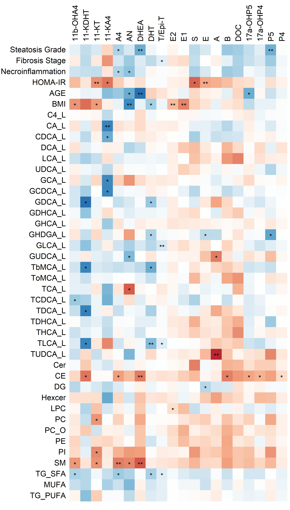
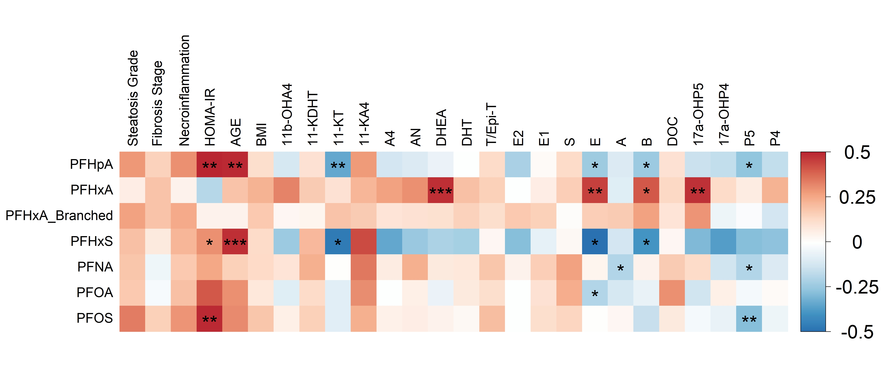

# Loading All R Packages
```{r, warning=FALSE,message=FALSE}
library(scales);library("plotrix");library(Maaslin2);  library(ggtext);library(lavaan);library(psych);library("xlsx");library(lsr);library(quantreg);library("readxl")
library(semPlot);library(mediation);require(lme4);require(reshape2);library(mlma);library(binilib);library(plyr);library("viridis");library(RColorBrewer) 
#library(mma);# library(d3heatmap);
library(magrittr); library(ggplot2);library( "censReg" );library(ggsankey);library(dplyr);library(tidyverse);library(dmetar);library(meta);library(ggforestplot); 
## Warning, do not add: 'library(forestplot)'! It is not working with ggforestplot... (9.9.24)
library(mdatools);library(circlize);library(igraph);library('bigsnpr');library(rcompanion);library(scRNAseq);
library(tibble);library(stringr);library(MOFA2);library('qpgraph') 
#ok
library("grid"); library("ggplotify");library(ggpubr);library(rstatix);library(datarium);library(RColorBrewer); library(ggh4x); library(effsize)
library(chorddiag);library(corrplot);library(scater);library(mdatools);options(scipen = 999); library(car);library(FSA);library(pathviewr);library(glmnet)
library("lmtest");library(PerformanceAnalytics);library(psych);library("readxl");library(ggforce);library(ComplexHeatmap);library(ragg) 
#These are ok to drive in start:
library('Hmisc');library(correlation);library(ggcorrplot);library(pheatmap);library(mgcv);library('ppcor');library(superb)
library(rmdformats);library(prettydoc);library(hrbrthemes);library(tint);library(tufte)# library(ComplexHeatmap); # library("heatmaply")
library(extrafont)

```

# Setting Global Variables
```{r, warning=FALSE,message=FALSE}

date='tikka6924' #change this...
#install.packages("ppcor") just in case the 'install' function here...
# font_import() #this is important if you have not loaded them before
loadfonts(device = "win") #this is important 
```

# Importing Data and Metadata
```{r, warning=FALSE,message=FALSE}

#First set your data folder:
setwd("C:/Users/patati/Desktop/TurkuOW/RWork")

#And then load the primary steroid data
NAFLD=read_excel("NAFLD_SteroidStudy.xlsx",sheet = "LFAT_steroidsDATA") #l ei tästä
oknames=colnames(NAFLD); NAFLD=data.frame(NAFLD)

#The names of the steroid groups need to be imported early on:
groups=read.csv("groups_17823.csv", header = TRUE, sep=";")
groups=groups[,c('Group','Abbreviation')]
groups=groups[groups[,'Abbreviation']!='F',]
groups=groups[order(groups[,'Group']),]


#P4 was found from elsewhere to have the following characteristics:
NAFLD[,'P4'] = as.numeric(NAFLD[,'P4'])
NAFLD[,'P4'][is.na(NAFLD[,'P4'])] = 22557.3330346846#median(NAFLD[,'P4'], na.rm=TRUE) 
NAFLD[,5:7][NAFLD[,5:7]==0.01]=0; colnames(NAFLD)=oknames
MASLD=read_excel("Combined.Matrix.For.Pauli.2023.10.17.Excel.Formatv2.xlsx") #vaan tästä!
oknames=colnames(MASLD); MASLD=data.frame(MASLD); colnames(MASLD)=oknames #Tätä kikkojen määrää...
rownames(MASLD)=MASLD[,1]
MASLD[,'P4'] = as.numeric(MASLD[,'P4']) #The same comment as above
MASLD[,'P4'][is.na(MASLD[,'P4'])] = 22557.3330346846 
eva=c('Grade(0-3)', 'Stage(0-4)','Necroinflammation')
MASLD[,eva][MASLD[,eva]==0.01]=0; #MASLD[,eva]
td=c('11-KDHT','AN','DHT','17a-OHP5','E2','P5','DOC')
val=c(103,252,51,200,26.5,253,10); vale=c(100,250,50,200,25,250,10)#MASLD[1:30,td] 
for (i in 1:7) {MASLD[,td][i][MASLD[,td][i]==val[i]]=vale[i]} #MASLD[1:30,td] # tu=c('E','11-KA4') # val=c(106000) # vale=c(100) # MASLD[,tu]

# These (E) are ok as per lab:
ME=read.csv('E_tikka231023.csv',header=TRUE, sep=";")
ME2=rownames(MASLD[MASLD[,'E']==106000,]) 
to=ME[which(ME[,1] %in% ME2),'patient.number']
te=ME[which(ME[,1] %in% ME2),'E']
MASLD[as.character(to),'E']=te
#These (11-KA4) will change in the lab (sometime after 24.10.23):
M11=read.csv('11KA4_tikka231023.csv',header=TRUE, sep=";")
M11[,1][c(1:5,9)];MASLD[as.character(M11[,1][c(1:5,9)]),'11-KA4'] #these were denoted with 'big interference'
MASLD[as.character(M11[,1][c(1:5,9)]),'11-KA4'] = NA#median(MASLD[!rownames(MASLD) %in% as.character(M11[,1][c(1:5,9)]),'11-KA4'])
a=MASLD[order(MASLD[,'BMI']),'BMI']
b=NAFLD[order(NAFLD[,'BMI']),'BMI']
them=unique(b[! b %in% a])
NAFLD=NAFLD[order(NAFLD[,'BMI']),] 
NAFLD=NAFLD[NAFLD[,'BMI']!=them,]
MASLD=MASLD[order(MASLD[,'BMI']),]
#https://appsilon.com/imputation-in-r/ #https://www.datasciencemadesimple.com/get-minimum-value-of-a-column-in-r-2/?expand_article=1
#New data import withouth changing the conames: https://readxl.tidyverse.org/articles/column-names.html
Bali=data.frame(read_excel("Liver_bile_acids_PFAS.xlsx",sheet = "Liver_BA",.name_repair = "minimal")); row.names(Bali)=Bali[,1]
Pfase=data.frame(read_excel("Liver_bile_acids_PFAS.xlsx",sheet = "PFAS_serum",.name_repair = "minimal")); rownames(Pfase)=as.vector(unlist(Pfase[,1]))
Base=data.frame(read_excel("Liver_bile_acids_PFAS.xlsx",sheet = "Serum_BA",.name_repair = "minimal"));rownames(Base)=as.vector(unlist(Base[,1]))
C4=data.frame(read_excel("Liver_bile_acids_PFAS.xlsx",sheet = "C4",.name_repair = "minimal")); rownames(C4)=as.vector(unlist(C4[,1]))
Clini=data.frame(read_excel("Matching clinical data_all.xlsx",sheet = "Sheet1",.name_repair = "minimal")); rownames(Clini)=as.vector(unlist(Clini[,1]));
# https://www.analyticsvidhya.com/blog/2021/06/hypothesis-testing-parametric-and-non-parametric-tests-in-statistics/
MASLD[1:3,1:33] #or head(MASLD);
#The below ordering needs to be changed...
Bali=Bali[as.character(MASLD$PatientNumber),];Bali[1:3,1:12] #https://stackoverflow.com/questions/54264980/r-how-to-set-row-names-attribute-as-numeric-from-character I did otherway around
Base=Base[as.character(MASLD$PatientNumber),];Base[1:3,1:12]
Clini=Clini[as.character(MASLD$PatientNumber),];Clini[1:3,1:12]
C4=C4[as.character(MASLD$PatientNumber),];C4[1:3,]
Pfase=Pfase[as.character(MASLD$PatientNumber),];Pfase[1:3,]
#Menopause markers:
menopause=read_excel("Putative_metabolic_markers_menopause.xlsx",sheet='menopause markers',.name_repair = "minimal"); #rownames(Clini)=as.vector(unlist(Clini[,1]));
menopause=menopause[8:dim(menopause)[1],]; menopause=menopause[,-15]; menopause[2,2:14]=menopause[1,2:14]; menopause=data.frame(menopause); menopause[2,13:14]=c('v1','v2'); #dim(menopause)
colnames(menopause)=c('row_names',menopause[2,2:dim(menopause)[2]]); menopause=menopause[3:dim(menopause)[1],];rownames(menopause)=as.vector(unlist(menopause[,1]));
menopause=menopause[as.character(MASLD$PatientNumber),]
colnames(Pfase)[colnames(Pfase)=='PFHxA.1']='PFHxA_Branched'
Pfase=Pfase[,colnames(Pfase)!='Benzylparaben.1']
Pfase[Pfase[,'Benzylparaben']>10,'Benzylparaben']=NA #m

Jeihou=data.frame(read_excel("Copy of BA_liverfat_RawData.xls",.name_repair = "minimal")); row.names(Jeihou)=Jeihou[,1];Jeihou=Jeihou[as.character(MASLD$PatientNumber),]
u=Jeihou[Jeihou[,'GHDGA']=='<LLOQ',1]; a=u[!is.na(u)]; b=rownames(Bali[Bali[,'GHDGA']==1,]); #length(b) length(a);intersect(a,b); 
uu=Jeihou[Jeihou[,'GHDGA']=='No Result',1]; aa=uu[!is.na(uu)]; #intersect(aa,b); c(aa,a)[!c(aa,a) %in% b] #24140250313 24112081112  #2/25
Bali[as.character(a),'GHDGA']=min(Bali[,'GHDGA'],na.rm=TRUE)/2
heps=Bali[Bali[,'GHDGA']==1,1] #2476250110  2487010610 24111141210
Bali[as.character(heps),'GHDGA']=NA
#https://www.datasciencemadesimple.com/get-minimum-value-of-a-column-in-r-2/?expand_article=1
mat=Bali[,c('TbMCA','ToMCA','TDCA','TDHCA','TLCA')]
mat[!mat>1]=10000
mat[mat==2]=10000 #colmins ei toiminuyt ja käytin:
hip=do.call(pmin, lapply(1:nrow(mat), function(i)mat[i,])) #https://stackoverflow.com/questions/13676878/fastest-way-to-get-min-from-every-column-in-a-matrix
hou=c('TbMCA','ToMCA','TDCA','TDHCA','TLCA')
for (i in 1:5) {Bali[Bali[,hou[i]]==1,hou[i]]=hip[i]}
for (i in 1:5) {Bali[Bali[,hou[i]]==2,hou[i]]=hip[i]}
# hepsa=Bali[Bali[,c('TbMCA','ToMCA','TDCA','TDHCA','TLCA')]==1,1] #2476250110  2487010610 24111141210
#An imputation for the missing values:
C4[is.na(C4[,2]),2]=median(C4[!is.na(C4[,2]),2]) #assuming that these were not below quantitation and replacing with median
#https://www.geeksforgeeks.org/performing-logarithmic-computations-in-r-programming-log-log10-log1p-and-log2-functions/# https://stackoverflow.com/questions/50476717/i-want-to-align-match-two-unequal-columns
#Matching two unequal columns..# #match the names of one original column (dat2) to ones that are missing (dat1 with to other) # #Not sure if this should be this difficult...
tv=cbind(MASLD[,1],NAFLD[,2:7],Clini[,'HOMA.IR'],MASLD[,colnames(NAFLD[,8:27])],Bali[,2:dim(Bali)[2]], C4[,2:dim(C4)[2]],Base[,2:dim(Base)[2]],Pfase[,(2:(dim(Pfase)[2]))], MASLD[,'PFAS']);#colnames(tv)#,C4[,2:dim(C4)[2]]). Clini[,'HOMA-IR'] # head(tv) #non nans # which(is.na(tv)) # MASLD[1:30,1:12] # NAFLD[1:30,7:20]
colnames(tv)[colnames(tv)=='C4[, 2:dim(C4)[2]]']='C4';colnames(tv)[colnames(tv)=='Clini[, \"HOMA.IR\"]']='HOMA-IR'
colnames(tv)[colnames(tv)=='MASLD[, \"PFAS\"]']='PFAS';
colnames(tv)[colnames(tv)=="MASLD[, 1]" ]='PatientNumber';#colnames(tv)#
rownames(tv)=unlist(Bali[,1]); #tv[1:5,1:11];#tv[1:5,12:55]; dim(tv[1:3,9:28]);tv[1:5,1:80]
hep=colnames(tv)[!colnames(tv) %in% c( "Benzylparaben" ,"Methylparaben")] 
#not sure when it is the best time to take not needed variables away, perhaps at the very end?
tv=tv[,hep]
tv=cbind(tv,MASLD[,(dim(MASLD)[2]-13):dim(MASLD)[2]]) 
# here I add the lipids. In the future, I need to divide all the groups in their own components e.g. dataframe called 'lipids' so
# that adding them will be more straighfoward
# head(tv) #non nans , ok colnames # which(is.na(tv))

tve=tv[,2:dim(tv)[2]]; tve[tve == 0] <- NA; 
#print(tve, max=nrow(tve)*ncol(tve)); note, here the covariates will be been scaled, since this yield later results (as seen with correlation plots and maps)
tv_half <- tve %>% mutate(replace(., is.na(.), min(., na.rm = T)/2)) #https://mdatools.com/docs/preprocessing--autoscaling.html
tv_half_log2 <- log2(tv_half);# print(tv_half_log2, max=nrow(tv_half_log2)*ncol(tv_half_log2))
tv_auto <- prep.autoscale(tv_half_log2, center = TRUE, scale = TRUE);  # head(tv_auto) #non nans  # which(is.na(tv_auto))

# Usually this should be the log2 value 'tv_half_log2' & 
#https://svkucheryavski.gitbooks.io/mdatools/content/preprocessing/text.html
# Necroinflammation  HOMA-IR Steatosis.Grade.0.To.3 Fibrosis.Stage.0.to.4
tv_all=cbind(tv[,1],tv_auto); #tv_all[1:5,1:11]; note, here the covariates have not been normalized or scaled/elaborated in any way;  maybe I need to do so (1/324 or 28524...); check 27524 the 

x1=colnames(tv_all[,c(1:8)]); v2=dim(NAFLD)[2]+1
x2=colnames(tv_all[,9:v2]);v3=(dim(Bali)[2]+v2);x3=colnames(tv_all[,(v2+1):(v3)]);v4=(dim(Base)[2])+v3
x4=colnames(tv_all[,(v3+1):(v4-1)]);x5=colnames(tv_all[,(v4):(dim(tv_all)[2])]); 
x3 <- paste(x3, "_L", sep="") #https://stackoverflow.com/questions/6984796/how-to-paste-a-string-on-each-element-of-a-vector-of-strings-using-apply-in-r
x4=gsub("(-[0-9]*)*.1", "", x4) #https://stackoverflow.com/questions/18997297/remove-ending-of-string-with-gsub
x4 <- paste(x4, "_S", sep="")# https://rdrr.io/bioc/qpgraph/man/qpNrr.html
x5a=x5[1:9]
x6=x5[10:length(x5)] #dividing to lipids
x5=x5a  #making sure that PFAS are separate
nm = c(x1,x2,x3,x4,x5,x6); nm=c('PatientNumber','Gender','AGE','BMI','Steatosis Grade','Fibrosis Stage','Necroinflammation','HOMA-IR',nm[9:length(nm)])
colnames(tv_all)=nm; #tv_all[1:5,1:30]; #NAFLD[1:2,1:28];
colnames(tv_all)[colnames(tv_all)=='MASLD[, \"PFAS\"]']='PFAS';
# head(tv_all) #non nans # which(is.na(tv_all)) # colnames(tv_all)

# jälkeenpäin lienee jeesh
x5=x5[x5!='PFAS'];x5=x5[x5!='Perfluorodecyl.ethanoic.acid']; x6=x6[x6!='Total_TG'] # x1;x2;x3;x4;x5;
tv_all=tv_all[,!colnames(tv_all) %in% c('Total_TG','PFAS',"Perfluorodecyl.ethanoic.acid")]

tv_half_log22=cbind(tv[,1],tv_half_log2);
# tv_half_log22=cbind(tv[,1:8],tv_half_log2);
x1=colnames(tv_half_log22[,c(1:8)]); v2=dim(NAFLD)[2]+1
x2=colnames(tv_half_log22[,9:v2]);v3=(dim(Bali)[2]+v2);
x3=colnames(tv_half_log22[,(v2+1):(v3)]);v4=(dim(Base)[2])+v3
x3=x3[c(length(x3),1:(length(x3)-1))]
x4=colnames(tv_half_log22[,(v3+1):(v4-1)]);
x5=colnames(tv_half_log22[,(v4):(dim(tv_half_log22)[2])]);
x3 <- paste(x3, "_L", sep="") #https://stackoverflow.com/questions/6984796/how-to-paste-a-string-on-each-element-of-a-vector-of-strings-using-apply-in-r
x4=gsub("(-[0-9]*)*.1", "", x4) #https://stackoverflow.com/questions/18997297/remove-ending-of-string-with-gsub
x4 <- paste(x4, "_S", sep="")# https://rdrr.io/bioc/qpgraph/man/qpNrr.html
x5a=x5[1:9]
x6=x5[10:length(x5)] #dividing to lipids
x5=x5a  #making sure that PFAS are separate
nm = c(x1,x2,x3,x4,x5,x6); nm=c('PatientNumber','Gender','AGE','BMI','Steatosis Grade','Fibrosis Stage','Necroinflammation','HOMA-IR',nm[9:length(nm)])
colnames(tv_half_log22)=nm; #tv_half_log22[1:5,1:30]; #NAFLD[1:2,1:28];
colnames(tv_half_log22)[colnames(tv_half_log22)=='MASLD[, \"PFAS\"]']='PFAS';
# colnames(tv_half_log22)

#jälkeenpäin lienee jeesh
x5=x5[x5!='PFAS'];x5=x5[x5!='Perfluorodecyl.ethanoic.acid']; x6=x6[x6!='Total_TG'] # x1;x2;x3;x4;x5;
tv_half_log22=tv_half_log22[,!colnames(tv_half_log22) %in% c('Total_TG','PFAS',"Perfluorodecyl.ethanoic.acid")]

colnames(tv)[colnames(tv)=='17aOH-P4']='17a-OHP4'
colnames(tv_half_log22)[colnames(tv_half_log22)=='17aOH-P4']='17a-OHP4'
colnames(tv_all)[colnames(tv_all)=='17aOH-P4']='17a-OHP4'

Treatment=colnames(tv_all)[71:77];
Mediator=colnames(tv_all)[9:28];
Outcome=colnames(tv_all)[c(29:51,78:90)]; ##https://sparkbyexamples.com/r-programming/r-remove-from-vector-with-examples/
Treatment=Treatment[!Treatment %in% c('Perfluorodecyl.ethanoic.acid')]
tv_all=tv_all[,!colnames(tv_all) %in% c('Total_TG','PFAS','Perfluorodecyl.ethanoic.acid')]
tv_all=tv_all[,!colnames(tv_all) %in% x4]
Outcome=Outcome[!Outcome %in% c('Total_TG','PFAS','Perfluorodecyl.ethanoic.acid')]
Outcome=Outcome[! Outcome %in% x4] #https://sparkbyexamples.com/r-programming/r-remove-from-vector-with-examples/
Mediator[Mediator=="17aOH-P4"]="17a-OHP4"

tv_covscl=tv_all
tv_covNS=cbind(tv[,1:8],tv_all[,9:dim(tv_all)[2]])
tv_LOG_covscl=tv_half_log22
tv_LOG_covNS=cbind(tv[,1:8],tv_half_log22[,9:dim(tv_half_log22)[2]])

colnames(tv_covNS)[1:8]=colnames(tv_all)[1:8]
colnames(tv_LOG_covNS)[1:8]=colnames(tv_all)[1:8]

tv_c=tv_covscl #cbind(tv[,1:8], tv_half_log2) #check also not logged and then the auto 

# https://stackoverflow.com/questions/6984796/how-to-paste-a-string-on-each-element-of-a-vector-of-strings-using-apply-in-r
# https://stackoverflow.com/questions/18997297/remove-ending-of-string-with-gsub
# https://rdrr.io/bioc/qpgraph/man/qpNrr.html

```

# Making Boxplots
```{r, warning=FALSE,message=FALSE,fig.width=8.0}
#https://r-graph-gallery.com/265-grouped-boxplot-with-ggplot2.html
#https://stackoverflow.com/questions/53724834/why-does-the-plot-size-differ-between-docx-and-html-in-rmarkdownrender

boxplots=function(tvt,Group,Outcome,Out,oute,other) {
  # tvt=ie
if (Group=='Male') {tvt=tvt[tvt[,'Gender']==1,]} else if (Group=='Female') 
{tvt=tvt[tvt[,'Gender']==0,]} else if (Group=='All') {tvt=tvt}
Steroid=rep(colnames(tvt[,9:28]), each=dim(tvt)[1])
data2=rep('Control',dim(tvt)[1])
num=min(tvt[,Outcome])
if (Outcome=='HOMA-IR') {num=1.5}
data2[tvt[,Outcome]>num]='Case' #'Steatosis.Grade.0.To.3' #
Treatment=data2
note=unlist(tvt[,9:28])
Concentration=as.vector(note)
data=data.frame(Steroid, Treatment ,  Concentration)
data[,'Group'] = 0
# data$Steroid #check the Xs etc out..
data$Steroid [data$Steroid  == '17aOH-P4']='17a-OHP4'
# groups$Abbreviation[groups$Abbreviation == '17a-OHP4']='17aOH-P4'
for (i in 1:21) {data[data$Steroid %in% groups$Abbreviation[i],'Group']=groups$Group[i]}
title = paste(Out,"'s Effect to Concentrations of Steroids", ' in ',Group,sep="")
if (Group=='Male') {lep=theme(legend.position = "none")} else if (Group=='Female') 
{lep=theme(legend.position = "none")} else if (Group=='All') {lep=theme_classic2()+theme(axis.text.x=element_text(angle=90,hjust=0.95,vjust=0.2,size = 14))}
# lep=theme(legend.position = "none")
if (num==1.5) {e1=paste('Case (>',num,')',sep="");e2=paste('Control (=',num,')',sep=""); e3=paste('****<0.001', '***<0.01', '**<0.5', '*<0.1')} else {e1=paste('Case (>',0,')',sep="");e2=paste('Control (=',0,')',sep="");e3=paste('****<0.001', '***<0.01', '**<0.5', '*<0.1')}

e3=paste('****<0.001', '***<0.01', '**<0.5', '*<0.1')

data=data[!is.na(data$Concentration),]
# grouped boxplot: https://stackoverflow.com/questions/32539222/group-boxplot-data-while-keeping-their-individual-x-axis-labels-in-ggplot2-in-r
p=ggplot(data, aes(x=Steroid, y=Concentration, fill=Treatment))+
geom_boxplot(notch=F, notchwidth=0.5,outlier.shape=1,outlier.size=2, coef=1.5)+
# coord_cartesian(ylim = c(0, 60000))+
theme(axis.text=element_text(color="black"))+
theme_classic2()+#https://stackoverflow.com/questions/34522732/changing-fonts-in-ggplot2
# scale_x_discrete(guide = guide_axis(angle = 90))+ https://stackoverflow.com/questions/37488075/align-axis-label-on-the-right-with-ggplot2
theme(axis.text.x=element_text(angle=90,hjust=0.95,vjust=0.2,size = 14))+#annotate(geom="text",family="Broadway",size=20)+#annotate(geom="text",family="Calibri",size = 14)+
theme(panel.grid.minor=element_blank())+ #http://www.sthda.com/english/wiki/ggplot2-rotate-a-graph-reverse-and-flip-the-plot
labs(size= "Type",x = "Steroids",y = "Log2 of Picomolar Concentrations ", title=title,size = 14)+ #log2 Autoscaled
scale_fill_manual(values=c("orange","blue"),name=c(oute),labels=c(e1,e2))+#abels=c("Case (>5)", "Control (=<5)"))
facet_grid(~Group, scales = "free_x", space = "free")+lep+
theme(text=element_text(size=10.5,family="Calibri"), #change font size of all text
        axis.text=element_text(size=14), #change font size of axis text
        axis.title=element_text(size=14), #change font size of axis titles
        plot.title=element_text(size=14), #change font size of plot title
        legend.text=element_text(size=14), #change font size of legend text
        legend.title=element_text(size=14))+theme(axis.text=element_text(color="black"))+stat_compare_means(hide.ns = TRUE,
        label= "p.signif",method = "wilcox.test",  symnum.args = list(cutpoints = c(0, 0.001, 0.01, 0.05, 0.1, 1), 
                           symbols = c("****", "***", "**", "*", "ns")))#+annotation_custom( grid::textGrob(x =1, y = 0.1, label = "OK"))#+showSignificance( c(1,2), 10, -0.05, "*")  
# http://www.sthda.com/english/articles/24-ggpubr-publication-ready-plots/76-add-p-values-and-significance-levels-to-ggplots/
# https://stackoverflow.com/questions/76758153/is-there-a-way-to-change-the-asterisks-to-match-custom-p-values
  #+annotate(geom="text",family="Broadway",size=20) # add_pval(plot, pairs = list(c(1, 2)), test='wilcox.test');plot
  #https://datavizpyr.com/horizontal-boxplots-with-ggplot2-in-r/
# https://stackoverflow.com/questions/72564551/a-custom-legend-unrelated-to-data-in-ggplot
# p #+ annotation_custom( grid::textGrob(x =3, y = 5, label = "'****<0.001', '***<0.01', '**<0.5', '*<0.1'")).. adding a custom label (unrelated to data) to ggplot is again one of these not so easy but should be easy things... :)

library(ragg)
path="C:/Users/patati/Documents/GitHub/new/" #oh, classical: https://forum.posit.co/t/r-markdown-html-document-doesnt-show-image/41629/2
pngfile <- fs::path(path,paste0(Group,Out,'boxee',".png"))#fs::path(knitr::fig_path(),  "theming2.png")
ragg::agg_png(pngfile, width = 60, height = 36, units = "cm", res = 300,scaling = 2)
#https://stackoverflow.com/questions/66429500/how-to-make-raggagg-png-device-work-with-ggsave
plot(p)
invisible(dev.off())
knitr::include_graphics(pngfile)
    
}

tv_half_log22[,'11-KA4'][tv_half_log22[,'11-KA4']==min(tv_half_log22[,'11-KA4'])]=median(tv_half_log22[,'11-KA4'])
other='23824e';ie=tv_half_log22## 'Steatosis Grade','Fibrosis Stage','Necroinflammation','HOMA-IR'
windowsFonts(A = windowsFont("Calibri (Body)"))

# The significance levels are: '****<0.001', '***<0.01', '**<0.5', '*<0.1'
Outcome='Steatosis Grade';Out='Steatosis'; oute='Steatosis';num=0;Group='All';boxplots(ie,Group,Outcome,Out,oute,other);Group='Female';boxplots(ie,Group,Outcome,Out,oute,other);Group='Male';boxplots(ie,Group,Outcome,Out,oute,other)
Outcome='Fibrosis Stage';Out='Fibrosis'; oute='Fibrosis Stage';num=0;Group='All';boxplots(ie,Group,Outcome,Out,oute,other);Group='Female';boxplots(ie,Group,Outcome,Out,oute,other);Group='Male';boxplots(ie,Group,Outcome,Out,oute,other) 
Outcome='Necroinflammation';Out='Necroinflammation'; oute='Level';num=0;Group='All';boxplots(ie,Group,Outcome,Out,oute,other);Group='Female';boxplots(ie,Group,Outcome,Out,oute,other);Group='Male';boxplots(ie,Group,Outcome,Out,oute,other)
Outcome='HOMA-IR';Out='HOMA-IR'; oute='Level';num=1.5 ;Group='All';boxplots(ie,Group,Outcome,Out,oute,other);Group='Female';boxplots(ie,Group,Outcome,Out,oute,other);Group='Male';boxplots(ie,Group,Outcome,Out,oute,other)

```

# Making Chord Diagrams 
```{r, warning=FALSE,message=FALSE,fig.width=9.0}
# First the correlations for the chord diagrams (both male and female as well as total subjects):
tv_c=data.frame(tv_c)
tv_c=tv_c[,!colnames(tv_c) %in% c('Total_TG','PFAS',"Perfluorodecyl.ethanoic.acid")]
tvf=tv_c[tv_c[,'Gender']==min(tv_c[,'Gender']),1:dim(tv_c)[2]]
tvm=tv_c[tv_c[,'Gender']==max(tv_c[,'Gender']),1:dim(tv_c)[2]]

tvtest=list(tv_c,tvf,tvm)
for (i in 1:3) {colnames(tvtest[[i]]) <- gsub("\\.", "-", colnames(tvtest[[i]]))
colnames(tvtest[[i]]) <- gsub("X11", "11", colnames(tvtest[[i]]))
colnames(tvtest[[i]]) <- gsub("X17", "17", colnames(tvtest[[i]]))
colnames(tvtest[[i]])[colnames(tvtest[[i]])=="T-Epi-T"]="T/Epi-T"
colnames(tvtest[[i]])[colnames(tvtest[[i]])=="Steatosis-Grade"]="Steatosis Grade"
colnames(tvtest[[i]])[colnames(tvtest[[i]])=="Fibrosis-Stage"]="Fibrosis Stage"
colnames(tvtest[[i]])[colnames(tvtest[[i]])=="17aOH-P4"]="17a-OHP4"
colnames(tvtest[[i]])[colnames(tvtest[[i]])=="HOMA IR"]="HOMA-IR"}
tv_c=tvtest[[1]]; tvf=tvtest[[2]]; tvm=tvtest[[3]];
x4[x4=="X7.oxo.DCA_S"]="X7-oxo-DCA_S"

dat = tv_c; dat = dat %>% select(-c('PatientNumber')) #this is quite nice way to delete columns, please remember...
resulta <- (rcorr(as.matrix(dat), type = c('spearman')))$r #compare pearson # intersect(colnames(resulta), rownames(resulta)) #https://stackoverflow.com/questions/45271448/r-finding-intersection-between-two-vectors

dat=tvf; dat= dat %>% select(-c('PatientNumber','Gender')) #this is quite nice way to delete columns, please remember...
resultaf <- (rcorr(as.matrix(dat), type = c('spearman')))$r #compare pearson

dat=tvm; dat= dat %>% select(-c('PatientNumber','Gender')) #this is quite nice way to delete columns, please remember...
resultam <- (rcorr(as.matrix(dat), type = c('spearman')))$r #compare pearson

#Check the columns away
at=colnames(resulta)[1:(length(x1)-1)] #clinicals
bt=colnames(resulta)[(length(at)+1):(length(at)+length(x2))] #Steroids
ct=colnames(resulta)[(length(at)+length(bt)+1):(length(at)+length(bt)+length(x3))] #BA_l
dt=colnames(resulta)[(length(at)+length(bt)+length(ct)+1):(length(at)+length(bt)+length(ct)+length(x4))] #BA_s
et=colnames(resulta)[(length(at)+length(bt)+length(ct)+length(dt)+1):(length(at)+length(bt)+length(ct)+length(dt)+length(x5))] #PFAS: change here
ft=colnames(resulta)[(length(at)+length(bt)+length(ct)+length(dt)+length(et)+1):(length(at)+length(bt)+length(ct)+length(dt)+length(et)+length(x6))] #
atl=length(at);btl=length(bt);ctl=length(ct);dtl=length(dt);etl=length(et);ftl=length(ft)

n_level=0.2; ## muuta tätä, # hist(as.numeric(Nrr)) #https://www.geeksforgeeks.org/elementwise-matrix-multiplication-in-r/

Nrr=qpNrr(resulta, verbose=FALSE);Nrr[is.na(Nrr)]=1; cond=data.frame(as.matrix(Nrr<n_level));RN=data.frame(resulta);tes_t=cond*RN;tes_t=as.matrix(tes_t);resulta=tes_t 
Nrr=qpNrr(resultaf, verbose=FALSE);Nrr[is.na(Nrr)]=1;cond=data.frame(as.matrix(Nrr<n_level));RN=data.frame(resultaf);tes_t=cond*RN;tes_t=as.matrix(tes_t);
resultaf=tes_t
Nrr=qpNrr(resultam, verbose=FALSE);Nrr[is.na(Nrr)]=1;cond=data.frame(as.matrix(Nrr<n_level));RN=data.frame(resultam);tes_t=cond*RN;tes_t=as.matrix(tes_t);
resultam=tes_t

#And then using a function for making the female and male chord and all subjects' diagrams... 
#This function takes elements from: 
# https://jokergoo.github.io/circlize_book/book/advanced-layout.html#combine-circular-plots
# https://stackoverflow.com/questions/31943102/rotate-labels-in-a-chorddiagram-r-circlize

group_chords=function(vars,n_level,fig_name, big,rem,modi,colt,gend,colors,a,b,c,d,e,f) {
  
  classes=5;
  tot=rownames(resulta)[2:dim(resulta)[1]];
  range=1:(a+b+c+e+f)
  layout(matrix(1:1, 1, 1)); 
  title='Gender'#
  genders= gend 
  windowsFonts(A = windowsFont("Calibri (Body)")) 
  i=1
  tes_t=vars;
  # tes_t=vars[[1]]
  if (gend=='All') {colnames(tes_t)=rownames(resulta);rownames(tes_t)=rownames(resulta)} else {colnames(tes_t)=rownames(resultaf);rownames(tes_t)=rownames(resultaf)}
  
  g1=c(rep('Clinical', a),rep('Steroids', b), rep('BA_liver', c),rep('Contaminants', e),rep('Lipids', f)) #rep('BA_serum', d)
  
  # removing self-correlation
  tes_t[1:a,1:a]=0
  tes_t[(a+1):(a+b),(a+1):(a+b)]=0
  tes_t[(a+b+1):(a+b+c),(a+b+1):(a+b+c)]=0
  tes_t[(a+b+c+1):(a+b+c+e),(a+b+c+1):(a+b+c+e)]=0
  tes_t[(a+b+c+e+1):(a+b+c+e+f),(a+b+c+e+1):(a+b+c+e+f)]=0 #if you have more groups... make this automatic, now it is not (18.1.24)
  
  
  group = structure(g1, names = colnames(tes_t));#group
  grid.col = structure(c(rep('blue', a),rep('red', b), rep('green', c),  rep('orange', e), rep('#756BB1', f)), 
                       names = rownames(tes_t)); ##https://www.datanovia.com/en/blog/top-r-color-palettes-to-know-for-great-data-visualization/ 
  
  tes_t=tes_t[range,range];grid.col = grid.col[range] #tes_t=resulta
  g <- graph.adjacency(tes_t, mode="upper", weighted=TRUE, diag=FALSE)
  e <- get.edgelist(g); df <- as.data.frame(cbind(e,E(g)$weight)); #
  df[,3]=as.numeric(df[, 3])
  
  rango <- function(x){((x-min(x))/(max(x)-min(x)))*2-1} #just a function for the -1 to 1 thing..
  col_fun = colorRamp2(c(min(df$V3), 0,max(df$V3)), c("blue",'white', "red"))
  df=df[!df$V1 %in% rem,];df=df[!df$V2 %in% rem,] #e.g.rem=x4
  # df$V3=rango(df$V3);
  
  for (i in 1:2) {
  df[,i]=  gsub("\\.", "-", df[,i])
  df[,i] <- gsub("X11", "11", df[,i])
  df[,i] <- gsub("X17", "17", df[,i]); df[,i][df[,i]=="T-Epi-T"]="T/Epi-T"
  df[,i][df[,i]=="Steatosis.Grade"]="Steatosis Grade"
  df[,i][df[,i]=="Steatosis-Grade"]="Steatosis Grade"
  df[,i][df[,i]=="Fibrosis.Stage"]="Fibrosis Stage"
  df[,i][df[,i]=="Fibrosis-Stage"]="Fibrosis Stage"
  df[,i][df[,i]=="17aOH.P4"]="17a-OHP4"
  df[,i][df[,i]=="HOMA.IR"]="HOMA-IR"}
  
  classes=modi #modi=4
  namesh=unique(g1)    #[c(1:6)[1:6 != modi]];
  cola=unique(grid.col)#[c(1:6)[1:6 != modi]]

  lgd_group = Legend(at = gend, type = "points", legend_gp = gpar(col = colors),  title_position = "topleft", title = title)
  
  lgd_points = Legend(at = namesh, type = "points", legend_gp = gpar(col = cola), title_position = "topleft", title = "Class")
  lgd_lines = Legend(at = c("Positive", "Negative"), type = "points", legend_gp = gpar(col = c('red','blue')), title_position = "topleft", title = "Correlation")
  lgd_edges= Legend(at = c(round(min(df$V3),1), round(max(df$V3),1)), col_fun = col_fun,  title_position = "topleft", title = "Edges")
  lgd_list_vertical = packLegend(lgd_group,lgd_points,  lgd_lines,lgd_edges) #lgd_lines,
    # chordDiagram(df, annotationTrack = c("grid"),  grid.col=grid.col, directional = FALSE,
    #              order = rownames(tes_t), preAllocateTracks = 1, col = col_fun,transparency = 0.5)
    # circos.trackPlotRegion(track.index = 1, panel.fun = function(x, y) {
    #   xlim = get.cell.meta.data("xlim"); ylim = get.cell.meta.data("ylim")
    #   sector.name = get.cell.meta.data("sector.index")
    #   circos.text(mean(xlim), ylim[1] + .1, sector.name, facing = "clockwise", niceFacing = TRUE, adj = c(0, 0.5))
    #   circos.axis(h = "top", labels.cex = 0.000001, major.tick.length = 0.2, sector.index = sector.name, track.index = 2)}, bg.border = NA) #https://stackoverflow.com/questions/31943102/rotate-labels-in-a-chorddiagram-r-circlize
    # windowsFonts(A = windowsFont("Calibri (Body)"))
    # draw(lgd_list_vertical, x = unit(5, "mm"), y = unit(5, "mm"), just = c("left", "bottom"))#}
    #These ten above lines have been already done, and now just show separately
    # dev.copy(jpeg,paste0(gend,'hie.jpeg'),width=9, height=12, units="in", res=1000);dev.off() # This is already done

knitr::include_graphics(paste0(gend,'hie.jpeg'))

    }


#All variables
n_level=0.2; circos.clear(); vars=list(resulta)
big='Yes';title='All Variables' # 
rem=x4; modi=5; colt='black'
a=length(x1)-1;b=length(x2);c=length(x3);
d=length(x4);e=length(x5);f=length(x6);#Check inside function
gend=c('All');colors=c('blue');group_chords(vars[[1]],n_level,fig_name,big,rem,modi,colt,gend,colors,a,b,c,d,e,f) #this drives the function

#Genderwise:
vars=list(resultaf,resultam); #
big='No';title='Genders Separated'; #or 'Yes' for the big plot alone
rem=x4; modi=4; colt='black';colors=c('white','black');#rem=x3; modi=5; colt='green';
a=length(x1)-2;b=length(x2);c=length(x3);
d=length(x4);e=length(x5);f=length(x6);#Check inside function
gend=c('Female');colors=c('white');group_chords(vars[[1]],n_level,fig_name,big,rem,modi,colt,gend,colors,a,b,c,d,e,f) #
gend=c('Male');colors=c('black');group_chords(vars[[2]],n_level,fig_name,big,rem,modi,colt,gend,colors,a,b,c,d,e,f) #


```

# Making Variance Explained Plots
```{r, warning=FALSE,message=FALSE,fig.width=6.0}
# This is it! https://bioconductor.org/packages/release/bioc/vignettes/scater/inst/doc/overview.html
#or
# https://stats.stackexchange.com/questions/79399/calculate-variance-explained-by-each-predictor-in-multiple-regression-using-r
# https://rdrr.io/github/MRCIEU/TwoSampleMR/man/get_r_from_pn.html
# https://onlinestatbook.com/2/effect_size/variance_explained.html
# https://stackoverflow.com/questions/10441437/why-am-i-getting-x-in-my-column-names-when-reading-a-data-frame
# https://stackoverflow.com/questions/27044727/removing-characters-from-string-in-r

varex_groups_plot=function(tv_all2,Group) { # if (Group=='Female') {cond=tv_all[,'Gender']==1} else if 
an.error.occured=FALSE
tv_all2=tv_all
tryCatch( { tv_all2[,'Gender'] }, error = function(e) {an.error.occured <<- TRUE})
if(an.error.occured) {if (Group=='female') {cond=tv_all2[,'SEX.1F.2M']==min(tv_all2[,'SEX.1F.2M'])} else if (Group=='male') 
  {cond=tv_all2[,'SEX.1F.2M']==max(tv_all2[,'SEX.1F.2M'])} else if (Group=='All'){cond=rep(TRUE,dim(tv_all2)[1])}} else {
if (Group=='female') {cond=tv_all2[,'Gender']==min(tv_all2[,'Gender'])} else if (Group=='male') {cond=tv_all2[,'Gender']==max(tv_all2[,'Gender'])} else if (Group=='All')
{cond=rep(TRUE,dim(tv_all2)[1])}}
tv_red=c(); tv_red=tv_all2[cond,]   
hep=tv_red
colnames(hep)[1:8]=colnames(tv_red)[1:8]
tv2=t(hep[,9:dim(tv_red)[2]])
sce=SingleCellExperiment(tv2)
logcounts(sce)=tv2
sce@colData=DataFrame(hep[,2:8]) #it is DataFrame with big Ds and Fs
names(colData(sce))=colnames(tv_all)[2:8]
vars <- getVarianceExplained(sce,variables=names(colData(sce))[1:7])
windowsFonts(A = windowsFont("Calibri (Body)"))
p=plotExplanatoryVariables(vars) 

library(ragg)
# Oh! https://www.tidyverse.org/blog/2020/08/taking-control-of-plot-scaling/
# https://r4ds.had.co.nz/graphics-for-communication.html#figure-sizing

path="C:/Users/patati/Documents/GitHub/new/" #oh, classical: https://forum.posit.co/t/r-markdown-html-document-doesnt-show-image/41629/2
pngfile <- fs::path(path,paste0(Group,'vex',".png"))#fs::path(knitr::fig_path(),  "theming2.png")
agg_png(pngfile, width = 60, height = 36, units = "cm", res = 300,scaling = 2)
plot(p)
invisible(dev.off())
knitr::include_graphics(pngfile)
}

# I'll be using the tv_all (logged and then scaled) values here, even though in the original function took 'lognormed' values, i.e.
# 'logNormCounts' #tässä funktiossa ensin tehdään normeeraus ja sitten vasta log2..., ts./or: 
# https://bioconductor.org/packages/devel/bioc/vignettes/SingleCellExperiment/inst/doc/intro.html
# counts <- assay(sce); # libsizes <- colSums(counts); # size.factors <- libsizes/mean(libsizes) # logcounts(sce) <- log2(t(t(counts)/size.factors) + 1)
# logcounts(sce)=scale(log2(tv2)) #depending on the order of the normalizing/scaling this will change...
# So, the way to go is however:
# https://bioinformatics.stackexchange.com/questions/22414/when-analysing-microarray-data-is-it-need-to-do-normalization-and-standardizati
# https://bioinformatics.stackexchange.com/questions/22426/inconsistent-microarray-expression-levels-after-normalizing-with-log2
# https://www.reddit.com/r/bioinformatics/comments/1ejs94m/log2_transformation_and_quantile_normalization/
varex_groups_plot(tv_all,Group='All');
varex_groups_plot(tv_all,Group='female');
varex_groups_plot(tv_all,Group='male')


```

# Making Heatmap with Effect Sizes
```{r, warning=FALSE,message=FALSE,fig.width=9.0}
#For calculating the effect sizes, I'll use the Cohen's d
# https://www.statology.org/cohens-d-in-r/
cohd=function(NAFLD, tv,Group,Outcome) {
if (Group=='Male') {NAFLDo=NAFLD[NAFLD[,'Gender']==max(NAFLD[,'Gender']),];tva=tv[tv[,'SEX.1F.2M']==max(tv[,'SEX.1F.2M']),]} else if (Group=='Female') 
{NAFLDo=NAFLD[NAFLD[,'Gender']==min(NAFLD[,'Gender']),];tva=tv[tv[,'SEX.1F.2M']==min(tv[,'SEX.1F.2M']),]} else if (Group=='All') {NAFLDo=NAFLD;tva=tv}
if (Outcome != 'HOMA-IR') {SG0=NAFLDo[NAFLDo[,Outcome] == min(NAFLDo[,Outcome]),]; SG1=NAFLDo[NAFLDo[,Outcome] > min(NAFLDo[,Outcome]),]} else if (Outcome == 'HOMA-IR') 
  {SG0=NAFLDo[tva[,'HOMA-IR'] <= 1.5,]; SG1=NAFLDo[tva[,'HOMA-IR'] > 1.5,]}
 
  cd=c();for (i in 1:20) {cd=append(cd,cohen.d(SG1[,i+8],SG0[,i+8])$estimate)} 
 
 return(cd)}

d=c()
NAFLD=tv_all
Outcome='Steatosis Grade';Group='All'; a=cohd(NAFLD, tv,Group,Outcome);Group='Female'; b=cohd(NAFLD, tv,Group,Outcome);Group='Male'; c=cohd(NAFLD, tv,Group,Outcome);d=cbind(d,cbind(a,b,c))
Outcome='Fibrosis Stage';Group='All'; a=cohd(NAFLD, tv,Group,Outcome);Group='Female'; b=cohd(NAFLD, tv,Group,Outcome);Group='Male'; c=cohd(NAFLD, tv,Group,Outcome);d=cbind(d,cbind(a,b,c))
Outcome='Necroinflammation';Group='All'; a=cohd(NAFLD, tv,Group,Outcome);Group='Female'; b=cohd(NAFLD, tv,Group,Outcome);Group='Male'; c=cohd(NAFLD, tv,Group,Outcome);d=cbind(d,cbind(a,b,c))
Outcome='HOMA-IR';Group='All'; a=cohd(NAFLD, tv,Group,Outcome);Group='Female'; b=cohd(NAFLD, tv,Group,Outcome);Group='Male'; c=cohd(NAFLD, tv,Group,Outcome);d=cbind(d,cbind(a,b,c))
rownames(d)=colnames(tv_all[,9:28])
colnames(d)=rep(c('All','Female','Male'),4)
write.csv(d,'cohens_da_tikka_v11924a.csv')
n=d
x=data.frame(n)
row.names(x)=colnames(tv_all[,9:28])

colnames(x)[1:3]=c("All_St.","Female_St.","Male_St.")
colnames(x) <- gsub(".1", "_Fib.", colnames(x))
colnames(x) <- gsub(".2", "_Nec.", colnames(x))
colnames(x) <- gsub(".3", "_HI", colnames(x))

groups=groups
groups[groups=="17a-OHP4"]="17aOH-P4"
op=groups[order(groups$Group),'Abbreviation']
op=op[op %in% row.names(x)]
x=x[op,]
brks_heatmap <- function(mat, color_palette){
     
       rng <- range(mat, na.rm = TRUE)
       lpal <- length(color_palette)
       
         c(seq(rng[1], 0, length.out=ceiling(lpal/2) + 1),
               seq(rng[2]/dim(mat)[1], rng[2], length.out=floor(lpal/2)))
 }
# #I do this in my computer and then load the figure, see below:
# color_palette=brewer.pal(n = 11, name = 'RdBu')
# color_palette=rev(color_palette)
# # library(grid)
# # jpeg("cohensd_tikka.jpeg", width=9, height=12, units="in", res=1000 );
# setHook("grid.newpage", function() pushViewport(viewport(x=1,y=1,width=0.9, height=0.9, name="vp", just=c("right","top"))), action="prepend")
# pheatmap(x,cluster_cols=FALSE,cluster_rows=FALSE,breaks = brks_heatmap(x, color_palette),color=color_palette,column_names_side = c("bottom"), angle_col = c("90"))
# setHook("grid.newpage", NULL, "replace")
# grid.text("Steatosis, Fibrosis, Necroinflammation, HOMA-IR", y=-0.07, x=0.4,gp=gpar(fontsize=16))
# grid.text("Steroids (Androgens, Estrogens, Gluc., Mineraloc., Progestogens)", x=-0.07, rot=90, gp=gpar(fontsize=16))
# #For quality/pltowise reasons I need to do this:
# dev.copy(jpeg,"cohensd_tikka.jpeg",width=9, height=12, units="in", res=1000);dev.off()
knitr::include_graphics("cohensd_tikka.jpeg")

```


# Making Heatmaps with Linear Model Estimates
```{r, warning=FALSE,message=FALSE,fig.width=7.0}

# You may need a rather big function to calculate the estimates and plot at the same time, since the spaces of exper. interest have been reduced from the max dataset size.

# Eli maksimilla vedetään... eli pitäis olla ok, sillä skaalattu vastaa korrelaatiota tss. skaalaus vielä miehiin...
the_funal=function(tv,Group,ok,fn,adj,sig.level,sick,sick_group,joo) { #  ok,aa,bb
  # tv=tv_all
  if (Group=='male') {NAFLDo=tv[tv[,'Gender']==max(tv[,'Gender']),]} else if (Group=='female') 
  {NAFLDo=tv[tv[,'Gender']==min(tv[,'Gender']),]} else if (Group=='All') {NAFLDo=tv}
  SG0=NAFLDo[,c(2:dim(tv)[2])]

  #https://stackoverflow.com/questions/10688137/how-to-fix-spaces-in-column-names-of-a-data-frame-remove-spaces-inject-dots
  oknames=colnames(SG0)
  SG0=data.frame(SG0)
  colnames(SG0)
  colnames(SG0[,8:27]) <- gsub("-", ".", colnames(SG0[,8:27]))
  colnames(SG0[,8:27]) <- gsub("/", ".", colnames(SG0[,8:27]))
  # SG0=destroyX(data.frame(SG0))
  hesh=c()
  xnam <- colnames(SG0)[c(4:7)]
  Treatment2=Treatment
  y <- Treatment2 #colnames(SG0)[c(70:76)]
  hoesh=c()
  
  j=1;i=1;p.val=c()
  for (i in 1:length(xnam)) {
    for (j in 1:length(y)) {
      if (Group!='All')  {fmla <- as.formula(paste(paste(c(y[j]," ~ "), collapse= ""), paste(c(xnam[i],'BMI','AGE'), collapse= "+")))} else if (Group=='All') 
      {fmla <- as.formula(paste(paste(c(y[j]," ~ "), collapse= ""), paste(c(xnam[i],'BMI','AGE','Gender'), collapse= "+")))} #https://stats.stackexchange.com/questions/190763/how-to-decide-which-glm-family-to-use
      poissone=lm( fmla, data=SG0) # anova(poissone);# poissone
      p.val=c();p.val <- anova(poissone)$'Pr(>F)'[1]
      ps=summary(poissone);
      pss=ps[[4]] # fmla <- as.formula(paste(paste(c(colnames(SG0[,8:27])[j]," ~ "), collapse= ""), paste(c(xnam[i],'BMI','AGE','Gender'), collapse= "+")))
      # uh=c();uh=summary(poissone)$fstatistic # https://gettinggeneticsdone.blogspot.com/2011/01/rstats-function-for-extracting-f-test-p.html
      # p.val <- pf(uh[1], df1 = uh[2], df2 = uh[3],lower.tail=F)
      hoesh=c(y[j],xnam[i],Group,pss[2,1],pss[2,4],pss[2,2])

      jeps=SG0# 
      r=as.numeric(hoesh[4]) #Suom. tää oli aikasemmin 'hösh', mutta sitten tuli ongelmia
      p=as.numeric(hoesh[5])
      rsadj=as.numeric(hoesh[6])
      colnames(jeps)=colnames(tv)[2:dim(tv)[2]]
      Treatment=hoesh[2]
      Mediator=hoesh[1]
      rm(hoesh)
     
      hesh=rbind(hesh,c(y[j],xnam[i],Group,r,pss[2,4],rsadj))
    }}
  

  j=1;i=1; rm(xnam,y)
  xnam <- colnames(SG0)[c(2)]
  y <- Treatment2#colnames(SG0)[c(70:76)]
  for (i in 1:length(xnam)) {
    for (j in 1:length(y)) {
      if (Group!='All')  {fmla <- as.formula(paste(paste(c(y[j]," ~ "), collapse= ""), paste(c(xnam[i],'BMI','AGE'), collapse= "+")))} else if (Group=='All') 
      {fmla <- as.formula(paste(paste(c(y[j]," ~ "), collapse= ""), paste(c(xnam[i],'BMI','AGE','Gender'), collapse= "+")))} #https://stats.stackexchange.com/questions/190763/how-to-decide-which-glm-family-to-use
      poissone=lm( fmla, data=SG0) # anova(poissone);# poissone
      p.val=c();p.val <- anova(poissone)$'Pr(>F)'[1]
      ps=summary(poissone);
      pss=ps[[4]] # Some pondering what to put as p values:
      # uh=c();uh=summary(poissone)$fstatistic # https://gettinggeneticsdone.blogspot.com/2011/01/rstats-function-for-extracting-f-test-p.html
      # p.val <- pf(uh[1], df1 = uh[2], df2 = uh[3],lower.tail=F)
      hoesh=c(y[j],xnam[i],Group,pss[2,1],pss[2,4],pss[2,2])
      
      jeps=SG0# 
      r=as.numeric(hoesh[4])
      p=as.numeric(hoesh[5])
      rsadj=as.numeric(hoesh[6])
      colnames(jeps)=colnames(tv)[2:dim(tv)[2]]
      Treatment=hoesh[2]
      Mediator=hoesh[1]
      rm(hoesh)
      
      hesh=rbind(hesh,c(y[j],xnam[i],Group,r,pss[2,4],rsadj))}}
  
  j=1;i=1; rm(xnam,y)
  xnam <- colnames(SG0)[c(3)];y <- Treatment2#colnames(SG0)[c(70:76)]
  for (i in 1:length(xnam)) {
    for (j in 1:length(y)) {
      if (Group!='All')  {fmla <- as.formula(paste(paste(c(y[j]," ~ "), collapse= ""), paste(c(xnam[i],'BMI','AGE'), collapse= "+")))} else if (Group=='All') 
      {fmla <- as.formula(paste(paste(c(y[j]," ~ "), collapse= ""), paste(c(xnam[i],'BMI','AGE','Gender'), collapse= "+")))} 
      #https://stats.stackexchange.com/questions/190763/how-to-decide-which-glm-family-to-use
      poissone=lm( fmla, data=SG0) # anova(poissone);# poissone
      p.val=c();p.val <- anova(poissone)$'Pr(>F)'[1]
      ps=summary(poissone);
      pss=ps[[4]] # fmla <- as.formula(paste(paste(c(colnames(SG0[,8:27])[j]," ~ "), collapse= ""), paste(c(xnam[i],'BMI','AGE','Gender'), collapse= "+")))
      uh=c();uh=summary(poissone)$fstatistic # https://gettinggeneticsdone.blogspot.com/2011/01/rstats-function-for-extracting-f-test-p.html
      hoesh=c(y[j],xnam[i],Group,pss[2,1],pss[2,4],pss[2,2])
      jeps=SG0# 
      r=as.numeric(hoesh[4])
      p=as.numeric(hoesh[5])
      rsadj=as.numeric(hoesh[6])
      colnames(jeps)=colnames(tv)[2:dim(tv)[2]]
      Treatment=hoesh[2]
      Mediator=hoesh[1]
      rm(hoesh)
      
      hesh=rbind(hesh,c(y[j],xnam[i],Group,r,pss[2,4],rsadj))}}
  

  j=1;i=1; rm(xnam,y)
  xnam <- Treatment2#colnames(SG0)[c(70:76)]#paste("x", 1:25, sep="") 28:length(colnames(SG0)
  y = colnames(SG0[,8:27])
  for (i in 1:length(xnam)) {
    for (j in 1:length(y)) {
      # if (file.exists(sub_dir)){next}
      if (Group!='All')  {fmla <- as.formula(paste(paste(c(y[j]," ~ "), collapse= ""), paste(c(xnam[i],'BMI','AGE'), collapse= "+")))} else if (Group=='All') 
      {fmla <- as.formula(paste(paste(c(y[j]," ~ "), collapse= ""), paste(c(xnam[i],'BMI','AGE','Gender'), collapse= "+")))} #https://stats.stackexchange.com/questions/190763/how-to-decide-which-glm-family-to-use
      poissone=lm( fmla, data=SG0) # anova(poissone);# poissone
      p.val=c();p.val <- anova(poissone)$'Pr(>F)'[1]
      ps=summary(poissone);
      pss=ps[[4]] # 
      uh=c();uh=summary(poissone)$fstatistic # https://gettinggeneticsdone.blogspot.com/2011/01/rstats-function-for-extracting-f-test-p.html
      hoesh=c(y[j],xnam[i],Group,pss[2,1],pss[2,4],pss[2,2])
      jeps=SG0# 
      r=as.numeric(hoesh[4])
      p=as.numeric(hoesh[5])
      rsadj=as.numeric(hoesh[6])
      colnames(jeps)=colnames(tv)[2:dim(tv)[2]]
      Treatment=hoesh[2]
      Mediator=hoesh[1]
      hesh=rbind(hesh,c(y[j],xnam[i],Group,r,pss[2,4],rsadj))}}

  
  # # 1)  steroids=BA/lipid
  
  # if (Group!='All') {
  j=1;i=1; rm(xnam,y)
  xnam <- c(x3,x6) # Group='All'
  y <- c(colnames(SG0[,8:27])); #colnames(SG0)[c(4:7)]
  
  for (i in 1:length(xnam)) {
    for (j in 1:length(y)) {
      # j=10
      if (Group!='All')  {fmla <- as.formula(paste(paste(c(y[j]," ~ "), collapse= ""), paste(c(xnam[i],'BMI','AGE'), collapse= "+")))} else if (Group=='All')
      {fmla <- as.formula(paste(paste(c(y[j]," ~ "), collapse= ""), paste(c(xnam[i],'BMI','AGE','Gender'), collapse= "+")))} #https://stats.stackexchange.com/questions/190763/how-to-decide-which-glm-family-to-use
      poissone=lm( fmla, data=SG0) # anova(poissone);# poissone
      p.val=c();
      p.val <- anova(poissone)$'Pr(>F)'[1]
      ps=summary(poissone);
      pss=ps[[4]] # fmla <- as.formula(paste(paste(c(colnames(SG0[,8:27])[j]," ~ "), collapse= ""), paste(c(xnam[i],'BMI','AGE','Gender'), collapse= "+")))
      uh=summary(poissone)$fstatistic # https://gettinggeneticsdone.blogspot.com/2011/01/rstats-function-for-extracting-f-test-p.html
      p.vala <- pf(uh[1], df1 = uh[2], df2 = uh[3],lower.tail=F)
      hoesh=c(y[j],xnam[i],Group,pss[2,1],pss[2,4],pss[2,2])

      jeps=SG0# 
      r=as.numeric(hoesh[4])
      p=as.numeric(hoesh[5])
      rsadj=as.numeric(hoesh[6])
      colnames(jeps)=colnames(tv)[2:dim(tv)[2]]
      Treatment=hoesh[2]
      Mediator=hoesh[1]
      rm(hoesh)

      hesh=rbind(hesh,c(y[j],xnam[i],Group,r,pss[2,4],rsadj))}}

  # ja 2) steroid = covar
  j=1;i=1; rm(xnam,y)
  xnam <- c('AGE','BMI',colnames(SG0)[c(4:7)]); 
  y <- c(colnames(SG0[,8:27])) # Group='All'
  
  for (i in 1:length(xnam)) {
    for (j in 1:length(y)) {
      if (Group!='All')  {fmla <- as.formula(paste(paste(c(y[j]," ~ "), collapse= ""), paste(c(xnam[i],'BMI','AGE'), collapse= "+")))} else if (Group=='All') 
      {fmla <- as.formula(paste(paste(c(y[j]," ~ "), collapse= ""), paste(c(xnam[i],'BMI','AGE','Gender'), collapse= "+")))} #https://stats.stackexchange.com/questions/190763/how-to-decide-which-glm-family-to-use
      poissone=lm( fmla, data=SG0) # anova(poissone);# poissone
      p.val=c();p.val <- anova(poissone)$'Pr(>F)'[1]
      ps=summary(poissone);
      pss=ps[[4]] # fmla <- as.formula(paste(paste(c(colnames(SG0[,8:27])[j]," ~ "), collapse= ""), paste(c(xnam[i],'BMI','AGE','Gender'), collapse= "+")))
      hoesh=c(y[j],xnam[i],Group,pss[2,1],pss[2,4],pss[2,2])

      jeps=SG0# 
      r=as.numeric(hoesh[4])
      p=as.numeric(hoesh[5])
      rsadj=as.numeric(hoesh[6])
      colnames(jeps)=colnames(tv)[2:dim(tv)[2]]
      Treatment=hoesh[2]
      Mediator=hoesh[1]
      rm(hoesh)
      
      hesh=rbind(hesh,c(y[j],xnam[i],Group,r,pss[2,4],rsadj))}}
  
  hesa=hesh
  hoi=as.data.frame(hesh)
  hopiu=hoi
  colnames(hopiu)=c('y','x','Gender','r','p','var_x')
  colnames(hoi)=c('y','x','Gender','r','p','var_x')
  
  #This in case you want to print to your local computer: ... :)
  # main_dir <- paste0(c("C://Users//patati//Desktop//TurkuOW//RWork//",fn),collapse="")
  # setwd(main_dir)
  
  meds=names(table(hoi[,1]))[!names(table(hoi[,1])) %in% c(x3,x5,x6)]
  covas=c('Steatosis.Grade','Fibrosis.Stage','Necroinflammation','HOMA.IR','AGE','BMI')
  
  if (adj=='ok') {
    # p.adjust(p=hopiu[,5], method = 'BH', n = length(hopiu[,5]))
    hoi[,5]=p.adjust(p=hopiu[,5], method = 'BH', n = length(hopiu[,5]))
    hopiu[,5]=p.adjust(p=hopiu[,5], method = 'BH', n = length(hopiu[,5]))
  }
  
  if (ok=='big') {
    
    rsa=c();joi=c()
    # Eli 'kaksi' vielä tarvitaan...
    # 1) BA/lipid=covar ja steroidit, ja 2) steroid=covar

    meds=names(table(hoi[,1]))[!names(table(hoi[,1])) %in% c(x3,x5,x6)]
    covas=c('Steatosis.Grade','Fibrosis.Stage','Necroinflammation','HOMA.IR','AGE','BMI')
    
    c1=hoi[,2] %in% covas
    c2=hoi[,1] %in% meds
    hyy=c1 & c2
    m1=hoi[hyy,]
    colnames(m1)=c('y','x','Gender','r','p','var_x') #c('y','x','Gender','r','p','radj')
    c1=hoi[,2] %in% c(x3,x6); c2=hoi[,1] %in% meds
    hyy=c1 & c2; m2=hoi[hyy,]
    colnames(m2)=c('y','x','Gender','r','p','var_x') # hist(as.numeric(m2[,6]),breaks=50)
    joi=rbind(m1,m2)
    i=4;rs=c()
    
    for (i in 4:5) {
      # i=4
      rs=joi[,c(1,2,i)] # rs=data.frame(rs)
      rs=reshape(rs,idvar="x",timevar="y",direction="wide")
      rownames(rs)=rs[,1]
      rs=rs[,-1]

      library(stringr) # x1 = "aallworldpopulations"
      colnames(rs)=str_sub(colnames(rs),3,-1)
      
      colnames(rs) <- gsub("\\.", "-", colnames(rs))
      colnames(rs) <- gsub("X11", "11", colnames(rs))
      colnames(rs) <- gsub("X17", "17", colnames(rs))
      # colnames(rs)["Steatosis-Grade"]
      colnames(rs)[colnames(rs)=="T-Epi-T"]="T/Epi-T"
      
      rownames(rs)[rownames(rs)=="Steatosis.Grade"]="Steatosis Grade"
      rownames(rs)[rownames(rs)=="Fibrosis.Stage"]="Fibrosis Stage"
      rownames(rs)[rownames(rs)=="HOMA.IR"]="HOMA-IR"
      covas[covas=="Steatosis.Grade"]="Steatosis Grade"
      covas[covas=="Fibrosis.Stage"]="Fibrosis Stage"
      covas[covas=="HOMA.IR"]="HOMA-IR"
      
      heps=c(groups[,2]) #check that you have driven the steroid data vis file...
      heps[heps=="17aOH-P4"]="17a-OHP4"
      cme1=match(heps,colnames(rs))
      cme2=match(c(covas,x3,x6),rownames(rs))
      
      rs=rs[cme2,cme1]
      
      rsa=rbind(rsa,rs) }
    
    
    rs1a=rsa[1:dim(rs)[1],];
    rs2a=rsa[(dim(rs1a)[1]+1):(dim(rs1a)[1]+dim(rs1a)[1]),]
  
    rs1=rs1a;rs2=rs2a
    rownames(rs2)=str_sub(rownames(rs2), end = -2)
    rownames(rs1) <- gsub("\\.", " ", rownames(rs1))
    rownames(rs2) <- gsub("\\.", " ", rownames(rs2))
    rownames(rs1)[rownames(rs1)=="HOMA IR"]="HOMA-IR";rownames(rs2)[rownames(rs2)=="HOMA IR"]="HOMA-IR"
    
    rango = function(x,mi,ma) {(ma-mi)/(max(x)-min(x))*(x-min(x))+mi}
    rs1 <- mutate_all(rs1, function(x) as.numeric(as.character(x)))
    rs2 <- mutate_all(rs2, function(x) as.numeric(as.character(x)))
    rs1=rango(rs1,-0.5,0.5) #check this if needed
  
    rs1=as.matrix(rs1)
    rs2=as.matrix(rs2)

    
    width=2500; height=4400
    order="original"; range='orig';corre='no_renorm'; type='full'; method='color';#ga='All';gf='Female';gm='Male' #color square
    cl.offset=1.0;cl.length=5;cl.cex = 0.6;pch.cex=0.6;pch=10;cl.pos = 'n';#cl.pos = 'b' ;#pch.cex=0.95,1.3; height=6300; pos 'b' cl.pos = 'b'
    ho=Group;hip1='BAs_lipids_as_y vs. steroids_as_x'

    # https://www.rdocumentation.org/packages/corrplot/versions/0.94/topics/corrplot
# Oh! https://www.tidyverse.org/blog/2020/08/taking-control-of-plot-scaling/
# https://r4ds.had.co.nz/graphics-for-communication.html#figure-sizing

#I have driven these separately for html: 
    # for that you need:     # jpeg(paste("Linear Model Estimate Plot ofe",hip1,Group,".jpg"), width = width, height = height, quality = 100,pointsize = 16, res=300); 

#     corrplot(rs1, type = type, order = order,method=method, p.mat=rs2, tl.col = "black", cl.cex = cl.cex,pch.cex=pch.cex,pch.col='black',pch=pch,
# sig.level = c(.001, .01, .05),cl.pos = cl.pos, insig = "label_sig",cl.offset=cl.offset,cl.length=cl.length,tl.cex=0.5,
# #  # to get the font size.... https://www.rdocumentation.org/packages/corrplot/versions/0.94/topics/corrplot
# tl.srt = 90, diag = TRUE,col = rev(COL2('RdBu')[25:(length(COL2('RdBu'))-25)]),is.corr = FALSE) #,is.corr = FALSE
    # and: dev.off() #

    #https://stackoverflow.com/questions/26574054/how-to-change-font-size-of-the-correlation-coefficient-in-corrplot
    #https://stackoverflow.com/questions/9543343/plot-a-jpg-image-using-base-graphics-in-r
   #oh, classical: https://forum.posit.co/t/r-markdown-html-document-doesnt-show-image/41629/2

    
  } else {
    
    rsa=c();rs1=c();rs2=c()
  
    c1=hoi[,1] %in% x5
    hoi[c1,] #tää tulee suoraan tällä PFAS 7:lle ekalle
    c2=hoi[,1] %in% names(table(hoi[,1]))[!names(table(hoi[,1])) %in% c(x3,x5,x6)] #vaikeemman kautta
    hyy=c1 & c2
    hoi2=hoi[c2 | c1 ,] #tähän myoes
    rownames(hoi2)=1:dim(hoi2)[1]
    hoi2=hoi2[1:182,]
    a=hoi2[1:42,1];b=hoi2[1:42,2]
    hoi2[1:42,]=cbind(b,a,hoi2[1:42,3:5])    
    hoi2=hoi2[,c(2,1,3:5)] 
    
    i=4;
    rse=c()
    for (i in 4:5) {
      
      rse=hoi2[,c(1,2,i)] # rs=data.frame(rs)
      rse=rse[order(rse[,1]),]
      rs=reshape(rse,idvar="x",timevar="y",direction="wide")
      rownames(rs)=rs[,1]
      rs=rs[,-1]
      
      library(stringr) # x1 = "aallworldpopulations"
      colnames(rs)=str_sub(colnames(rs),3,-1)

      colnames(rs) <- gsub("\\.", "-", colnames(rs))
      colnames(rs) <- gsub("X11", "11", colnames(rs))
      colnames(rs) <- gsub("X17", "17", colnames(rs))
      colnames(rs)[colnames(rs)=="T-Epi-T"]="T/Epi-T"
      colnames(rs)[colnames(rs)=="T-E-T"]="T/Epi-T"
      colnames(rs)[colnames(rs)=="Steatosis-Grade"]="Steatosis Grade"
      colnames(rs)[colnames(rs)=="Fibrosis-Stage"]="Fibrosis Stage"
      colnames(rs)[colnames(rs)=="17aOH-P4"]="17a-OHP4"
      heps=c(covas,groups[,2])
      heps <- gsub("\\.", " ", heps)
      heps[heps=="HOMA IR"]="HOMA-IR"
      heps[heps=="17aOH-P4"]="17a-OHP4"
      ccc=match(heps,colnames(rs))

      rs=rs[,ccc]
      rsa=rbind(rsa,rs) 
    }
    
    rs1a=rsa[1:7,];
    rs2a=rsa[8:14,]
    rs1=rs1a;rs2=rs2a
    # rownames(rs2)=str_sub(rownames(rs2), end = -2)
    width=5500; height=2300
    
    order="original"; range='orig';corre='no_renorm'; type='full'; method='color'; #ga='All';gf='Female';gm='Male' #color square
    cl.offset=1.0;cl.length=5;cl.cex = 1.05;pch.cex=1.05;pch=20;cl.pos = 'r';#cl.pos = 'b' ;#pch.cex=0.95,1.3; height=6300; pos 'b' cl.pos = 'b'
    ho=Group; hip1='Steroids_y vs. PFAS_as_x'
    rs1 <- mutate_all(rs1, function(x) as.numeric(as.character(x)))
    rs2 <- mutate_all(rs2, function(x) as.numeric(as.character(x)))
    rs1=rango(rs1,-0.5,0.5) #check if needed
    
    # E.g., rs1[rs1 > 0.25]=0.25 # rs1[rs1 < -0.25]=-0.25 or aa, bb
    
    rs1=as.matrix(rs1)
    rs2=as.matrix(rs2)

  order="original"; range='orig';corre='no_renorm'; type='full'; method='color'; #ga='All';gf='Female';gm='Male' #color square
  cl.offset=1.0;cl.length=5;cl.cex = 1.4;pch.cex=1.5;pch=20;cl.pos = 'r';#cl.pos = 'b' ;#pch.cex=0.95,1.3; height=6300; pos 'b' cl.pos = 'b'
  ho=Group;hip1='Steroids_y vs. PFAS_as_x'

#I have driven these separately for html: 
# corrplot(rs1, type = type, order = order,method=method, p.mat=rs2, tl.col = "black", cl.cex = cl.cex,pch.cex=pch.cex,pch.col='black',pch=pch,
#      sig.level = c(.001, .01, .05),cl.pos = cl.pos, insig = "label_sig",cl.offset=cl.offset,cl.length=cl.length, tl.cex=0.8,
#      tl.srt = 90, diag = TRUE,col = rev(COL2('RdBu')[25:(length(COL2('RdBu'))-25)]),is.corr = FALSE) #,is.corr = FALSE

    
  } 
  # https://scales.arabpsychology.com/stats/how-to-remove-the-last-character-from-a-string-in-r-2-examples/
  return(list(hopiu))
}

# The scaling here just in case:
rango = function(x,mi,ma) {(ma-mi)/(max(x)-min(x))*(x-min(x))+mi}

#To apply to all groups at one go:
huus=function(tv,adj,sig.level,sick,sick_group,joo) {
  huus=c();huusa=c();heijaa=c('All','female','male'); ok=c('big','small')  ; jj=c()
  hyp=1;hrt=1;oo="C:/Users/patati/Documents/GitHub/new/lme/"
  for (hyp in 1:2) {
    for (hrt in 1:3) {
      # the_funal=function(tv,Group,ok,aa,bb,fn,adj)
      huus=append(huus,the_funal(tv,heijaa[hrt],ok[hyp],fn,adj,sig.level,sick,sick_group,joo))}}

  return(huus)}

# Driving the function with the parameters as follows:
adj='nook'; sig.level=c(.001,0.01, 0.05); sick='no'; joo='joo' #sickGroup..
metanorm_S_non_fdr=huus(tv_all,adj,sig.level,sick,sick_group,joo)

```

```{r, echo=FALSE, out.width="50%", fig.cap="Heatmap of LMEs (linear model estimates) from Steroids vs. BAs & Lipids & Covariates with All Subjects"}
knitr::include_graphics("Linear Model Estimate Plot of BAs_lipids_as_y vs. steroids_as_x All .jpg")
```
```{r, echo=FALSE, out.width="50%", fig.cap="Heatmap of LMEs from Steroids vs. BAs & Lipids & Covariates with Female Subjects"}
knitr::include_graphics("Linear Model Estimate Plot of BAs_lipids_as_y vs. steroids_as_x female .jpg")
```
```{r, echo=FALSE, out.width="50%", fig.cap="Heatmap of LMEs from Steroids vs. BAs & Lipids & Covariates with Male Subjects"}

```
```{r, echo=FALSE, out.width="50%", fig.cap="Heatmap of LMEs from Steroids vs. PFAS & Covariates with All Subjects"}
#fig.cap="Linear Model Estimates between Steroids and Variables"
knitr::include_graphics("Linear Model Estimate Plot of Steroids_y vs. PFAS_as_x All .jpg")
```
```{r, echo=FALSE, out.width="50%", fig.cap="Heatmap of LMEs from Steroids vs. PFAS & Covariates with Female Subjects"}
#fig.cap="Linear Model Estimates between Steroids and Variables"

```
```{r, echo=FALSE, out.width="50%", fig.cap="Heatmap of LMEs from Steroids vs. PFAS & Covariates with Male Subjects"}
#fig.cap="Linear Model Estimates between Steroids and Variables"
knitr::include_graphics("Linear Model Estimate Plot of Steroids_y vs. PFAS_as_x male .jpg")
# [1] "Linear Model Estimate Plot of BAs_lipids_as_y vs. steroids_as_x All .jpg"   
# [2] "Linear Model Estimate Plot of BAs_lipids_as_y vs. steroids_as_x female .jpg"
# [3] "Linear Model Estimate Plot of BAs_lipids_as_y vs. steroids_as_x male .jpg"  
# [4] "Linear Model Estimate Plot of Steroids_y vs. PFAS_as_x All .jpg"            
# [5] "Linear Model Estimate Plot of Steroids_y vs. PFAS_as_x female .jpg"         
# [6] "Linear Model Estimate Plot of Steroids_y vs. PFAS_as_x male .jpg"  
```


# Making Causal Mediation Analysis
```{r, warning=FALSE,message=FALSE}
#The basic hypothesis. All are variables (y~x+m;m~x)
loop_med_simplified1a=function(Treatment, Mediator, Outcome,tv_all,Group,name,simss,t.val,test,sick,sick_group) { # if (Group=='Female') {cond=tv_all[,'Gender']==1} else if (Group=='Male') # {cond=tv_all[,'Gender']==2} else if (Group=='All') {cond=rep(TRUE,dim(tv_all)[1])}
  if (Group=='female') {cond=tv_all[,'Gender']==min(tv_all[,'Gender'])} else if (Group=='male') {cond=tv_all[,'Gender']==max(tv_all[,'Gender'])} else if (Group=='All') {cond=rep(TRUE,dim(tv_all)[1])}
  tv_red=c(); 
  if (sick=='yes') {tv_red=tv_all[cond & as.vector(sick_group),]} else   {tv_red=tv_all[cond,]} 
  X <- tv_red[,Treatment] #Standard values did not five erros # hep=colnames(X)[!colnames(X) %in% c( "Benzylparaben" ,"Methylparaben")] # X=X[,hep]
  M <- tv_red[,Mediator]  #
  Y <- tv_red[,Outcome]   #"Steatosis.Grade.0.To.3"       "Fibrosis.Stage.0.to.4"       "Necroinflammation"            "HOMA-IR"   
  # cova <- tv_red[,c('AGE','BMI','Gender')] 
  Data <- cbind(X,M,Y);   ## colnames(Data)[which(names(Data) == "X")] <- "PFOA_L"
  colnames(Data) <- gsub(" ", "_", colnames(Data)) # colnames(Data[,1:2])[1]=Treatment
  Data=data.frame(Data)
  # https://rdrr.io/cran/mlma/man/data.org.html # https://cran.r-project.org/web/packages/mma/mma.pdf
  # this time the b and c are in the loop, and b is the model 'M', i.e. M~X (e.g. Allocholic acid ~ PFOA_L)
  # the c is the model 'Y', i.e. Y~M+X, e.g. CAR ~PFOA + Allocholic acid (note, just one mediator at the time... )
  control.value=colMins(as.matrix(X)) #test also with colMedians colMins -abs(colMins(as.matrix(X))*2
  treat.value=colMaxs(as.matrix(X))
  #M~X
  x=c();m=c(); y=c();ye=c()
  for (i in 1:length(colnames(X))) {x=append(x,paste("Data[, ",i , "]", sep=""))}
  for (j in (dim(X)[2]+1):(length(colnames(M))+dim(X)[2])) {m=append(m,paste("Data[, ",j , "]", sep="")) }
  #Y~X+M
  for (z in (dim(M)[2]+dim(X)[2]+1):(dim(Data)[2])) {y=append(y,paste("Data[, ",z , "]", sep="")) } #this dimension was essential for the loop names
  med_out=c();res=c(); tmp=c();rn=c();med_oute=c();med_sense=c();resa=c()  
  j=1;i=1;z=1
  # simss=2; length(y)*length(m)*length(x)
  for (i in 1:length(y)) {
    for (j in 1:length(m)) { #control.value=mina[i]
      for (z in 1:length(x)) {
        fmla1 <- as.formula(paste(paste(m[j], collapse= "+")," ~ ", paste(x[z], collapse= "+"))) 
        b = lm(fmla1, Data)
        xm=paste(paste(c(x[z],m[j]), collapse= "+"))
        fmla2 <- as.formula(paste(y[i]," ~ ", xm)) #https://www.statology.org/glm-vs-lm-in-r/
        c = lm(fmla2, Data) 
        if (t.val=='no'){med_oute=mediate(b, c, treat =  x[z], mediator = m[j],sims = simss)} else if (t.val=='yes') # control.value=control.value[z],treat.value=treat.value[z]  
        {med_oute=mediate(b, c, treat =  x[z], mediator = m[j],sims = simss,control.value=control.value[z],treat.value=X[test,z] )} else if (t.val=='minmax') 
        {med_oute=mediate(b, c, treat =  x[z], mediator = m[j],sims = simss,control.value=control.value[z],treat.value=treat.value[z] )} 
        
        med_out = summary(med_oute) #you need sims=100 min for the paper, maybe more like 1000... 10 was too little, but can get you results fast..
        tmp=c(med_out$d0, med_out$d0.p, med_out$d0.ci[1],med_out$d0.ci[2],med_out$z0, med_out$z0.p, med_out$z0.ci[1],med_out$z0.ci[2],med_out$n1, med_out$n1.p,med_out$n1.ci[1],med_out$n1.ci[2],med_out$tau.coef,med_out$tau.p,med_out$tau.ci[1],med_out$tau.ci[2]) 
        res <- rbind(res,tmp);
        rn=append(rn,paste(colnames(X)[z],colnames(M)[j],colnames(Y)[i], sep=" ")) #attaching two rownames...
        remove(tmp) }}} #https://intro2r.com/loops.html https://www.benjaminbell.co.uk/2022/12/loops-in-r-nested-loops.html 
  
  rownames(res)=rn #write.csv(rn,'iii.csv')
  colnames(res)=c('ACME', 'd0.p', 'd0.ci_l','d0.ci_u','ADE', 'z0.p', 'z0.ci_l','z0.ci_u','Proportion Mediated', 'n1.p','n.ci_l','n1.ci_u','Total Effect','tau.p','tau.ci_l','tau.ci_u') #d0 and d1 are the same as.. 'd1', 'd1.p',
  res=res[order(res[,2]),] #res=res[rev(order(res[,1])),]
  rownames(res) <- gsub("X11", "11", rownames(res))
  rownames(res) <- gsub("X17", "17", rownames(res))
  write.xlsx(res, file = paste(name,Group,date,'.xlsx'), append = FALSE, row.names = TRUE) 
  #https://stackoverflow.com/questions/21847830/handling-java-lang-outofmemoryerror-when-writing-to-excel-from-r
  return(res)}


#Testing hypothesis one:
the_essentials=function(Treatment, Mediator, Outcome,tv, Group,name,simss,t.val,test,sick,sick_group,fn,lkm,date,joo,ip) {
  hoi1=paste("C:/Users/patati/Desktop/TurkuOW/RWork/basic causal mediation with the counterfactuals/",fn,sep='')
  setwd(hoi1) #https://topepo.github.io/caret/parallel-processing.html # https://ds-pl-r-book.netlify.app/optimization-in-r.html

  name=paste(simss,'basic_divisions'); #sick='yes'
  Group='All'; uh7ma=loop_med_simplified1a(Treatment, Mediator, Outcome,tv_all,Group,name,simss,t.val,test,sick,sick_group);try({uh7ma},{uh7ma=data.frame(0)});  save(uh7ma,file=paste(fn,'all.RData'));#try({uh7ma},{uh7ma=data.frame(0)})
  Group='female'; uh7f=loop_med_simplified1a(Treatment, Mediator, Outcome,tv_all,Group,name,simss,t.val,test,sick,sick_group);  try({uh7f},{uh7f=data.frame(0)});save(uh7f, file=paste(fn,'female.RData'));
  Group='male';   uh7m=loop_med_simplified1a(Treatment, Mediator, Outcome,tv_all,Group,name,simss,t.val,test,sick,sick_group);try({uh7m},{uh7m=data.frame(0)});save(uh7m, file=paste(fn,'male.RData'));
}

simss=100;name='Jaot_OK_basica'; joo='ei';ip=1
ccova=tv[,c("Steatosis.Grade.0.To.3" , "Fibrosis.Stage.0.to.4" ,"Necroinflammation" ,  "HOMA-IR")]
sick_group=rowSums(ccova)>4
file_names=c("Steatosis" , "Fibrosis" ,"Necroinflammation" ,  "HOMAIR", 'Menopause')
lkm=30; joo='ei';ip=1; sick='yes'
t.val='no'; Group='All' #name='generic';

#All;
joo='joo';sick='no'
ccova=tv[,c("Steatosis.Grade.0.To.3", "Fibrosis.Stage.0.to.4" ,"Necroinflammation","HOMA-IR")] 
fn='All'; sick_group=rowSums(ccova)>4 #toth#
#Driving the analysis takes more than 1h (with a basic laptop 2023,100sims and all three groups) so drive the below only if needed:
#the_essentials(Treatment, Mediator, Outcome,tv_all,Group,name,simss,t.val,test,sick, sick_group,fn,lkm,date,joo,ip)
# setwd("C:/Users/patati/Desktop/TurkuOW/RWork/basic causal mediation with the counterfactuals/") #check this if needed...

#In case, the 'case' sample/subject analysis would be needed: 
# Steatosis
# ccovae=tv[,c("Steatosis.Grade.0.To.3")]; sick_group=ccovae>0 #toth# # hist(ccovae,breaks=100) # hist(ccova[,'HOMA-IR'],breaks=100)
# fn=file_names[1]; 
# the_essentials(Treatment, Mediator, Outcome,tv_all,Group,name,simss,t.val,test,sick,sick_group,fn,lkm,date,joo,ip)
# #Fibrosis
# ccovae=tv[,c("Fibrosis.Stage.0.to.4")]; 
# sick_group=ccovae>0 #toth#
# fn=file_names[2]; 
# the_essentials(Treatment, Mediator, Outcome,tv_all,Group,name,simss,t.val,test,sick,sick_group,fn,lkm,date,joo,ip)
# #Necroinfl.
# ccovae=tv[,c("Necroinflammation")]; sick_group=ccovae>0 #toth#
# fn=file_names[3];
# the_essentials(Treatment, Mediator, Outcome,tv_all,Group,name,simss,t.val,test,sick,sick_group,fn,lkm,date,joo,ip)
# Homa # remember to always test the function with minimun number setting or as light parameters as possible to get it through... before big runs
# joo='ei';sick='yes'
# ccovae=tv[,c("HOMA-IR")]; sick_group=ccovae>1.5 #toth#
# fn=file_names[4]; 
# the_essentials(Treatment, Mediator, Outcome,tv_all,Group,name,simss,t.val,test,sick,sick_group,fn,lkm,date,joo,ip)
# Then there is also possibility for elab.

```

# Making Sankey Diagrams
```{r, warning=FALSE,message=FALSE,fig.width=10.0}

#To do these diagrams, you need to have a reduced dataset as well as a function that acounts the group (male/female)
reduced2=function(u3,Group,name,lkm) {
  c1=c()
  ACMEMedian=c();ACMEpval=c();ACMEVar=c()
  ADEMedian=c();ADEpval=c();ADEVar=c()
  c1= u3 #[u3[,'ADE'] < ADEMedian  & DV<ADEVar,] #& u3[,'z0.p']<ADEpval
  ACMEMedian=0#median(c1[,'ACME'][c1[,'ACME']>0])
  c1=c1[c1[,'ACME']>ACMEMedian & ((c1[,'ACME']-c1[,'ADE']) > 0), ] 
  c1=c1[rev(order(c1[,'ACME'])),];       
  c1=tryCatch({c1[1:lkm,]}, error = function(msg){return(c1)})
  
  write.xlsx(c1, file = paste(name,Group,date,'.xlsx'), append = FALSE, row.names = TRUE)
  
  return(c1)}

plottings_sf=function(uh7ma,date,sick,Group) {
  rt2=uh7ma #[,1:17]# rtot=rtot[,1:17]# rtot=data.frame(rtot) # name=paste(simss,'basic hypothesis',take)# https://stat.ethz.ch/R-manual/R-devel/library/stats/html/p.adjust.html# https://www.middleprofessor.com/files/applied-biostatistics_bookdown/_book/adding-covariates-to-a-linear-model# https://github.com/MarioniLab/miloR# https://www.nature.com/articles/s41467-023-40458-9/figures/4
  name=paste('Contaminants_Steroids_BAs_or_Lipids_sims',date) # rtot=rtot_2000_mrct # rtot=uh5
  
  hoi=c(); 
  hoi=scan(text=rt2[,1] , what=" ")#rownames(rt2)# names(rt2[,1]) rownames(rt2)
  hoi=as.data.frame(matrix(hoi, ncol = 3,  byrow = TRUE), stringsAsFactors = FALSE)

  colnames(hoi)=c('Contaminants','Steroids','Bile Acids or Lipids')#,'Gender') ## https://stats.stackexchange.com/questions/282155/causal-mediation-analysis-negative-indirect-and-total-effect-positive-direct# https://www.researchgate.net/post/How_can_I_interpret_a_negative_indirect_effect_for_significant_mediation# https://stackoverflow.com/questions/31518150/gsub-in-r-is-not-replacing-dot replacing dot
  
  hoi[,'Steroids' ][hoi[,'Steroids' ]=='17aOH.P4']='17a-OHP4'
  hoi[,'Steroids' ][hoi[,'Steroids' ]=='17aOH-P4']='17a-OHP4'
  hoi[,'Steroids' ]  <- gsub("\\.", "-",  hoi[,'Steroids' ] ) #:)
  hoi[,'Steroids' ][ hoi[,'Steroids' ]=='T-Epi-T']='T/Epi-T'
  
  df2 <- hoi %>%make_long('Contaminants','Steroids','Bile Acids or Lipids') 
  #In case you need to print to computer: meda='Sankey plot of ', pdf(paste(meda,name,sick,Group,".pdf"), width = 20, height = 20,  pointsize = 18);
  # print(ggplot(df2, aes(x = x,  next_x = next_x, node = node,  next_node = next_node,fill = factor(node),label = node)) +geom_sankey(flow.alpha = 0.5, node.color = 1) +        geom_sankey_label(size = 5.5, color = 1, fill = "white") +scale_fill_viridis_d() + theme_sankey(base_size = 30) + theme(legend.position = "none")+
  #theme(axis.title.x = element_blank()));dev.off()
  
windowsFonts(A = windowsFont("Calibri (Body)")) 

p=ggplot(df2, aes(x = x,  next_x = next_x, node = node,  next_node = next_node,fill = factor(node),label = node)) +
          geom_sankey(flow.alpha = 1, node.color = 1) + 
          geom_sankey_label(size = 3.0, color = 1, fill = "white") +
          # scale_fill_viridis_d(option = "D", alpha = 0.95) + 
          theme_sankey(base_size = 24) + 
          scale_fill_grey(start = 0.5, end = 0.5)+
          theme(axis.text.x = element_text(hjust = 0.5, vjust=7,colour = 'black'))+ #https://stackoverflow.com/questions/38862303/customize-ggplot2-axis-labels-with-different-colors
          theme(legend.position = "none") +
          theme(axis.title.x = element_blank())
library(ragg)
# Oh! https://www.tidyverse.org/blog/2020/08/taking-control-of-plot-scaling/
# https://r4ds.had.co.nz/graphics-for-communication.html#figure-sizing

path="C:/Users/patati/Documents/GitHub/new/" #oh, classical: https://forum.posit.co/t/r-markdown-html-document-doesnt-show-image/41629/2
pngfile <- fs::path(path,paste0(Group,'e',".png"))#fs::path(knitr::fig_path(),  "theming2.png")
agg_png(pngfile, width = 60, height = 36, units = "cm", res = 300,scaling = 2)
plot(p)
invisible(dev.off())
knitr::include_graphics(pngfile)
}


library(readxl)
setwd("C:/Users/patati/Desktop/TurkuOW/RWork/tests6/tests_basic/") #check this if needed...

all_all=read_xlsx(path = "100basic All tikka3624 .xlsx") #total Male tikka76524 hyp4b_oki.xlsx") #e on healthy :)
all_all=as.data.frame(all_all); all_all=all_all[!is.na(all_all$ACME),]; all_all=na.omit(all_all); all_all1=all_all

all_Female=read_xlsx(path = "100basic Female tikka3624 .xlsx") #total Male tikka76524 hyp4b_oki.xlsx") #e on healthy :)
all_Female=as.data.frame(all_Female); all_Female=all_Female[!is.na(all_Female$ACME),]; all_Female=na.omit(all_Female); 

all_Male=read_xlsx(path = "100basic Male tikka3624 .xlsx") #total Male tikka76524 hyp4b_oki.xlsx") #e on healthy :)
all_Male=as.data.frame(all_Male); all_Male=all_Male[!is.na(all_Male$ACME),]; all_Male=na.omit(all_Male); 

sick='all samples'
lkm=30;Group='All'; name='just all';date='tikka6924_alla'
alma=reduced2(all_all1,Group,name,lkm);
plottings_sf(alma,date,sick,Group)

date='tikka6924_femala';name='just all';Group='female';
almaf=reduced2(all_Female,Group,name,lkm); #all_Female
almaf = na.omit(almaf)
plottings_sf(almaf,date,sick,Group)

date='tikka6924_mala';name='just all';Group='male';
almam=reduced2(all_Male,Group,name,lkm);
almam = na.omit(almam) #https://www.tutorialspoint.com/how-to-remove-rows-from-data-frame-in-r-that-contains-nan
plottings_sf(almam,date,sick,Group)

```

# About R Setups
```{r, warning=FALSE,message=FALSE}
# As per this date (12.9.24), all the above codes work to produce results with the data files given.
# All the packages have been copied to local drive (12.9.24), i.e. the content of '.libPaths()'
# R is 'R version 4.3.1 (2023-06-16 ucrt)' (with 'version'/'getRversion()' command)
# And RStudio is '2024.4.0.735' (with 'RStudio.Version()' command)
# In addition, the following information regarding the setups is given:
sessionInfo()

```

