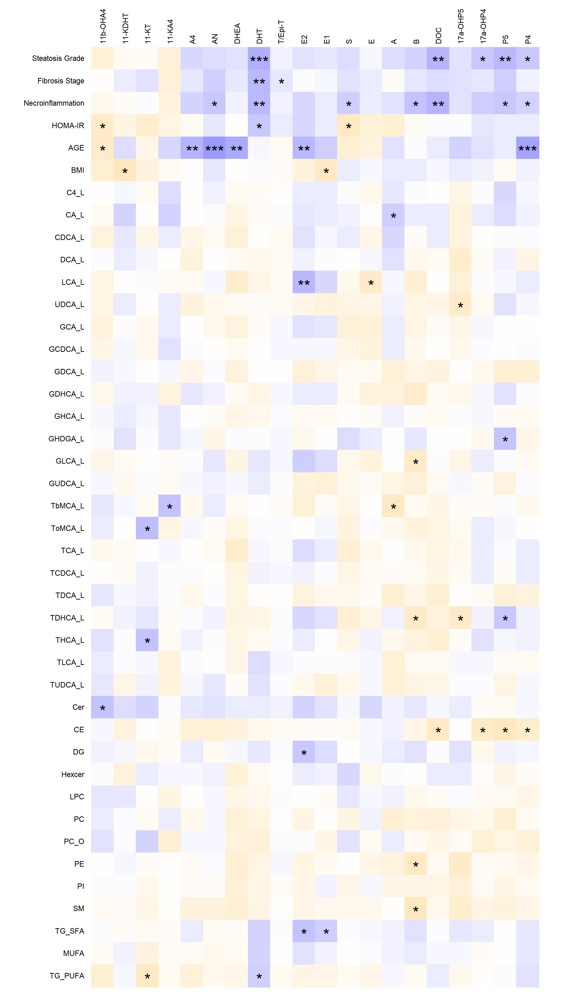

# Introduction
```{r, warning=FALSE,message=FALSE}

# Welcome to the 'steroid data analysis' webpage! 

# The procedures and explanations to make all the analysis and plots are in their individual chapters below. 
# These methods could be also easily applied to other types of data sets and metabolites than 'steroids' and their respective metadata per se. 
# In addition, there is a small 'disclaimer' also at the end of this webpage to emphasize that this site is mainly for educational purposes.
# Please let me know if you have any questions. For that, use the 'following' email: patati at the university of Turku

```


# Loading All R Packages
```{r, warning=FALSE,message=FALSE}
library(scales);library("plotrix");library(Maaslin2);  library(ggtext);library(lavaan);library(psych);library("xlsx");library(lsr);library(quantreg);library("readxl")
library(semPlot);library(mediation);require(lme4);require(reshape2);library(mlma);library(binilib);library(plyr);library("viridis");library(RColorBrewer) 
library(magrittr); library(ggplot2);library( "censReg" );library(ggsankey);library(dplyr);library(tidyverse);library(dmetar);library(meta);library(ggforestplot); 
## Warning, do not add: 'library(forestplot)'! It is not working with ggforestplot... (9.9.24)
library(mdatools);library(circlize);library(igraph);library('bigsnpr');library(rcompanion);library(scRNAseq);
library(tibble);library(stringr);library(MOFA2);library('qpgraph') 
library("grid"); library("ggplotify");library(ggpubr);library(rstatix);library(datarium);library(RColorBrewer); library(ggh4x); library(effsize)
library(chorddiag);library(corrplot);library(scater);library(mdatools);library(car);library(FSA);library(pathviewr);library(glmnet)
library("lmtest");library(PerformanceAnalytics);library(psych);library("readxl");library(ggforce);library(ComplexHeatmap);library(ragg) 
library('Hmisc');library(correlation);library(ggcorrplot);library(pheatmap);library(mgcv);library('ppcor');library(superb)
library(rmdformats);library(prettydoc);library(hrbrthemes);library(tint);library(tufte);require(remotes);library(insight);  library(magick)
library(extrafont);library(scatterplot3d); library(rgl);library(ggsankey);library(ggsankeyfier); library(daiR); library(sjPlot)


# https://require.predictiveecology.org/

```


# Setting Global Variables
```{r, warning=FALSE,message=FALSE}
thedate <- strftime(Sys.Date(),"%d%m%y")
date=paste0('tikka',thedate) # Change this...
options(scipen = 999); 
# Just in case the 'install' functions here...
# Basic installing commands, examples:
# BiocManager::install("mgcv")
# install.packages('dmetar')
# devtools::install_github("davidsjoberg/ggforestplot") #this you have to know, check google
## devtools::install_github("NightingaleHealth/ggforestplot"); devtools::install_github("mattflor/chorddiag")
# remotes::install_github("MathiasHarrer/dmetar") #this you have to know, check google
# remotes::install_version("insight", version = "0.20.5", repos = "http://cran.us.r-project.org", force=TRUE)

# https://stackoverflow.com/questions/32771517/package-cannot-be-unloaded-in-r-cannot-install-package
# font_import() # This is important if you have not loaded them before
# loadfonts(device = "win") #Same applies here.
```


# Importing Data and Metadata
```{r, warning=FALSE,message=FALSE}

#First set your data folder:
setwd("C:/Users/patati/Desktop/TurkuOW/RWork")

#Skip to the end of this section, if you have already imported and saved the data in R:

# So, loading the primary steroid data would be:
# NAFLD=read_excel("NAFLD_SteroidStudy.xlsx",sheet = "LFAT_steroidsDATA") # This is partly auxiliary
# oknames=colnames(NAFLD); NAFLD=data.frame(NAFLD)
# 
# #The names of the steroid groups need to be imported early on:
# groups=read.csv("groups_17823.csv", header = TRUE, sep=";")
# groups=groups[,c('Group','Abbreviation')]
# groups=groups[groups[,'Abbreviation']!='F',]
# groups=groups[order(groups[,'Group']),]
# groups[,'Abbreviation'][groups[,'Abbreviation']=='17aOH-P4']='17a-OHP4'
# 
# ForSteroidNames=read_excel("C:/Users/patati/Desktop/TurkuOW/RWork/NAFLD_SteroidStudy_for groups.xlsx",sheet = "Steroid name abbreviations") # This is partly auxiliary
# groups2=data.frame(ForSteroidNames)[,1:4]; g1=read.csv("C:/Users/patati/Desktop/TurkuOW/RWork/groups_17823.csv", header = TRUE, sep=";")
# groups2=cbind(g1[,'Group'], groups2[,c('Abbreviation','Abbreviation_old','Name')])
# groups2=groups2[groups2[,'Abbreviation']!='FF',]; colnames(groups2)[1]="Group";
# groups2=groups2[order(groups2[,'Group']),]
# groups2[,'Abbreviation'][groups2[,'Abbreviation']=='17aOH-P4']='17a-OHP4'
# 
# #P4 was found from elsewhere to have the following characteristics:
# NAFLD[,'P4'] = as.numeric(NAFLD[,'P4'])
# NAFLD[,'P4'][is.na(NAFLD[,'P4'])] = 22557.3330346846#median(NAFLD[,'P4'], na.rm=TRUE) 
# NAFLD[,5:7][NAFLD[,5:7]==0.01]=0; colnames(NAFLD)=oknames
# MASLD=read_excel("Combined.Matrix.For.Pauli.2023.10.17.Excel.Formatv2.xlsx") # This is the main file
# oknames=colnames(MASLD); MASLD=data.frame(MASLD); colnames(MASLD)=oknames   # All kinds of tricks are needed for getting the right data format
# rownames(MASLD)=MASLD[,1]
# MASLD[,'P4'] = as.numeric(MASLD[,'P4']) #The same comment as above
# MASLD[,'P4'][is.na(MASLD[,'P4'])] = 22557.3330346846 
# eva=c('Grade(0-3)', 'Stage(0-4)','Necroinflammation')
# MASLD[,eva][MASLD[,eva]==0.01]=0; 
# td=c('11-KDHT','AN','DHT','17a-OHP5','E2','P5','DOC')
# val=c(103,252,51,200,26.5,253,10); vale=c(100,250,50,200,25,250,10)
# for (i in 1:7) {MASLD[,td][i][MASLD[,td][i]==val[i]]=vale[i]} 
# 
# # These (E) are ok as per lab:
# ME=read.csv('E_tikka231023.csv',header=TRUE, sep=";")
# ME2=rownames(MASLD[MASLD[,'E']==106000,]) 
# to=ME[which(ME[,1] %in% ME2),'patient.number']
# te=ME[which(ME[,1] %in% ME2),'E']
# MASLD[as.character(to),'E']=te
# # These (11-KA4) will perhaps change in the lab (sometime after 24.10.23):
# M11=read.csv('11KA4_tikka231023.csv',header=TRUE, sep=";")
# # M11[,1][c(1:5,9)];MASLD[as.character(M11[,1][c(1:5,9)]),'11-KA4'] #These were denoted with 'big interference'
# MASLD[as.character(M11[,1][c(1:5,9)]),'11-KA4'] = NA #Alternatively: median(MASLD[!rownames(MASLD) %in% as.character(M11[,1][c(1:5,9)]),'11-KA4'])
# a=MASLD[order(MASLD[,'BMI']),'BMI']
# b=NAFLD[order(NAFLD[,'BMI']),'BMI']
# them=unique(b[! b %in% a])
# NAFLD=NAFLD[order(NAFLD[,'BMI']),] 
# NAFLD=NAFLD[NAFLD[,'BMI']!=them,]
# MASLD=MASLD[order(MASLD[,'BMI']),]
# #https://appsilon.com/imputation-in-r/ #https://www.datasciencemadesimple.com/get-minimum-value-of-a-column-in-r-2/?expand_article=1
# # New data import withouth changing the conames: https://readxl.tidyverse.org/articles/column-names.html
# Bali=data.frame(read_excel("Liver_bile_acids_PFAS.xlsx",sheet = "Liver_BA",.name_repair = "minimal")); row.names(Bali)=Bali[,1]
# Pfase=data.frame(read_excel("Liver_bile_acids_PFAS.xlsx",sheet = "PFAS_serum",.name_repair = "minimal")); rownames(Pfase)=as.vector(unlist(Pfase[,1]))
# Base=data.frame(read_excel("Liver_bile_acids_PFAS.xlsx",sheet = "Serum_BA",.name_repair = "minimal"));rownames(Base)=as.vector(unlist(Base[,1]))
# C4=data.frame(read_excel("Liver_bile_acids_PFAS.xlsx",sheet = "C4",.name_repair = "minimal")); rownames(C4)=as.vector(unlist(C4[,1]))
# Clini=data.frame(read_excel("Matching clinical data_all.xlsx",sheet = "Sheet1",.name_repair = "minimal")); rownames(Clini)=as.vector(unlist(Clini[,1]));
# #https://www.analyticsvidhya.com/blog/2021/06/hypothesis-testing-parametric-and-non-parametric-tests-in-statistics/
# MASLD[1:2,2:27] #or head(MASLD);
# 
# # The below ordering needs to be changed...
# Bali=Bali[as.character(MASLD$PatientNumber),];Bali[1:3,2:10] #https://stackoverflow.com/questions/54264980/r-how-to-set-row-names-attribute-as-numeric-from-character I did otherway around
# Base=Base[as.character(MASLD$PatientNumber),];#Base[1:3,2:10]
# Clini=Clini[as.character(MASLD$PatientNumber),];#Clini[1:3,2:10] # Many of these are irrelevant here... so not opening them, they would exhaust this file
# C4=C4[as.character(MASLD$PatientNumber),];#C4[1:3,]
# Pfase=Pfase[as.character(MASLD$PatientNumber),];Pfase[1:3,2:10]
# 
# # Menopause markers:
# menopause=read_excel("Putative_metabolic_markers_menopause.xlsx",sheet='menopause markers',.name_repair = "minimal"); #rownames(Clini)=as.vector(unlist(Clini[,1]));
# menopause=menopause[8:dim(menopause)[1],]; menopause=menopause[,-15]; menopause[2,2:14]=menopause[1,2:14]; menopause=data.frame(menopause); menopause[2,13:14]=c('v1','v2'); #dim(menopause)
# colnames(menopause)=c('row_names',menopause[2,2:dim(menopause)[2]]); menopause=menopause[3:dim(menopause)[1],];rownames(menopause)=as.vector(unlist(menopause[,1]));
# menopause=menopause[as.character(MASLD$PatientNumber),]
# colnames(Pfase)[colnames(Pfase)=='PFHxA.1']='PFHxA_Branched'
# Pfase=Pfase[,colnames(Pfase)!='Benzylparaben.1']
# Pfase[Pfase[,'Benzylparaben']>10,'Benzylparaben']=NA 
# 
# Jeihou=data.frame(read_excel("Copy of BA_liverfat_RawData.xls",.name_repair = "minimal")); row.names(Jeihou)=Jeihou[,1];Jeihou=Jeihou[as.character(MASLD$PatientNumber),]
# u=Jeihou[Jeihou[,'GHDGA']=='<LLOQ',1]; a=u[!is.na(u)]; b=rownames(Bali[Bali[,'GHDGA']==1,]);
# uu=Jeihou[Jeihou[,'GHDGA']=='No Result',1]; aa=uu[!is.na(uu)]; 
# Bali[as.character(a),'GHDGA']=min(Bali[,'GHDGA'],na.rm=TRUE)/2
# heps=Bali[Bali[,'GHDGA']==1,1] 
# Bali[as.character(heps),'GHDGA']=NA
# #https://www.datasciencemadesimple.com/get-minimum-value-of-a-column-in-r-2/?expand_article=1
# mat=Bali[,c('TbMCA','ToMCA','TDCA','TDHCA','TLCA')]
# mat[!mat>1]=10000
# mat[mat==2]=10000 #Colmins did not work so I used (i.e. colmins ei toiminut ja käytin):
# hip=do.call(pmin, lapply(1:nrow(mat), function(i)mat[i,])) #https://stackoverflow.com/questions/13676878/fastest-way-to-get-min-from-every-column-in-a-matrix
# hou=c('TbMCA','ToMCA','TDCA','TDHCA','TLCA')
# for (i in 1:5) {Bali[Bali[,hou[i]]==1,hou[i]]=hip[i]}
# for (i in 1:5) {Bali[Bali[,hou[i]]==2,hou[i]]=hip[i]}
# 
# # An imputation for the missing values:
# C4[is.na(C4[,2]),2]=median(C4[!is.na(C4[,2]),2]) #assuming that these were not below quantitation and replacing with median
# #https://www.geeksforgeeks.org/performing-logarithmic-computations-in-r-programming-log-log10-log1p-and-log2-functions/
# #https://stackoverflow.com/questions/50476717/i-want-to-align-match-two-unequal-columns
# 
# #Matching two unequal columns.. match the names of one original column (dat2) to ones that are missing (dat1 with to other) #Not sure if this should be this difficult...
# tv=cbind(MASLD[,1],NAFLD[,2:7],Clini[,'HOMA.IR'],MASLD[,colnames(NAFLD[,8:27])],Bali[,2:dim(Bali)[2]], C4[,2:dim(C4)[2]],Base[,2:dim(Base)[2]],Pfase[,(2:(dim(Pfase)[2]))], MASLD[,'PFAS']);
# colnames(tv)[colnames(tv)=='C4[, 2:dim(C4)[2]]']='C4';colnames(tv)[colnames(tv)=='Clini[, \"HOMA.IR\"]']='HOMA-IR'
# colnames(tv)[colnames(tv)=='MASLD[, \"PFAS\"]']='PFAS';
# colnames(tv)[colnames(tv)=="MASLD[, 1]" ]='PatientNumber';#colnames(tv)#
# rownames(tv)=unlist(Bali[,1]); 
# hep=colnames(tv)[!colnames(tv) %in% c( "Benzylparaben" ,"Methylparaben")] 
# 
# # Not sure when it is the best time to take not needed variables away, perhaps at the very end?
# tv=tv[,hep]
# # Here I add the lipids. In the future, I need to divide all the groups in their own components e.g. dataframe called 'lipids' so that adding them will be more straightforward:
# tv=cbind(tv,MASLD[,(dim(MASLD)[2]-13):dim(MASLD)[2]]) 
# # hupo=match(   colnames(tv)[colnames(tv) %in% groups2[,3]], groups2[,3] ) # do ni; https://www.geeksforgeeks.org/how-to-find-index-of-element-in-vector-in-r/
# # tvauxe=tv
# # colnames(tv)[colnames(tv) %in% groups2[,3]]=groups2[hupo,2]
# 
# 
# # The basic preprocessing is just the below lines:
# tve=tv[,2:dim(tv)[2]]; tve[tve == 0] <- NA; #Almost all variables are here
# tv_half <- tve %>% mutate(replace(., is.na(.), min(., na.rm = T)/2)) #https://mdatools.com/docs/preprocessing--autoscaling.html
# tv_half_log2 <- log2(tv_half);
# tv_auto <- prep.autoscale(as.matrix(tv_half_log2), center = TRUE, scale = TRUE);  #https://svkucheryavski.gitbooks.io/mdatools/content/preprocessing/text.html
# tv_all=cbind(tv[,1],tv_auto); 
# 
# # Changing the column names needs to have separate variables for each type of variable (contaminant, steroid, etc.)
# x1=colnames(tv_all[,c(1:8)]); v2=dim(NAFLD)[2]+1
# x2=colnames(tv_all[,9:v2]);v3=(dim(Bali)[2]+v2);x3=colnames(tv_all[,(v2+1):(v3)]);v4=(dim(Base)[2])+v3
# x4=colnames(tv_all[,(v3+1):(v4-1)]);x5=colnames(tv_all[,(v4):(dim(tv_all)[2])]); 
# x3 <- paste(x3, "_L", sep="") #https://stackoverflow.com/questions/6984796/how-to-paste-a-string-on-each-element-of-a-vector-of-strings-using-apply-in-r
# x4=gsub("(-[0-9]*)*.1", "", x4) #https://stackoverflow.com/questions/18997297/remove-ending-of-string-with-gsub
# x4 <- paste(x4, "_S", sep="")# https://rdrr.io/bioc/qpgraph/man/qpNrr.html
# x5a=x5[1:9]
# x6=x5[10:length(x5)] #Dividing to lipids
# x5=x5a  #Making sure that PFAS are separate
# nm = c(x1,x2,x3,x4,x5,x6); nm=c('PatientNumber','Gender','AGE','BMI','Steatosis Grade','Fibrosis Stage','Necroinflammation','HOMA-IR',nm[9:length(nm)])
# colnames(tv_all)=nm; #tv_all[1:5,1:30]; #NAFLD[1:2,1:28];
# colnames(tv_all)[colnames(tv_all)=='MASLD[, \"PFAS\"]']='PFAS';
# # This (deletion) is good to do after all the previous:
# x5=x5[x5!='PFAS'];x5=x5[x5!='Perfluorodecyl.ethanoic.acid']; x6=x6[x6!='Total_TG'] # x1;x2;x3;x4;x5;
# tv_all=tv_all[,!colnames(tv_all) %in% c('Total_TG','PFAS',"Perfluorodecyl.ethanoic.acid")]
# 
# # In case you would need just the logged values:
# tv_half_log22=cbind(tv[,1],tv_half_log2);
# x1=colnames(tv_half_log22[,c(1:8)]); v2=dim(NAFLD)[2]+1
# x2=colnames(tv_half_log22[,9:v2]);v3=(dim(Bali)[2]+v2);
# x3=colnames(tv_half_log22[,(v2+1):(v3)]);v4=(dim(Base)[2])+v3
# x3=x3[c(length(x3),1:(length(x3)-1))]
# x4=colnames(tv_half_log22[,(v3+1):(v4-1)]);
# x5=colnames(tv_half_log22[,(v4):(dim(tv_half_log22)[2])]);
# x3 <- paste(x3, "_L", sep="") 
# #https://stackoverflow.com/questions/6984796/how-to-paste-a-string-on-each-element-of-a-vector-of-strings-using-apply-in-r
# x4=gsub("(-[0-9]*)*.1", "", x4) #https://stackoverflow.com/questions/18997297/remove-ending-of-string-with-gsub
# x4 <- paste(x4, "_S", sep="")# https://rdrr.io/bioc/qpgraph/man/qpNrr.html
# x5a=x5[1:9]
# x6=x5[10:length(x5)] #dividing to lipids
# x5=x5a  #making sure that PFAS are separate
# nm = c(x1,x2,x3,x4,x5,x6); nm=c('PatientNumber','Gender','AGE','BMI','Steatosis Grade','Fibrosis Stage','Necroinflammation','HOMA-IR',nm[9:length(nm)])
# colnames(tv_half_log22)=nm; #tv_half_log22[1:5,1:30]; #NAFLD[1:2,1:28];
# colnames(tv_half_log22)[colnames(tv_half_log22)=='MASLD[, \"PFAS\"]']='PFAS';
# # This (deletion) is good to do after all the previous:
# x5=x5[x5!='PFAS'];x5=x5[x5!='Perfluorodecyl.ethanoic.acid']; x6=x6[x6!='Total_TG'] # x1;x2;x3;x4;x5;
# tv_half_log22=tv_half_log22[,!colnames(tv_half_log22) %in% c('Total_TG','PFAS',"Perfluorodecyl.ethanoic.acid")]
# 
# # This needs to be done early on:
# colnames(tv)[colnames(tv)=='17aOH-P4']='17a-OHP4'
# colnames(tv_half_log22)[colnames(tv_half_log22)=='17aOH-P4']='17a-OHP4'
# colnames(tv_all)[colnames(tv_all)=='17aOH-P4']='17a-OHP4'
# 
# tv_all=tv_all[,!colnames(tv_all) %in% c('Total_TG','PFAS','Perfluorodecyl.ethanoic.acid')]
# tv_all=tv_all[,!colnames(tv_all) %in% x4]
# 
# # In case you would need nonscaled covariates and scaled/logged all other variables:
# tv_covscl=tv_all
# tv_covNS=cbind(tv[,1:8],tv_all[,9:dim(tv_all)[2]])
# tv_LOG_covscl=tv_half_log22
# tv_LOG_covNS=cbind(tv[,1:8],tv_half_log22[,9:dim(tv_half_log22)[2]])
# colnames(tv_covNS)[1:8]=colnames(tv_all)[1:8]
# colnames(tv_LOG_covNS)[1:8]=colnames(tv_all)[1:8]
# # This is needed occasionally:
# tv_c=tv_covscl 
# # https://stackoverflow.com/questions/6984796/how-to-paste-a-string-on-each-element-of-a-vector-of-strings-using-apply-in-r
# # https://stackoverflow.com/questions/18997297/remove-ending-of-string-with-gsub # https://rdrr.io/bioc/qpgraph/man/qpNrr.html
# 
# hupo=match(   colnames(tv_c)[colnames(tv_c) %in% groups2[,3]], groups2[,3] ) 
# # do ni; https://www.geeksforgeeks.org/how-to-find-index-of-element-in-vector-in-r/
# tvauxe=tv_c
# colnames(tv_c)[colnames(tv_c) %in% groups2[,3]]=groups2[hupo,2]
# 
# # This needs to be done also soon, to gather all the treatment etc. variable names separately...: 
# Treatment=colnames(tv_all)[52:58];
# Mediator=colnames(tv_all)[9:28];
# Outcome=colnames(tv_all)[c(29:51,59:71)]; ##https://sparkbyexamples.com/r-programming/r-remove-from-vector-with-examples/
# 
# Outcome=Outcome[!Outcome %in% c('Total_TG','PFAS','Perfluorodecyl.ethanoic.acid')]
# Outcome=Outcome[! Outcome %in% x4] #https://sparkbyexamples.com/r-programming/r-remove-from-vector-with-examples/
# Mediator[Mediator=="17aOH-P4"]="17a-OHP4"
# Treatment=Treatment[!Treatment %in% c('Perfluorodecyl.ethanoic.acid')]

# tvauxe2=tv_LOG_covscl
# hupo=match(   colnames(tv_LOG_covscl)[colnames(tv_LOG_covscl) %in% groups2[,3]], groups2[,3] ) 
# colnames(tv_LOG_covscl)[colnames(tv_LOG_covscl) %in% groups2[,3]]=groups2[hupo,2]

# save.image('thereal.RData')

# Loading the workspace is somewhat faster:
load("thereal.RData")

```


# Making Boxplots
```{r, warning=FALSE,message=FALSE,fig.width=8.0}
#https://r-graph-gallery.com/265-grouped-boxplot-with-ggplot2.html
#https://stackoverflow.com/questions/53724834/why-does-the-plot-size-differ-between-docx-and-html-in-rmarkdownrender

boxplots=function(tvt,Group,Outcome,Out,oute,other) {
  # tvt=ie
if (Group=='Male') {tvt=tvt[tvt[,'Gender']==1,]} else if (Group=='Female') 
{tvt=tvt[tvt[,'Gender']==0,]} else if (Group=='All') {tvt=tvt}
Steroid=rep(colnames(tvt[,9:28]), each=dim(tvt)[1])
data2=rep('Control',dim(tvt)[1])
num=min(tvt[,Outcome])
if (Outcome=='HOMA-IR') {num=1.5}
data2[tvt[,Outcome]>num]='Case' #'Steatosis.Grade.0.To.3' #
Treatment=data2
note=unlist(tvt[,9:28])
Concentration=as.vector(note)
data=data.frame(Steroid, Treatment ,  Concentration)
data[,'Group'] = 0
# data$Steroid #check the Xs etc out..
data$Steroid [data$Steroid  == '17aOH-P4']='17a-OHP4'
# groups$Abbreviation[groups$Abbreviation == '17a-OHP4']='17aOH-P4'
rownames(groups2)=1:20
for (i in as.numeric(rownames(groups2))) {data[data$Steroid %in% groups2$Abbreviation[i],'Group']=groups2$Group[i]}
title = paste(Out,"'s Effect to Concentrations of Steroids", ' in ',Group,sep="")
# if (Group=='Male') {lep=theme(legend.position = "none")} else if (Group=='Female') 
# {lep=theme(legend.position = "none")} else if (Group=='All') {lep=theme_classic2()+theme(axis.text.x=element_text(angle=90,hjust=0.95,vjust=0.2,size = 14))}

lep=theme_classic2()+theme(axis.text.x=element_text(angle=90,hjust=0.95,vjust=0.2,size = 14))
# lep=theme(legend.position = "none")
if (num==1.5) {e1=paste('Case (>',num,')',sep="");e2=paste('Control (<=',num,')',sep="")} else {e1=paste('Case (>',0,')',sep="");e2=paste('Control (=',0,')',sep="")}

data=data[!is.na(data$Concentration),]
# grouped boxplot: https://stackoverflow.com/questions/32539222/group-boxplot-data-while-keeping-their-individual-x-axis-labels-in-ggplot2-in-r
p=ggplot(data, aes(x=Steroid, y=Concentration, fill=Treatment))+
geom_boxplot(notch=F, notchwidth=0.5,outlier.shape=1,outlier.size=2, coef=1.5)+
# coord_cartesian(ylim = c(0, 60000))+
theme(axis.text=element_text(color="black"))+
theme_classic2()+#https://stackoverflow.com/questions/34522732/changing-fonts-in-ggplot2
# scale_x_discrete(guide = guide_axis(angle = 90))+ https://stackoverflow.com/questions/37488075/align-axis-label-on-the-right-with-ggplot2
theme(axis.text.x=element_text(angle=90,hjust=0.95,vjust=0.2,size = 10.5))+#annotate(geom="text",family="Broadway",size=20)+#annotate(geom="text",family="Calibri",size = 14)+
theme(panel.grid.minor=element_blank())+ #http://www.sthda.com/english/wiki/ggplot2-rotate-a-graph-reverse-and-flip-the-plot
labs(size= "Type",x = "Steroids",y = "Log2 of Picomolar Concentrations ", title=title,size = 14)+ #log2 Autoscaled
scale_fill_manual(values=c("orange","blue"),name=c(oute),labels=c(e1,e2))+#abels=c("Case (>5)", "Control (=<5)"))
facet_grid(~Group, scales = "free_x", space = "free")+lep+
theme(text=element_text(size=10.5,family="Calibri"), #change font size of all text
        axis.text=element_text(size=14), #change font size of axis text
        axis.title=element_text(size=14), #change font size of axis titles
        plot.title=element_text(size=14), #change font size of plot title
        legend.text=element_text(size=14), #change font size of legend text
        legend.title=element_text(size=14))+theme(axis.text=element_text(color="black"))+stat_compare_means(hide.ns = TRUE,
        label= "p.signif",method = "wilcox.test",  symnum.args = list(cutpoints = c(0, 0.001, 0.01, 0.05, 0.1, 1), 
                           symbols = c("****", "***", "**", "*", "ns")),size=8,paired = F, label.y = 15.5) #https://github.com/kassambara/ggpubr/issues/69 
  #https://datavizpyr.com/horizontal-boxplots-with-ggplot2-in-r/
library(ragg)
path="C:/Users/patati/Documents/GitHub/new/" #oh, classical: https://forum.posit.co/t/r-markdown-html-document-doesnt-show-image/41629/2
pngfile <- fs::path(path,paste0(Group,Out,'boxiaa',".png"))#fs::path(knitr::fig_path(),  "theming2.png")
ragg::agg_png(pngfile, width = 60, height = 36, units = "cm", res = 300,scaling = 2)
# pdffile <- fs::path(path,paste0(Group,Out,'boxi',".pdf"))#fs::path(knitr::fig_path(),  "theming2.png")
# library(pdftools)
# pdftools::pdf_text(pdffile)
# pdf(file = pdffile,   # The directory you want to save the file in
    # width = 4, # The width of the plot in inches
    # height = 4) # The height of the plot in inches
#https://stackoverflow.com/questions/66429500/how-to-make-raggagg-png-device-work-with-ggsave
# pdf("plot1.pdf")
plot(p)
invisible(dev.off())
# dev.off()
knitr::include_graphics(paste0(Group,Out,'boxiaa',".png"))
# knitr::opts_chunk$set(fig.path=path)
# knitr::opts_chunk$set(dev='pdf') 
# knitr::opts_chunk$set(dev.args=list(pdf = list(family = "Helvetica", useDingbats = FALSE)))
# knitr::opts_chunk$set(fig.width=8,fig.height=6)
# daiR::image_to_pdf(paste0(Group,Out,'boxiaa',".png"), pdf_name=paste0(pngfile,'.pdf')) #https://rdrr.io/cran/daiR/man/image_to_pdf.html #this is good!
# sjPlot::save_plot(paste0(Group,Out,'boxiaa','.svg'), fig = p, width=60, height=36,dpi = 300);
# Customizing the output
# pdf(paste0(Group,Out,'boxi',"my_plot.pdf"),         # File name
#     width = 8, height = 7, # Width and height in inches
#     bg = "white",          # Background color
#     colormodel = "cmyk",    # Color model (cmyk is required for most publications)
#     paper = "A4")          # Paper size
# plot(p)
# dev.off()
}

tv_half_log22[,'11-KA4'][tv_half_log22[,'11-KA4']==min(tv_half_log22[,'11-KA4'])]=median(tv_half_log22[,'11-KA4'])
other='241024e';ie=tv_half_log22## 'Steatosis Grade','Fibrosis Stage','Necroinflammation','HOMA-IR'
hupo=match(   colnames(ie)[colnames(ie) %in% groups2[,3]], groups2[,3] ) 
colnames(ie)[colnames(ie) %in% groups2[,3]]=groups2[hupo,2]
windowsFonts(A = windowsFont("Calibri (Body)"))

# The significance levels are: '****<0.001', '***<0.01', '**<0.05', '*<0.1'
Outcome='Steatosis Grade';Out='Steatosis'; oute='Steatosis Grade';num=0;Group='All';boxplots(ie,Group,Outcome,Out,oute,other);Group='Female';boxplots(ie,Group,Outcome,Out,oute,other);Group='Male';boxplots(ie,Group,Outcome,Out,oute,other)
Outcome='Fibrosis Stage';Out='Fibrosis'; oute='Fibrosis Stage';num=0;Group='All';boxplots(ie,Group,Outcome,Out,oute,other);Group='Female';boxplots(ie,Group,Outcome,Out,oute,other);Group='Male';boxplots(ie,Group,Outcome,Out,oute,other) 
# https://www.elsevier.es/en-revista-annals-hepatology-16-articulo-assessment-hepatic-fibrosis-necroinflammation-among-S1665268119314590 #So it is in grade
Outcome='Necroinflammation';Out='Necroinflammation'; oute='Necroinflammation Grade';num=0;Group='All';boxplots(ie,Group,Outcome,Out,oute,other);Group='Female';boxplots(ie,Group,Outcome,Out,oute,other);Group='Male';boxplots(ie,Group,Outcome,Out,oute,other)
Outcome='HOMA-IR';Out='HOMA-IR'; oute='HOMA-IR';num=1.5 ;Group='All';boxplots(ie,Group,Outcome,Out,oute,other);Group='Female';boxplots(ie,Group,Outcome,Out,oute,other);Group='Male';boxplots(ie,Group,Outcome,Out,oute,other)


```


# Making Forest Plots
```{r, warning=FALSE,message=FALSE,fig.width=6.0,fig.align="left"} 

# Some further definitions are needed
NAFLD=cbind(tv[,1:28])#,tv_half_log2[,1:20])#tv[,1:28]);
NAFLD[NAFLD[,c(5)]>0,5]=1;NAFLD[NAFLD[,c(6)]>0,6]=1;NAFLD[NAFLD[,c(7)]>0,7]=1;
NAFLD[NAFLD[,c(8)] <= 1.5,8]=0;NAFLD[NAFLD[,c(8)]>1.5,8]=1; 
# You need to do this to get rid of Xs and other not recognizable for the below function:
colnames(NAFLD) <- gsub("-", ".", colnames(NAFLD))
colnames(NAFLD) <- gsub("/", ".", colnames(NAFLD))
colnames(NAFLD) <- gsub("11", "X11", colnames(NAFLD))
colnames(NAFLD) <- gsub("17", "X17", colnames(NAFLD))
colnames(NAFLD) <- gsub("#", ".", colnames(NAFLD))
colnames(NAFLD)[colnames(NAFLD)=='X17aOH.P4']='X17.aOHP4' #oh...

# This works with the autoscaled (raw if loge=1 and remove 1 in the means) data NAFLD as well...
pre_errors_2=function(NAFLD,Outcome,Group,name,ordera,oute,first,e,xlim) { # Group='Female'
  
  if (Group=='Male') {NAFLDo=NAFLD[NAFLD[,'SEX.1F.2M']==2,]} else if (Group=='Female') 
  {NAFLDo=NAFLD[NAFLD[,'SEX.1F.2M']==1,]} else if (Group=='All') {NAFLDo=NAFLD} 
  sample_data=c();n0=c();n1=c()

  for (i in 1:2) {
    if (i==1) {SG0=NAFLDo[NAFLDo[,Outcome] == 0,];n0=dim(SG0)[1]} else if (i==2) {SG0=NAFLDo[NAFLDo[,Outcome] > 0,];n1=dim(SG0)[1]}#Steatosis.Grade.0.To.3 Fibrosis.Stage.0.to.4
    #https://stats.stackexchange.com/questions/237256/is-the-shapiro-wilk-test-only-applicable-to-smaller-sample-sizes # https://statisticsbyjim.com/hypothesis-testing/nonparametric-parametric-tests/
    means=c();for (j in 9:28) {means=append(means,median(SG0[,j], na.rm=TRUE))} 
    #https://www.statology.org/mean-standard-deviation-grouped-data/ # https://amsi.org.au/ESA_Senior_Years/SeniorTopic4/4h/4h_2content_11.html # https://www.themathdoctors.org/mean-and-standard-deviation-of-grouped-data/
    sds=c();for (j in 9:28) {sds=append(sds,sd(SG0[,j],na.rm=TRUE))} #here we are... :)
    error_lower=means-sds; error_upper=means+sds; error=sds
    sample_data <- append(sample_data,data.frame(study=colnames(NAFLD[,9:28]),index=colnames(NAFLD[,9:28]),result=means,error=error))} # cate<- (str_extract(colnames(SG0[,9:28]), "[aA-zZ]+"))    #https://stackoverflow.com/questions/29825537/group-categories-in-r-according-to-first-letters-of-a-string
    # https://datatofish.com/create-dataframe-in-r/#if you know: ga=groups[,'Abbreviation']; md=metad[,'name']; unique(c(ga,md)); ga[!(ga %in% md)]; ga[ga=="17a-OHP4"]="17aOH-P4"
  # https://stackoverflow.com/questions/31518150/gsub-in-r-is-not-replacing-dot
  # http://www.sthda.com/english/wiki/unpaired-two-samples-wilcoxon-test-in-r
  # https://blogs.sas.com/content/iml/2011/04/27/log-transformations-how-to-handle-negative-data-values.html
  # https://stats.stackexchange.com/questions/155429/how-to-transform-negative-values-to-logarithms
  # https://www.ncbi.nlm.nih.gov/pmc/articles/PMC1534033/
  df=data.frame(sample_data) #
  ps=c();for (j in 9:28) {xnam <- colnames(NAFLDo)[j]; fmla <- as.formula(paste(xnam, "~",Outcome));
  ps=append(ps,wilcox.test(fmla, data = NAFLDo,exact = FALSE)$p.value)}#kruskal.test
  # http://www.sthda.com/english/wiki/unpaired-two-samples-wilcoxon-test-in-r
  # https://www.statisticshowto.com/probability-and-statistics/statistics-definitions/parametric-and-non-parametric-data/
  a=df[df[,1]==e,'result.1']/df[df[,1]==e,'result']; 
  v2=data.frame(log(df$result.1/df$result)) #this should give the right order of the variables if not the absolute change
  v2[,'result']=v2[,1];v2[,'name']=df$study;v2=v2[,2:3]
  v2[,'name'] <- gsub("\\.", "-", v2[,'name']) #https://stackoverflow.com/questions/31518150/gsub-in-r-is-not-replacing-dot
  v2[,'name'] <- gsub("X11", "11", v2[,'name'])
  v2[,'name'] <- gsub("X17", "17", v2[,'name'])
  v2[,'name'][v2[,'name']=="T-Epi-T"]="T/Epi-T"
  v2[,'pval']=ps# df2=df[rev(order(df[,'error'])),]
  # https://www.bmj.com/content/312/7038/1079.full# https://stats.stackexchange.com/questions/589920/how-can-i-back-transform-a-log-data-to-interpret-t-test-and-get-original-ci
  # https://www.biostars.org/p/16481/
  # https://whitlockschluter3e.zoology.ubc.ca/RLabs/R_tutorial_Contingency_analysis.html # https://sphweb.bumc.bu.edu/otlt/mph-modules/ep/ep713_randomerror/ep713_randomerror6.html
  # https://www.r-bloggers.com/2015/01/easy-error-propagation-in-r/# https://www.biostars.org/p/342756/ https://en.wikipedia.org/wiki/Tukey%27s_range_test 
  #https://en.wikipedia.org/wiki/Wilcoxon_signed-rank_test
  v2[,'result_pure']=(df$result.1/df$result) #case and control
  v2[,'error']=(abs((1/df$result)*df$error.1)+abs((df$result.1/df$result^2)*df$error))/dim(NAFLDo)[1]*1.64
  # This 'error' definition above is ok... it is from the Jukka Vaari 1993 Fysiikan Laboratoriotyöt  
  v2[,'error'][v2[,'error']>(median(v2[,'error'])+sd(v2[,'error']))]=median(v2[,'error'])*1.25
  v2[,'errord1a']=v2[,'result_pure']-v2[,'error']#(df$result.1-dy)/(df$result+dx)# #
  v2[,'errord2a']=v2[,'result_pure']+v2[,'error']#(df$result.1+dy)/(df$result-dx)##
  v2[,'errord1']=log(v2[,'errord1a'])
  v2[,'errord2']=log(v2[,'errord2a'])
  v2[,'result']=log(v2[,'result_pure'])
  v2[,'Control']=df$result
  v2[,'Case']=df$result.1 #
  #https://stackoverflow.com/questions/31518150/gsub-in-r-is-not-replacing-dot

  v2[,'pval0']=v2[,'pval']
  v2[,'pval1']=v2[,'pval']
  v2[,'Significance0']= v2[,'pval0']<0.1#
  v2[,'Significance0'][v2[,'Significance0']==TRUE]='Yes'
  v2[,'Significance0'][v2[,'Significance0']==FALSE]='No'
  v2[,'Color0']=v2[,'pval0'] < 0.1#(v2[,case1]  < 1 & v2[,case2] < 1) | (v2[,case1]  >= 1 & v2[,case2] >= 1)
  v2[,'Color0'][v2[,'Color0']==TRUE]='blue'
  v2[,'Color0'][v2[,'Color0']==FALSE]='grey'
  v2[,'Significance1']= v2[,'pval1']<0.1#(v2[,case1]  < 1 & v2[,case2] < 1) | (v2[,case1]  >= 1 & v2[,case2] >= 1)
  v2[,'Significance1'][v2[,'Significance1']==TRUE]='Yes'
  v2[,'Significance1'][v2[,'Significance1']==FALSE]='No'
  v2[,'Color1']=v2[,'pval1'] < 0.1#(v2[,case1]  < 1 & v2[,case2] < 1) | (v2[,case1]  >= 1 & v2[,case2] >= 1)
  v2[,'Color1'][v2[,'Color1']==TRUE]='blue'
  v2[,'Color1'][v2[,'Color1']==FALSE]='grey'

  gn=groups[,c('Group','Abbreviation')]
  gn=gn[gn[,'Abbreviation']!='F',]
  gn=gn[order(data.frame(gn[,'Abbreviation'])[,1]),]
  v2=v2[order(v2[,'name']),]
  v2=cbind(v2,gn[order(data.frame(gn[,'Abbreviation'])[,1]),])
  v2=v2[rev(order(v2[,'result'])),]

  xlab = "Autoscaled Concentrations (SE)" #xlab = "Raw Concentrations in Log10 Scale (SE)"}
  xlim=c(min(v2$errord1),max(v2$errord2)) #Occasionally: xlim=c(min(v2$result)*1.1,max(v2$result)*1.1) # if (xlim[2]>1) {xlim[2]=1};# if (xlim[1] < -0.75) {xlim[1]=-0.75};
  
  # Below wex, has been done already:
  # plote2=forestplot(df = v2, #drive tba_example_v3_oh_tikka17823.R if not working via 'x' error #coef, #
  #                   estimate = result,
  #                   se=0,#abs(errord1-errord2)/4, #sterr,##this makes the significant value:
  #                   pvalue = pval1,psignif = 0.1,
  #                   xlim=xlim, xlab = 'Logged Ratio between Raw Concentrations of Case and Control with 90% CI',ylab='Steroid Groups',
  #                   title='',colour = Significance1 ) +#,colour = Significance
  #   ggforce::facet_col(facets = ~Group,scales = "free_y",space = "free", strip.position='left')+
  # geom_errorbarh(aes(xmin = errord1, xmax = errord2,height = .0,colour=Significance1));#plote2
  # 
  # if (sum(v2[,'Significance1']=='Yes')==20) {hp=c('blue','blue')} else {hp=c('#999999','blue')};#plote2
  # if (Group=='All' & first==TRUE) {ordera=v2$name[order(v2$result)]; #
  # plote2[["data"]][["name"]]=factor(plote2[["data"]][["name"]], levels = ordera)} else if
  # (Group=='All' & first==FALSE) {plote2[["data"]][["name"]]=factor(plote2[["data"]][["name"]], levels = ordera)} else if
  # (Group=='Female') {plote2[["data"]][["name"]]=factor(plote2[["data"]][["name"]], levels = ordera)} else if
  # (Group=='Male') {plote2[["data"]][["name"]]=factor(plote2[["data"]][["name"]], levels = ordera)}
  # #https://www.r-bloggers.com/2020/03/how-to-standardize-group-colors-in-data-visualizations-in-r/
  # plote2$layers[[1]]$aes_params$odd <- "#00000000" #https://stackoverflow.com/questions/71745719/how-to-control-stripe-transparency-using-ggforestplot-geom-stripes
  # v2$Group2=v2$Group
  # v2 <- transform(v2,Group2 = as.numeric(as.factor(Group2)))
  # v2$facet_fill_color <- c("red", "green", "blue", "yellow", "brown")[v2$Group2]
  # jopon=plote2  +theme(axis.text.y=element_blank()) +theme_classic2();   #theme(axis.text.y = element_text(lineheight=.05));
  # jopon2=jopon+geom_point(aes(colour = factor(Significance1)),colour = v2[,'Color1']) +
  #   scale_color_manual(values=hp)+theme(legend.position = "none")+theme(strip.text.y = element_text(size=-Inf)) #ggtext::element_markdown(size = 12)
  # # https://stackoverflow.com/questions/10547487/remove-facet-wrap-labels-completely
  # g <- ggplot_gtable(ggplot_build(jopon2))
  # stripr <- which(grepl('strip-l', g$layout$name)); fills <- c("red","green","blue","yellow",'brown'); k <- 1;
  # for (i in stripr) {j <- which(grepl('rect', g$grobs[[i]]$grobs[[1]]$childrenOrder))
  #   g$grobs[[i]]$grobs[[1]]$children[[j]]$gp$fill <- fills[k]; k <- k+1}
  # grid::grid.draw(g)
  # https://stackoverflow.com/questions/24169675/multiple-colors-in-a-facet-strip-background-in-ggplot
  # http://www.sthda.com/english/wiki/ggplot2-axis-scales-and-transformations
  # https://www.statology.org/geom_point-fill/
  # https://stackoverflow.com/questions/62093084/set-geom-vline-line-types-and-sizes-with-aes-mapping-in-ggplot2
  # https://en.wikipedia.org/wiki/Standard_error
  # This has been already done:
  # jpeg(paste(name ,"divi.jpg"), width = 7500, height = 11000, quality = 100,pointsize = 16, res=1000); print(grid::grid.draw(g));dev.off();
  # daiR::image_to_pdf(paste(name ,"divi.jpg"), pdf_name=paste0(paste(name ,"divi.jpg"),'.pdf'))#https://rdrr.io/cran/daiR/man/image_to_pdf.html #this is good!
  # sjPlot::save_plot(paste0(Group,Out,'boxi','.svg'), fig = paste(name ,"divi.jpg"), width=41, height=60,dpi = 1000);
  # my_image <- image_read(paste(name ,"divi.jpg"));my_svg <- image_convert(my_image, format="svg"); image_write(my_svg, paste(name ,"divi.svg"))

  return(ordera) #If you do not want to have 'null' to the Rmarkdown/html take this away
  } 


# This is with first(!!). Use it. 
# Outcome='Steatosis.Grade.0.To.3';Out='Steatosis'; oute='Steatosis';first=TRUE; e='P4';ordera=c();
Group='All';name1=paste("Forest plot of",Group, "Steroid Ratios in",Out);
# hel=pre_errors_2(NAFLD,Outcome,Group,name1,ordera,oute,first,e,xlim)
# #Afterwards:
# first=FALSE;
Group='Female';name2=paste("Forest plot of",Group, "Steroid Ratios in",Out);
# pre_errors_2(NAFLD,Outcome,Group,name2,ordera=hel,oute,first,e,xlim)
Group='Male'; name3=paste("Forest plot of",Group, "Steroid Ratios in",Out);
# pre_errors_2(NAFLD,Outcome,Group,name3,ordera=hel,oute,first,e,xlim)
# 
# Outcome='Fibrosis.Stage.0.to.4'; Out='Fibrosis';oute='Fibrosis';
Group='All'; name4=paste("Forest plot of",Group, "Steroid Ratios in",Out);
# pre_errors_2(NAFLD,Outcome,Group,name4,ordera=hel,oute,first,e,xlim)
Group='Female';name5=paste("Forest plot of",Group, "Steroid Ratios in",Out);
# pre_errors_2(NAFLD,Outcome,Group,name5,ordera=hel,oute,first,e,xlim)
Group='Male'; name6=paste("Forest plot of",Group, "Steroid Ratios in",Out);
# pre_errors_2(NAFLD,Outcome,Group,name6,ordera=hel,oute,first,e,xlim)
# 
# Outcome='Necroinflammation'; Out='Necroinflammation';oute='Necroinflammation';
Group='All'; name7=paste("Forest plot of",Group, "Steroid Ratios in",Out); 
# pre_errors_2(NAFLD,Outcome,Group,name7,ordera=hel,oute,first,e,xlim) #not the very first though...
Group='Female';name8=paste("Forest plot of",Group, "Steroid Ratios in",Out);
# pre_errors_2(NAFLD,Outcome,Group,name8,ordera=hel,oute,first,e,xlim)
Group='Male'; name9=paste("Forest plot of",Group, "Steroid Ratios in",Out); 
# pre_errors_2(NAFLD,Outcome,Group,name9,ordera=hel,oute,first,e,xlim)
# 
# Outcome='HOMA.IR';Out='HOMA-IR';oute='HOMAIR';
Group='All';name10=paste("Forest plot of",Group, "Steroid Ratios in",Out);
# pre_errors_2(NAFLD,Outcome,Group,name10,ordera=hel,oute,first,e,xlim) #not the very first though...
Group='Female';name11=paste("Forest plot of",Group, "Steroid Ratios in",Out); 
# pre_errors_2(NAFLD,Outcome,Group,name11,ordera=hel,oute,first,e,xlim)
Group='Male'; name12=paste("Forest plot of",Group, "Steroid Ratios in",Out); 
# pre_errors_2(NAFLD,Outcome,Group,name12,ordera=hel,oute,first,e,xlim)

```

```{r,echo=FALSE, out.width="25%",fig.cap=name1,fig.align="left"}
path="C:/Users/patati/Documents/GitHub/new/"; knitr::include_graphics(paste0(path,paste(name1 ,"divi.jpg")))
```
```{r,echo=FALSE, out.width="25%",fig.cap=name2,fig.align="left"}
path="C:/Users/patati/Documents/GitHub/new/"; knitr::include_graphics(paste0(path,paste(name2 ,"divi.jpg")))
```
```{r,echo=FALSE, out.width="25%",fig.cap=name3,fig.align="left"}
path="C:/Users/patati/Documents/GitHub/new/"; knitr::include_graphics(paste0(path,paste(name3 ,"divi.jpg")))
```
```{r,echo=FALSE, out.width="25%",fig.cap=name4,fig.align="left"}
path="C:/Users/patati/Documents/GitHub/new/"; knitr::include_graphics(paste0(path,paste(name4 ,"divi.jpg")))
```
```{r,echo=FALSE, out.width="25%",fig.cap=name5,fig.align="left"}
path="C:/Users/patati/Documents/GitHub/new/"; knitr::include_graphics(paste0(path,paste(name5 ,"divi.jpg")))
```
```{r,echo=FALSE, out.width="25%",fig.cap=name6,fig.align="left"}
path="C:/Users/patati/Documents/GitHub/new/"; knitr::include_graphics(paste0(path,paste(name6 ,"divi.jpg")))
```
```{r,echo=FALSE, out.width="25%",fig.cap=name7,fig.align="left",echo=FALSE,eval = FALSE }
path="C:/Users/patati/Documents/GitHub/new/"; knitr::include_graphics(paste0(path,paste(name7 ,"divi.jpg")))
```
```{r,echo=FALSE, out.width="25%",fig.cap=name8,fig.align="left",echo=FALSE,eval = FALSE }
path="C:/Users/patati/Documents/GitHub/new/"; knitr::include_graphics(paste0(path,paste(name8 ,"divi.jpg")))
```
```{r,echo=FALSE, out.width="25%",fig.cap=name9,fig.align="left",echo=FALSE,eval = FALSE }
path="C:/Users/patati/Documents/GitHub/new/"; knitr::include_graphics(paste0(path,paste(name9 ,"divi.jpg")))
```
```{r,echo=FALSE, out.width="25%",fig.cap=name10,fig.align="left",echo=FALSE,eval = FALSE }
path="C:/Users/patati/Documents/GitHub/new/"; knitr::include_graphics(paste0(path,paste(name10 ,"divi.jpg")))
```
```{r,echo=FALSE, out.width="25%",fig.cap=name11,fig.align="left",echo=FALSE,eval = FALSE }
path="C:/Users/patati/Documents/GitHub/new/"; knitr::include_graphics(paste0(path,paste(name11 ,"divi.jpg")))
```
```{r,echo=FALSE, out.width="25%",fig.cap=name12,fig.align="left",echo=FALSE,eval = FALSE }
path="C:/Users/patati/Documents/GitHub/new/"; knitr::include_graphics(paste0(path,paste(name12 ,"divi.jpg")))
```


# Making Chord Diagrams 
```{r, warning=FALSE,message=FALSE,fig.width=9.0,fig.align="left"}
# First the correlations for the chord diagrams (both male and female as well as total subjects):

tv_c=tvauxe

hupo=match(   colnames(tv_c)[colnames(tv_c) %in% groups2[,3]], groups2[,3] ) 
# do ni; https://www.geeksforgeeks.org/how-to-find-index-of-element-in-vector-in-r/
# tvauxe=tv_c
colnames(tv_c)[colnames(tv_c) %in% groups2[,3]]=groups2[hupo,2]
ok=colnames(tv_c)

tv_c=data.frame(tv_c); #colnames(tv_c)=colnames(tv_covscl)
tv_c=tv_c[,!colnames(tv_c) %in% c('Total_TG','PFAS',"Perfluorodecyl.ethanoic.acid")]
tvf=tv_c[tv_c[,'Gender']==min(tv_c[,'Gender']),1:dim(tv_c)[2]]
tvm=tv_c[tv_c[,'Gender']==max(tv_c[,'Gender']),1:dim(tv_c)[2]]

tvtest=list(tv_c,tvf,tvm)
for (i in 1:3) {colnames(tvtest[[i]]) <- gsub("\\.", "-", colnames(tvtest[[i]]))
colnames(tvtest[[i]]) <- gsub("X11", "11", colnames(tvtest[[i]]))
colnames(tvtest[[i]]) <- gsub("X17", "17", colnames(tvtest[[i]]))
colnames(tvtest[[i]])[colnames(tvtest[[i]])=="T-Epi-T"]="T/Epi-T"
colnames(tvtest[[i]])[colnames(tvtest[[i]])=="Steatosis-Grade"]="Steatosis Grade"
colnames(tvtest[[i]])[colnames(tvtest[[i]])=="Fibrosis-Stage"]="Fibrosis Stage"
colnames(tvtest[[i]])[colnames(tvtest[[i]])=="17aOH-P4"]="17a-OHP4"
colnames(tvtest[[i]])[colnames(tvtest[[i]])=="HOMA IR"]="HOMA-IR"}
tv_c=tvtest[[1]]; tvf=tvtest[[2]]; tvm=tvtest[[3]];
x4[x4=="X7.oxo.DCA_S"]="X7-oxo-DCA_S"

dat = tv_c;dat= dat %>% select(-c('PatientNumber'))  #this is quite nice way to delete columns, please remember...
resulta <- (rcorr(as.matrix(dat), type = c('spearman')))$r #compare pearson # intersect(colnames(resulta), rownames(resulta)) 
colnames(resulta)=ok[2:dim(tv_c)[2]];rownames(resulta)=ok[2:dim(tv_c)[2]];
#https://stackoverflow.com/questions/45271448/r-finding-intersection-between-two-vectors

dat=tvf; dat= dat %>% select(-c('PatientNumber','Gender')) #this is quite nice way to delete columns, please remember...
resultaf <- (rcorr(as.matrix(dat), type = c('spearman')))$r;
colnames(resultaf)=ok[3:dim(tv_c)[2]];rownames(resultaf)=ok[3:dim(tv_c)[2]];

dat=tvm; dat= dat %>% select(-c('PatientNumber','Gender')) #this is quite nice way to delete columns, please remember...
resultam <- (rcorr(as.matrix(dat), type = c('spearman')))$r #
colnames(resultam)=ok[3:dim(tv_c)[2]];rownames(resultam)=ok[3:dim(tv_c)[2]];


#Check the columns away
at=colnames(resulta)[1:(length(x1)-1)] #clinicals
bt=colnames(resulta)[(length(at)+1):(length(at)+length(x2))] #Steroids
ct=colnames(resulta)[(length(at)+length(bt)+1):(length(at)+length(bt)+length(x3))] #BA_l
dt=colnames(resulta)[(length(at)+length(bt)+length(ct)+1):(length(at)+length(bt)+length(ct)+length(x4))] #BA_s
et=colnames(resulta)[(length(at)+length(bt)+length(ct)+length(dt)+1):(length(at)+length(bt)+length(ct)+length(dt)+length(x5))] #PFAS: change here
ft=colnames(resulta)[(length(at)+length(bt)+length(ct)+length(dt)+length(et)+1):(length(at)+length(bt)+length(ct)+length(dt)+length(et)+length(x6))] #
atl=length(at);btl=length(bt);ctl=length(ct);dtl=length(dt);etl=length(et);ftl=length(ft)

n_level=0.2; ## muuta tätä, # hist(as.numeric(Nrr)) #https://www.geeksforgeeks.org/elementwise-matrix-multiplication-in-r/

Nrr=qpNrr(resulta, verbose=FALSE);Nrr[is.na(Nrr)]=1; cond=data.frame(as.matrix(Nrr<n_level));RN=data.frame(resulta);tes_t=cond*RN;tes_t=as.matrix(tes_t);resulta=tes_t 
Nrr=qpNrr(resultaf, verbose=FALSE);Nrr[is.na(Nrr)]=1;cond=data.frame(as.matrix(Nrr<n_level));RN=data.frame(resultaf);tes_t=cond*RN;tes_t=as.matrix(tes_t);resultaf=tes_t
Nrr=qpNrr(resultam, verbose=FALSE);Nrr[is.na(Nrr)]=1;cond=data.frame(as.matrix(Nrr<n_level));RN=data.frame(resultam);tes_t=cond*RN;tes_t=as.matrix(tes_t);resultam=tes_t

colnames(resulta)[colnames(resulta) == 'Gender'] <- 'Sex(F-M+)';rownames(resulta)[rownames(resulta) == 'Gender'] <- 'Sex(F-M+)'
# colnames(resultaf)[colnames(resultaf) == 'Gender'] <- 'Sex(F-M+)';rownames(resultaf)[rownames(resultaf) == 'Gender'] <- 'Sex(F-M+)'
# colnames(resultam)[colnames(resultam) == 'Gender'] <- 'Sex(F-M+)';rownames(resultam)[rownames(resultam) == 'Gender'] <- 'Sex(F-M+)'
# 
colnames(resulta)[2:dim(resulta)[2]]=ok[3:dim(tv_c)[2]];rownames(resulta)[2:dim(resulta)[2]]=ok[3:dim(tv_c)[2]]; #joo ei näy monet condeista 0.01:llä: resulta[,4:7]
colnames(resultaf)[2:dim(resultaf)[2]]=ok[4:dim(tv_c)[2]];rownames(resultaf)[2:dim(resultaf)[2]]=ok[4:dim(tv_c)[2]];
colnames(resultam)[2:dim(resultam)[2]]=ok[4:dim(tv_c)[2]];rownames(resultam)[2:dim(resultam)[2]]=ok[4:dim(tv_c)[2]];
# # 

#FYI:  data.frame(words = unlist(colnames(resulta)))
#https://stackoverflow.com/questions/32834067/how-to-split-a-text-document-or-string-of-text-in-r-so-that-each-word-is-its-o
# colnames(resultaf)=colnames(tv_c)[3:dim(tv_c)[2]];rownames(resultaf)=colnames(tv_c)[3:dim(tv_c)[2]]; 
# colnames(resultam)=colnames(tv_c)[3:dim(tv_c)[2]];rownames(resultam)=colnames(tv_c)[3:dim(tv_c)[2]]; 

#And then using a function for making the female and male chord and all subjects' diagrams... 
#This function takes elements from: 
# https://jokergoo.github.io/circlize_book/book/advanced-layout.html#combine-circular-plots
# https://stackoverflow.com/questions/31943102/rotate-labels-in-a-chorddiagram-r-circlize
# https://jokergoo.github.io/circlize_book/book/the-chorddiagram-function.html#orders-of-links

group_chords=function(vars,n_level,fig_name, big,rem,modi,colt,gend,colors,a,b,c,d,e,f) {
  
  classes=5;
  tot=rownames(resulta)[2:dim(resulta)[1]];
  range=1:(a+b+c+e+f)
  layout(matrix(1:1, 1, 1)); 
  title='Sex'#
  genders= gend 
  windowsFonts(A = windowsFont("Calibri (Body)")) 
  i=1
  tes_t=vars #vars[[1]]
  if (gend=='All') {colnames(tes_t)=rownames(resulta);rownames(tes_t)=rownames(resulta)} else {colnames(tes_t)=rownames(resultaf);rownames(tes_t)=rownames(resultaf)}
  
  g1=c(rep('Clinical', a),rep('Steroids', b), rep('BA_liver', c),rep('Contaminants', e),rep('Lipids', f)) #rep('BA_serum', d)
  
  # removing self-correlation; 
  tes_t[1:a,1:a]=0
  tes_t[(a+1):(a+b),(a+1):(a+b)]=0
  tes_t[(a+b+1):(a+b+c),(a+b+1):(a+b+c)]=0
  tes_t[(a+b+c+1):(a+b+c+e),(a+b+c+1):(a+b+c+e)]=0
  tes_t[(a+b+c+e+1):(a+b+c+e+f),(a+b+c+e+1):(a+b+c+e+f)]=0 #if you have more groups... make this automatic, now it is not (18.1.24), yes:
  # https://jokergoo.github.io/circlize_book/book/the-chorddiagram-function.html#orders-of-links 
  
  
  group = structure(g1, names = colnames(tes_t));#group
  grid.col = structure(c(rep('#93c29f', a),rep('#a83277', b), rep('red', c),  rep('grey', e), rep('black', f)),
                       # c(rep('blue', a),rep('red', b), rep('green', c),  rep('orange', e), rep('#756BB1', f)),
                       #(c(rep('#3283a8', a),rep('#a83277', b), rep('#a86932', c),  rep('#32a898', e), rep('#756BB1', f)), 
                       names = rownames(tes_t)); ##https://www.datanovia.com/en/blog/top-r-color-palettes-to-know-for-great-data-visualization/ 
  # insert 'color hex' in google
  
  tes_t=tes_t[range,range];grid.col = grid.col[range] #tes_t=resulta
  g <- graph.adjacency(tes_t, mode="upper", weighted=TRUE, diag=FALSE)
  e <- get.edgelist(g); df <- as.data.frame(cbind(e,E(g)$weight)); #
  df[,3]=as.numeric(df[, 3])
  
  # Edge.Thickness <- (abs(Correlation.Strength) * Thickness.Multiplier)
  
  # rango <- function(x){((x-min(x))/(max(x)-min(x)))*2-1} #just a function for the -1 to 1 thing..
  rango <- function(x){((x-min(x))/(max(x)-min(x)))*2} #just a function for the -1 to 1 thing..
  # if (gend=='All') {col_fun = colorRamp2(c(-0.8, 0, 0.8), c("blue",'white', "orange"))} else {col_fun = colorRamp2(c(-1, 0,1), c("blue",'white', "orange"))} #
  col_fun=colorRamp2(c(-1, 0,1), c("blue",'white', "orange"),transparency = 0.25)
  # col_fun = colorRamp2(range(mat), c("#FFEEEE", "#FF0000"), transparency = 0.5)
  # if (gend=='All') {col_fun = colorRamp2(c(min(df$V3), 0,max(df$V3)), c("blue",'white', "orange"))} else {col_fun = colorRamp2(c(min(df$V3), 0,max(df$V3)), c("blue",'white', "orange"))}
  df=df[!df$V1 %in% rem,];df=df[!df$V2 %in% rem,] #e.g.rem=x4
  # df$V3=rango(df$V3);
  
  
  # for (i in 1:2) {
  # df[,i]=  gsub("\\.", "-", df[,i])
  # df[,i] <- gsub("X11", "11", df[,i])
  # df[,i] <- gsub("X17", "17", df[,i]); df[,i][df[,i]=="T-Epi-T"]="T/Epi-T"
  # df[,i][df[,i]=="Steatosis.Grade"]="Steatosis Grade"
  # df[,i][df[,i]=="Steatosis-Grade"]="Steatosis Grade"
  # df[,i][df[,i]=="Fibrosis.Stage"]="Fibrosis Stage"
  # df[,i][df[,i]=="Fibrosis-Stage"]="Fibrosis Stage"
  # df[,i][df[,i]=="17aOH.P4"]="17a-OHP4"
  # df[,i][df[,i]=="HOMA.IR"]="HOMA-IR"
  # # df[,i][df[,i]=="Gender"]="Sex"
  
  # }
  
  classes=modi #modi=4
  namesh=unique(g1)    #[c(1:6)[1:6 != modi]];
  cola=unique(grid.col)#[c(1:6)[1:6 != modi]]
  
  if (gend=='All') {
  ccu=df[,3] > 0.2
  ccu2=df[,3] < -0.2
  cx=ccu | ccu2} else {
     ccu=df[,3] > 0.25
  ccu2=df[,3] < -0.25
  cx=ccu | ccu2}

  lgd_group = Legend(at = gend, type = "points", legend_gp = gpar(col = colors),  title_position = "topleft", title = title)

  lgd_points = Legend(at = namesh, type = "points", legend_gp = gpar(col = cola), title_position = "topleft", title = "Class")
  lgd_lines = Legend(at = c("Positive", "Negative"), type = "points", legend_gp = gpar(col = c('orange','blue')), title_position = "topleft", title = "Correlation")
  lgd_edges= Legend(at = c(-1,1), col_fun = col_fun,  title_position = "topleft", title = "Edges") #lgd_edges= Legend(at = c(round(min(df$V3),1), round(max(df$V3),1)), col_fun = col_fun,  title_position = "topleft", title = "Edges")
  lgd_list_vertical = packLegend(lgd_group,lgd_points,  lgd_lines,lgd_edges) #lgd_lines,
  circos.par(gap.after = 1.5,start.degree = 90) #https://jokergoo.github.io/circlize_book/book/the-chorddiagram-function.html
    chordDiagram(df, annotationTrack = c("grid"),  grid.col=grid.col, directional = FALSE,symmetric = TRUE, scale=FALSE, #link.decreasing = FALSE,
                 link.lwd = 0.3, link.border = "white",
                 # link.arr.width=abs(df[,3])*rango(df[,3])*50, #this is for arrows
                 order = rownames(tes_t), preAllocateTracks = 1, col = col_fun,transparency = 0.25,big.gap = 10, small.gap = 1) #link.zindex = rank(df[,3]), link.visible = cx)
    circos.trackPlotRegion(track.index = 1, panel.fun = function(x, y) {
      xlim = get.cell.meta.data("xlim"); ylim = get.cell.meta.data("ylim")
      sector.name = get.cell.meta.data("sector.index")
      circos.text(mean(xlim), ylim[1] + .1, sector.name, facing = "clockwise", niceFacing = TRUE, adj = c(0, 0.5))
      circos.axis(h = "top", labels.cex = 0.000001, major.tick.length = 0.2, sector.index = sector.name, track.index = 2)}, bg.border = NA) #https://stackoverflow.com/questions/31943102/rotate-labels-in-a-chorddiagram-r-circlize
    windowsFonts(A = windowsFont("Calibri (Body)"))
    draw(lgd_list_vertical, x = unit(5, "mm"), y = unit(5, "mm"), just = c("left", "bottom"))#}
  # These ten above lines have been already done, and now just show separately
  dev.copy(jpeg,paste0(gend,n_level,'hiee.jpg'),width=10.5, height=12, units="in", res=1000);dev.off() # This is already done

knitr::include_graphics(paste0(gend,n_level,'hiee.jpg'))
daiR::image_to_pdf(paste0(gend,n_level,'hiee.jpg'), pdf_name=paste0(paste0(gend,n_level,'hie'),'.pdf')) #https://rdrr.io/cran/daiR/man/image_to_pdf.html #this is good!
# sjPlot::save_plot(paste0(gend,n_level,'hiee.jpg'), fig = p, width=9*2.54, height=12*2.54,dpi = 1000); #inch is 2.54cm
my_image <- image_read(paste0(gend,n_level,'hiee.jpg'));my_svg <- image_convert(my_image, format="svg"); image_write(my_svg, paste(paste0(gend,n_level,'hie.jpg') ,".svg"))


}

# All variables
n_level=0.2; circos.clear(); vars=list(resulta)
big='Yes';title='All Variables' # 
rem=x4; modi=5; colt='black'
a=length(x1)-1;b=length(x2);c=length(x3);d=length(x4);e=length(x5);f=length(x6);#Check inside function
gend=c('All');colors=c('blue');
group_chords(vars[[1]],n_level,fig_name,big,rem,modi,colt,gend,colors,a,b,c,d,e,f) #this drives the function
# https://jokergoo.github.io/circlize_book/book/the-chorddiagram-function.html#orders-of-links

# Genderwise:
vars=list(resultaf,resultam); #
big='No';title='Genders Separated'; #or 'Yes'  for the big plot alone
rem=x4; modi=4; colt='black';colors=c('white','black');#rem=x3; modi=5; colt='green';
a=length(x1)-2;b=length(x2);c=length(x3);
d=length(x4);e=length(x5);f=length(x6);#Check inside function
gend=c('Female');colors=c('white');group_chords(vars[[1]],n_level,fig_name,big,rem,modi,colt,gend,colors,a,b,c,d,e,f) #
gend=c('Male');colors=c('black');group_chords(vars[[2]],n_level,fig_name,big,rem,modi,colt,gend,colors,a,b,c,d,e,f) #


```


# Making Variance Explained Plots
```{r, warning=FALSE,message=FALSE,fig.width=6.0,fig.align="left"}
# This is it! https://bioconductor.org/packages/release/bioc/vignettes/scater/inst/doc/overview.html
# or
# https://stats.stackexchange.com/questions/79399/calculate-variance-explained-by-each-predictor-in-multiple-regression-using-r
# https://rdrr.io/github/MRCIEU/TwoSampleMR/man/get_r_from_pn.html
# https://onlinestatbook.com/2/effect_size/variance_explained.html
# https://stackoverflow.com/questions/10441437/why-am-i-getting-x-in-my-column-names-when-reading-a-data-frame
# https://stackoverflow.com/questions/27044727/removing-characters-from-string-in-r

varex_groups_plot=function(tv_all2,Group) { # if (Group=='Female') {cond=tv_all[,'Gender']==1} else if 
an.error.occured=FALSE
tv_all2=tv_all
tryCatch( { tv_all2[,'Gender'] }, error = function(e) {an.error.occured <<- TRUE})
if(an.error.occured) {if (Group=='female') {cond=tv_all2[,'SEX.1F.2M']==min(tv_all2[,'SEX.1F.2M'])} else if (Group=='male') 
  {cond=tv_all2[,'SEX.1F.2M']==max(tv_all2[,'SEX.1F.2M'])} else if (Group=='All'){cond=rep(TRUE,dim(tv_all2)[1])}} else {
if (Group=='female') {cond=tv_all2[,'Gender']==min(tv_all2[,'Gender'])} else if (Group=='male') {cond=tv_all2[,'Gender']==max(tv_all2[,'Gender'])} else if (Group=='All')
{cond=rep(TRUE,dim(tv_all2)[1])}}
tv_red=c(); tv_red=tv_all2[cond,]   
hep=tv_red
colnames(hep)[1:8]=colnames(tv_red)[1:8]
tv2=t(hep[,9:dim(tv_red)[2]])
sce=SingleCellExperiment(tv2)
logcounts(sce)=tv2
sce@colData=DataFrame(hep[,2:8]) #it is DataFrame with big Ds and Fs
names(colData(sce))=colnames(tv_all)[2:8]
names(colData(sce))[1]='The Gender'
vars <- getVarianceExplained(sce,variables=names(colData(sce))[1:7]);colVars(vars)
windowsFonts(A = windowsFont("Calibri (Body)"))
mypalette <- scales::hue_pal()(ncol(colData(sce)))
names(mypalette) <- colnames(tv_all)[2:8]
if (Group!='All') {vars=vars[,2:7]}
p=plotExplanatoryVariables(vars)+theme(text=element_text(size=25,family="Calibri"))+theme(axis.text=element_text(size=20,family="Calibri"))#https://scales.arabpsychology.com/stats/how-to-change-font-size-in-ggplot2/
# Nans and the levels are problems for consistent colors in the plot:
p[[1]]=p[[1]][!is.na(p[[1]][,1]),]; p[[1]][,1]=as.vector(unlist(p[[1]][,1])) #uh huh... # p[[1]][,'Expl_Var']=droplevels(p[[1]][,'Expl_Var'])
p[[1]]=p[[1]][order(p[[1]][,1]),]

library(ragg)
# Oh! https://www.tidyverse.org/blog/2020/08/taking-control-of-plot-scaling/
# https://r4ds.had.co.nz/graphics-for-communication.html#figure-sizing
path="C:/Users/patati/Documents/GitHub/new/" #oh, classical: https://forum.posit.co/t/r-markdown-html-document-doesnt-show-image/41629/2
sips=paste0(Group,'vex',".png")
pngfile <- fs::path(path,sips)#fs::path(knitr::fig_path(),  "theming2.png")
agg_png(pngfile, width = 60, height = 36, units = "cm", res = 300,scaling = 2)
plot(p)
invisible(dev.off())
knitr::include_graphics(pngfile)
# daiR::image_to_pdf(sips, pdf_name=paste0(sips,'.pdf')) #https://rdrr.io/cran/daiR/man/image_to_pdf.html #this is good!
# sjPlot::save_plot(paste0(sips,".svg"), fig = p, width=60, height=36,dpi = 300); #inch is 2.54cm
# my_image <- image_read(sips);my_svg <- image_convert(my_image, format="svg"); image_write(my_svg, paste(sips,".svg"))

}

# I'll be using the tv_all (logged and then scaled) values here, even though in the original function took 'lognormed' values, i.e.
# 'logNormCounts' #tässä funktiossa ensin tehdään normeeraus ja sitten vasta log2..., ts./or: 
# https://bioconductor.org/packages/devel/bioc/vignettes/SingleCellExperiment/inst/doc/intro.html
# counts <- assay(sce); # libsizes <- colSums(counts); # size.factors <- libsizes/mean(libsizes) # logcounts(sce) <- log2(t(t(counts)/size.factors) + 1)
# logcounts(sce)=scale(log2(tv2)) #depending on the order of the normalizing/scaling this will change...
# So, the way to go is however:
# https://bioinformatics.stackexchange.com/questions/22414/when-analysing-microarray-data-is-it-need-to-do-normalization-and-standardizati
# https://bioinformatics.stackexchange.com/questions/22426/inconsistent-microarray-expression-levels-after-normalizing-with-log2
# https://www.reddit.com/r/bioinformatics/comments/1ejs94m/log2_transformation_and_quantile_normalization/
varex_groups_plot(tv_all,Group='All');
varex_groups_plot(tv_all,Group='female');
varex_groups_plot(tv_all,Group='male')


```


# Making Heatmap with Effect Sizes
```{r, warning=FALSE,message=FALSE,fig.width=9.0,fig.align="left"}
#For calculating the effect sizes, I'll use the Cohen's d
# https://www.statology.org/cohens-d-in-r/
cohd=function(NAFLD, tv,Group,Outcome) {
if (Group=='Male') {NAFLDo=NAFLD[NAFLD[,'Gender']==max(NAFLD[,'Gender']),];tva=tv[tv[,'SEX.1F.2M']==max(tv[,'SEX.1F.2M']),]} else if (Group=='Female') 
{NAFLDo=NAFLD[NAFLD[,'Gender']==min(NAFLD[,'Gender']),];tva=tv[tv[,'SEX.1F.2M']==min(tv[,'SEX.1F.2M']),]} else if (Group=='All') {NAFLDo=NAFLD;tva=tv}
if (Outcome != 'HOMA-IR') {SG0=NAFLDo[NAFLDo[,Outcome] == min(NAFLDo[,Outcome]),]; SG1=NAFLDo[NAFLDo[,Outcome] > min(NAFLDo[,Outcome]),]} else if (Outcome == 'HOMA-IR') 
  {SG0=NAFLDo[tva[,'HOMA-IR'] <= 1.5,]; SG1=NAFLDo[tva[,'HOMA-IR'] > 1.5,]}
 
  cd=c();for (i in 1:20) {cd=append(cd,cohen.d(SG1[,i+8],SG0[,i+8])$estimate)} 
 
 return(cd)}

d=c()
NAFLD=tv_all
Outcome='Steatosis Grade';Group='All'; a=cohd(NAFLD, tv,Group,Outcome);Group='Female'; b=cohd(NAFLD, tv,Group,Outcome);Group='Male'; c=cohd(NAFLD, tv,Group,Outcome);d=cbind(d,cbind(a,b,c))
Outcome='Fibrosis Stage';Group='All'; a=cohd(NAFLD, tv,Group,Outcome);Group='Female'; b=cohd(NAFLD, tv,Group,Outcome);Group='Male'; c=cohd(NAFLD, tv,Group,Outcome);d=cbind(d,cbind(a,b,c))
Outcome='Necroinflammation';Group='All'; a=cohd(NAFLD, tv,Group,Outcome);Group='Female'; b=cohd(NAFLD, tv,Group,Outcome);Group='Male'; c=cohd(NAFLD, tv,Group,Outcome);d=cbind(d,cbind(a,b,c))
Outcome='HOMA-IR';Group='All'; a=cohd(NAFLD, tv,Group,Outcome);Group='Female'; b=cohd(NAFLD, tv,Group,Outcome);Group='Male'; c=cohd(NAFLD, tv,Group,Outcome);d=cbind(d,cbind(a,b,c))
rownames(d)=colnames(tv_all[,9:28])
colnames(d)=rep(c('All','Female','Male'),4)
write.csv(d,'cohens_da_tikka_v11924a.csv')
n=d
x=data.frame(n)
row.names(x)=colnames(tv_all[,9:28])

colnames(x)[1:3]=c("All_St.","Female_St.","Male_St.")
colnames(x) <- gsub(".1", "_Fib.", colnames(x))
colnames(x) <- gsub(".2", "_Nec.", colnames(x))
colnames(x) <- gsub(".3", "_HI", colnames(x))

groups=groups
groups[groups=="17a-OHP4"]="17aOH-P4"
op=groups[order(groups$Group),'Abbreviation']
op=op[op %in% row.names(x)]
x=x[op,]
brks_heatmap <- function(mat, color_palette){
     
       rng <- range(mat, na.rm = TRUE)
       lpal <- length(color_palette)
       
         c(seq(rng[1], 0, length.out=ceiling(lpal/2) + 1),
               seq(rng[2]/dim(mat)[1], rng[2], length.out=floor(lpal/2)))
 }
# #I do this in my computer and then load the figure, see below:
# color_palette=brewer.pal(n = 11, name = 'RdBu')
# color_palette=rev(color_palette)
# color_palette=colorRampPalette(c('blue', 'white','orange'), alpha = TRUE)(150)
# # library(grid)
# # jpeg("cohensd_tikka.jpg", width=9, height=12, units="in", res=1000 );
# setHook("grid.newpage", function() pushViewport(viewport(x=1,y=1,width=0.9, height=0.9, name="vp", just=c("right","top"))), action="prepend")
# pheatmap(x,cluster_cols=FALSE,cluster_rows=FALSE,breaks = brks_heatmap(x, color_palette),color=color_palette,column_names_side = c("bottom"), angle_col = c("90"))
# setHook("grid.newpage", NULL, "replace")
# grid.text("Steatosis, Fibrosis, Necroinflammation, HOMA-IR", y=-0.07, x=0.4,gp=gpar(fontsize=16))
# grid.text("Steroids (Androgens, Estrogens, Gluc., Mineraloc., Progestogens)", x=-0.07, rot=90, gp=gpar(fontsize=16))
# #For quality/pltowise reasons I need to do this:
# dev.copy(jpeg,"cohensd_tikka_OK181124.jpg",width=9, height=12, units="in", res=1000);dev.off()

knitr::include_graphics("cohensd_tikka_OK181124.jpg")
# daiR::image_to_pdf("cohensd_tikka_OK181124.jpg", pdf_name=paste0("cohensd_tikka_OK251024.jpg",'.pdf'))
# sjPlot::save_plot("cohensd_tikka_OK181124.svg", fig = p, width=9*2.54, height=12*2.54,dpi = 1000); #inch is 2.54cm
# my_image <- image_read('cohensd_tikka_OK181124.jpg');my_svg <- image_convert(my_image, format="svg"); image_write(my_svg, paste('cohensd_tikka_OK181124.jpg',".svg"))

```


# Making Heatmaps with Correlations
```{r, warning=FALSE,message=FALSE,fig.width=9.0,fig.align="left"}

#The correlations (ok):
#Correlation matrices:
#http://www.sthda.com/english/wiki/visualize-correlation-matrix-using-correlogram
#squares are good for individual associations, because the order is the same
# More info regarding the function:
# https://jokergoo.github.io/circlize_book/book/legends.html
# https://cran.r-project.org/web/packages/ggplotify/vignettes/ggplotify.html
# https://bioinfo4all.wordpress.com/2021/03/13/tutorial-7-how-to-do-chord-diagram-using-r/
# https://jokergoo.github.io/circlize_book/book/advanced-usage-of-chorddiagram.html
# https://jokergoo.github.io/circlize_book/book/a-complex-example-of-chord-diagram.html

tv_c=tv_covscl#tv_half_log22 #cbind(tv[,1:8], tv_half_log2) #check also not logged and then the auto one
tv_c=tv_c[,c(1:3,4:(dim(tv_c)[2]))]#dim(tv_c)[2],
tv_c=tv_c[,!colnames(tv_c) %in% c('Total_TG','PFAS','Perfluorodecyl.ethanoic.acid')]
tv_c=tv_c[,!colnames(tv_c) %in% x4]
colnames(tv_c)[colnames(tv_c)=="17aOH-P4"]="17a-OHP4"
tvf=tv_c[tv_c[,'Gender']==min(tv_c[,'Gender']),1:dim(tv_c)[2]] #tv['Steatosis.Grade.0.To.3'==0,9:27]] #tv[tv[,'Necroinflammation']==0,9:80]; #SG0i=as.numeric(SG0i); check also: tv[tv[,'HOMA-IR']==0,9:80]
tvm=tv_c[tv_c[,'Gender']==max(tv_c[,'Gender']),1:dim(tv_c)[2]]


# rango = function(x,mi,ma) {(ma-mi)/(max(x)-min(x))*(x-min(x))+mi}
dat = tv_c; 
dat=dat[,!colnames(dat) %in% c('Gender','PatientNumber')] #SEX.1F.2M
resulta <- (rcorr(as.matrix(dat), type = c('spearman')))$r #compare pearson # intersect(colnames(resulta), rownames(resulta)) #https://stackoverflow.com/questions/45271448/r-finding-intersection-between-two-vectors
p.mat.a=rcorr(as.matrix(dat), type = c('spearman'))$P; 
p.mat.a[is.na(p.mat.a)]=1; 
p.mat.aa=matrix(p.adjust(p.mat.a,method="BH"),nrow=dim(p.mat.a)[1],ncol=dim(p.mat.a)[2]); 
rownames(p.mat.aa)=rownames(p.mat.a);colnames(p.mat.aa)=colnames(p.mat.a)
# write.csv(resulta,'MASLD_steroid_study correlations with spearman_log_tikka12424.csv')
# resulta=dat
dat=tvf; # 
dat=dat[,!colnames(dat) %in% c('Gender','PatientNumber')] #SEX.1F.2M
resultaf <- (rcorr(as.matrix(dat), type = c('spearman')))$r #compare pearson# intersect(colnames(resultaf), rownames(resultaf)) #https://stackoverflow.com/questions/45271448/r-finding-intersection-between-two-vectors
p.mat.f=rcorr(as.matrix(dat), type = c('spearman'))$P
p.mat.f[is.na(p.mat.f)]=1; 
p.mat.ff=matrix(p.adjust(p.mat.f,method="BH"),nrow=dim(p.mat.f)[1],ncol=dim(p.mat.f)[2]); 
rownames(p.mat.ff)=rownames(p.mat.f);colnames(p.mat.ff)=colnames(p.mat.f)
# write.csv(resultaf,'MASLD_steroid_study female correlations with spearman_log_tikka12424.csv')
dat=tvm;  # 
dat=dat[,!colnames(dat) %in% c('Gender','PatientNumber')] #dat= dat %>% select(-c('Gender')) #this is quite nice way to delete columns, please remember...
resultam <- (rcorr(as.matrix(dat), type = c('spearman')))$r #compare pearson # intersect(colnames(resultam), rownames(resultam)) #https://stackoverflow.com/questions/45271448/r-finding-intersection-between-two-vectors
p.mat.m=rcorr(as.matrix(dat), type = c('spearman'))$P
p.mat.m[is.na(p.mat.m)]=1; 
p.mat.mm=matrix(p.adjust(p.mat.m,method="BH"),nrow=dim(p.mat.m)[1],ncol=dim(p.mat.m)[2]); 
rownames(p.mat.mm)=rownames(p.mat.m);colnames(p.mat.mm)=colnames(p.mat.m)
# write.csv(resultam,'MASLD_steroid_study male correlations with spearman_log_tikka12424.csv')
resulta[resulta==1]=0
resultam[resultam==1]=0
resultaf[resultaf==1]=0;min(resultaf);max(resultaf);n_level=1


# https://www.rdocumentation.org/packages/corrplot/versions/0.92/topics/corrplot
# https://cran.r-project.org/web/packages/corrplot/vignettes/corrplot-intro.html
order="original" #alphabet, hclust, original #https://stackoverflow.com/questions/51115495/how-to-keep-order-of-the-correlation-plot-labels-as-same-in-the-datafile
range='orig';corre='re_renormae'; method='color' #color square
jpeg(paste("Correlations with Full Plot of All_vok_nes",n_level,order,range,corre,method,".jpg"), width = 8000, height = 8000, quality = 100,pointsize = 23, res=300);
corrplot(resulta, type = "lower", order = order,method=method, tl.col = "black", tl.srt = 90, diag = FALSE,col = rev(COL2('RdBu')),is.corr = FALSE) #,is.corr = FALSE
dev.off(); eoh=paste("Correlations with Full Plot of All_vok_nes",n_level,order,range,corre,method,".jpg")
daiR::image_to_pdf(eoh, pdf_name=paste0(eoh,'.pdf'))
my_image <- image_read(eoh);my_svg <- image_convert(my_image, format="svg"); image_write(my_svg, paste(eoh,".svg"))
jpeg(paste("Correlations with Full Plot of Female_voek",n_level,order,range,corre,method,".jpg"), width = 8000, height = 8000, quality = 100,pointsize = 23, res=300);
corrplot(resultaf, type = "lower", order = order,method=method,tl.col = "black", tl.srt = 90, diag = FALSE,col = rev(COL2('RdBu')),is.corr = FALSE)
dev.off();eoh=paste("Correlations with Full Plot of Female_voek",n_level,order,range,corre,method,".jpg")
daiR::image_to_pdf(eoh, pdf_name=paste0(eoh,'.pdf'))
my_image <- image_read(eoh);my_svg <- image_convert(my_image, format="svg"); image_write(my_svg, paste(eoh,".svg"))
jpeg(paste("Correlations with Full Plot of Male_voeka",n_level,order,range,corre,method,".jpg"), width = 8000, height = 8000, quality = 100,pointsize = 23, res=300); 
corrplot(resultam, type = "lower", order = order, method=method,tl.col = "black", tl.srt = 90, diag = FALSE,col = rev(COL2('RdBu')),is.corr = FALSE) #order = "alphabet",  order = "hclust",
dev.off();eoh=paste("Correlations with Full Plot of Male_voeka",n_level,order,range,corre,method,".jpg")
daiR::image_to_pdf(eoh, pdf_name=paste0(eoh,'.pdf'))
my_image <- image_read(eoh);my_svg <- image_convert(my_image, format="svg"); image_write(my_svg, paste(eoh,".svg"))

#The ok ones:
x1=colnames(resulta)[c(1:6)]
x1=c(x1[3:6],x1[1],x1[2])#x1[2],
x5=x5[!x5=='Perfluorodecyl.ethanoic.acid']
colnames(resulta)[colnames(resulta)=="17aOH-P4"]="17a-OHP4"
colnames(p.mat.a)[colnames(p.mat.a)=="17aOH-P4"]="17a-OHP4"
x2[x2=="17aOH-P4"]="17a-OHP4"
x2=x2[order(match(x2,groups[,2]))] #https://stackoverflow.com/questions/1568511/how-do-i-sort-one-vector-based-on-values-of-another
x5=x5[!x5=='Perfluorodecyl.ethanoic.acid']

resulta1=resulta[c(x1,x2),x5];p.mat.a1=p.mat.aa[c(x1,x2),x5]
resulta2=resultaf[c(x1,x2),x5];p.mat.f1=p.mat.ff[c(x1,x2),x5]
resulta3=resultam[c(x1,x2),x5];p.mat.m1=p.mat.mm[c(x1,x2),x5]
# tv_ah=rango(resulta3,(min(resulta2)),max(resulta2)); resulta3=tv_ah;#
hip1='transposesa_kaikki scale';width = 2400;height=6000;pch.cex=1.2;
ho='PFAS vs. clinical factors and steroids'
resulta1=t(resulta1);resulta2=t(resulta2);resulta3=t(resulta3)
p.mat.a1=t(p.mat.a1);p.mat.f1=t(p.mat.f1);p.mat.m1=t(p.mat.m1)
width = 6000;height=2800;

# resulta1=resulta[c(x3,x6),x5];p.mat.a1=p.mat.aa[c(x3,x6),x5]
# resulta2=resultaf[c(x3,x6),x5];p.mat.f1=p.mat.ff[c(x3,x6),x5]
# resulta3=resultam[c(x3,x6),x5];p.mat.m1=p.mat.mm[c(x3,x6),x5]
# # tv_ah=rango(resulta3,(min(resulta2)),max(resulta2)); resulta3=tv_ah;#
# hip1='transpose';width = 2400;height=6000;pch.cex=1.2;ho='PFAS vs. BAs and lipids'
# resulta1=t(resulta1);resulta2=t(resulta2);resulta3=t(resulta3)
# p.mat.a1=t(p.mat.a1);p.mat.f1=t(p.mat.f1);p.mat.m1=t(p.mat.m1)
# width = 9000;height=2800;
# 
path="C:/Users/patati/Documents/GitHub/new/"; setwd(path)
resulta1[resulta1 >0.4] = 0.4
resulta1[resulta1 < -0.4] = -0.4

resulta2[resulta2 >0.4] = 0.4
resulta2[resulta2 < -0.4] = -0.4

resulta3[resulta3 >0.4] = 0.4
resulta3[resulta3 < -0.4] = -0.4

# hist(as.numeric(unlist(resulta1)),breaks=30,ylim=c(0.0,40))  #xlim=c(0.04,0.4),
# resulta1[resulta1 > 1]  = 1
# resulta1[resulta1 < -1] = -1 #col.lim=c(-0.4,0.4))

#https://www.rdocumentation.org/packages/corrplot/versions/0.92/topics/corrplot
#https://cran.r-project.org/web/packages/corrplot/vignettes/corrplot-intro.html
#https://statisticsglobe.com/change-font-size-corrplot-r
#order can be: alphabet, hclust, original #https://stackoverflow.com/questions/51115495/how-to-keep-order-of-the-correlation-plot-labels-as-same-in-the-datafile

order="original"; range='orig';corre='no_rendorm'; type='full'; method='color';ga='All';gf='Female';gm='Male' #color square
col = colorRampPalette(c('blue', 'white','orange'), alpha = TRUE)(100)
cl.offset=1.0;cl.length=5;cl.cex = 1.3;pch.cex=1.3;pch=20;cl.pos = 'n';#cl.pos = 'b' ;#pch.cex=0.95,1.3; height=6300; pos 'b' cl.pos = 'b'
jpeg(paste("Square Correlation Plot ofdd",ho,ga,hip1,"3.jpg"), width = width, height = height, quality = 100,pointsize = 30, res=300);# par( ps=ps)# par(cex.lab=90)
corrplot(resulta1, type = type, order = order,method=method, p.mat=p.mat.a1, tl.col = "black", #sum(COL2('RdBu')=="#FF7417")
         cl.cex = cl.cex, pch.cex=pch.cex, pch.col='black',pch=pch,#pitikö vain pch lisätä pch väriin väriin... mystistä...'#FEE12B'
sig.level = c(.001,.05, .2),cl.pos = cl.pos, insig = "label_sig", cl.offset=cl.offset,cl.length=cl.length,
tl.srt = 90, diag = TRUE,col = col,is.corr = FALSE, col.lim=c(-0.4,0.4) ) #only in age...0.001,
dev.off();eoh=paste("Square Correlation Plot ofdd",ho,ga,hip1,"3.jpg")
daiR::image_to_pdf(eoh, pdf_name=paste0(eoh,'.pdf'))
my_image <- image_read(eoh);my_svg <- image_convert(my_image, format="svg"); image_write(my_svg, paste(eoh,".svg"))
pch.cex=1.3;
jpeg(paste("Square Correlation Plot ofd",ho,gf,hip1,"3.jpg"), width = width, height = height, quality = 100,pointsize = 30, res=300);
corrplot(resulta2, type = type, order = order,method=method, p.mat=p.mat.f1,tl.col = "black",
         cl.cex = cl.cex,  pch.cex=pch.cex,pch.col='black',pch=pch,
sig.level = c(.001, .05, .2), cl.pos = cl.pos, insig = "label_sig",cl.offset=cl.offset,cl.length=cl.length,
tl.srt = 90, diag = TRUE,col = col,is.corr = FALSE,col.lim=c(-0.4,0.4)) #
dev.off();eoh=paste("Square Correlation Plot ofd",ho,gf,hip1,"3.jpg")
daiR::image_to_pdf(eoh, pdf_name=paste0(eoh,'.pdf'))
my_image <- image_read(eoh);my_svg <- image_convert(my_image, format="svg"); image_write(my_svg, paste(eoh,".svg"))
# pch.cex=2.9;
jpeg(paste("Square Correlation Plot ofd",ho,gm,hip1,"3.jpg"), width = width, height = height, quality = 100,pointsize = 30, res=300);
corrplot(resulta3, type = type, order = order,method=method, p.mat=p.mat.m1, tl.col = "black", cl.cex = cl.cex,pch.cex=pch.cex,
         pch.col='black',pch=pch,
sig.level = c(.001, .05, .2),cl.pos = cl.pos, insig = "label_sig",cl.offset=cl.offset,cl.length=cl.length,
tl.srt = 90, diag = TRUE,col = col,is.corr = FALSE,col.lim=c(-0.4,0.4)) #,is.corr = FALSE
dev.off();eoh=paste("Square Correlation Plot ofd",ho,gm,hip1,"3.jpg")
daiR::image_to_pdf(eoh, pdf_name=paste0(eoh,'.pdf'))
my_image <- image_read(eoh);my_svg <- image_convert(my_image, format="svg"); image_write(my_svg, paste(eoh,".svg"))


resulta1=resulta[c(x1,x3,x6),x2];  p.mat.a1=p.mat.aa[c(x1,x3,x6),x2]
resulta2=resultaf[c(x1,x3,x6),x2]; p.mat.f1=p.mat.ff[c(x1,x3,x6),x2]
resulta3=resultam[c(x1,x3,x6),x2]; p.mat.m1=p.mat.mm[c(x1,x3,x6),x2]
# tv_ah=rango(resulta3,(min(resulta2)),max(resulta2)); resulta3=tv_ah;#
hip1='transpose'; width = 3700;height=6300;ho='steroids vs. all others except PFAS';ps=28 #pch=10;
min(c(resulta2)); max(c(resulta2)) #These are around -0.4 and 0.4
col = colorRampPalette(c('blue', 'white','orange'), alpha = TRUE)(100)

# resulta1=resulta[c(x3,x6),x2];  p.mat.a1=p.mat.aa[c(x3,x6),x2]
# resulta2=resultaf[c(x3,x6),x2]; p.mat.f1=p.mat.ff[c(x3,x6),x2]
# resulta3=resultam[c(x3,x6),x2]; p.mat.m1=p.mat.mm[c(x3,x6),x2]
# tv_ah=rango(resulta3,(min(resulta2)),max(resulta2)); resulta3=tv_ah;#
# resulta1=t(resulta1);resulta2=t(resulta2);resulta3=t(resulta3);p.mat.a1=t(p.mat.a1);p.mat.f1=t(p.mat.f1);p.mat.m1=t(p.mat.m1);
# hip1='transpose'; width = 3200;height=2000;ho='steroids vs. all others except PFAS';ps=12 #pch=10;
# min(c(resulta2)); max(c(resulta2)) #These are around -0.4 and 0.4
# col = colorRampPalette(c('blue', 'white','orange'), alpha = TRUE)(150)
# resulta1[resulta1 > 0.25] = 0.4
# resulta1[resulta1 < -0.25] = -0.4
# hist(as.numeric(unlist(resulta1)),breaks=30,ylim=c(0.0,40))  #xlim=c(0.04,0.4),

path="C:/Users/patati/Documents/GitHub/new/"; setwd(path)
resulta1[resulta1 >0.5] = 0.5
resulta1[resulta1 < -0.5] = -0.5

resulta2[resulta2 >0.5] = 0.5
resulta2[resulta2 < -0.5] = -0.5

resulta3[resulta3 >0.5] = 0.5
resulta3[resulta3 < -0.5] = -0.5

# resulta1=resulta1[,groups[,'Abbreviation']];resulta2=resulta2[,groups[,'Abbreviation']];resulta3=resulta3[,groups[,'Abbreviation']]

order="original"; range='orig';corre='no_renorm'; type='full'; method='color';ga='All';gf='Female';gm='Male' #color square
cl.offset=1.0;cl.length=5;cl.cex = 1.22;pch.cex=1.22;pch=5;cl.pos = 'n';#cl.pos = 'b' ;#pch.cex=0.95,1.3; height=6300; pos 'b' cl.pos = 'b'
jpeg(paste("Square Correlation Plot ofrra",ho,ga,hip1,"3.jpg"), width = width, height = height, quality = 100,pointsize = 14, res=500);# par( ps=ps)# par(cex.lab=90)
corrplot(resulta1, type = type, order = order,method=method, p.mat=p.mat.a1, tl.col = "black", #sum(COL2('RdBu')=="#FF7417")
         cl.cex = cl.cex, pch.cex=pch.cex, pch.col='black',pch=pch,#pitikö vain pch lisätä pch väriin väriin... mystistä...'#FEE12B'
sig.level = c(.001,.05, .2),cl.pos = cl.pos, insig = "label_sig", cl.offset=cl.offset,cl.length=cl.length,
tl.srt = 90, diag = TRUE,col = col,is.corr = FALSE,col.lim=c(-0.5,0.5)) #only in age...0.001, is.corr = TRUE/FALSE rev(COL2('RdBu')[1:(length(COL2('RdBu'))-0)])
dev.off();eoh=paste("Square Correlation Plot ofrr",ho,ga,hip1,"3.jpg")
daiR::image_to_pdf(eoh, pdf_name=paste0(eoh,'.pdf'))
my_image <- image_read(eoh);my_svg <- image_convert(my_image, format="svg"); image_write(my_svg, paste(eoh,".svg"))

# pch.cex=1.3;
jpeg(paste("Square Correlation Plot ofa",ho,gf,hip1,"3.jpg"), width = width, height = height, quality = 100,pointsize = 14, res=500);
corrplot(resulta2, type = type, order = order,method=method, p.mat=p.mat.f1,tl.col = "black",
         cl.cex = cl.cex,  pch.cex=pch.cex,pch.col='black',pch=pch,
sig.level = c(.001, .05, .2), cl.pos = cl.pos, insig = "label_sig",cl.offset=cl.offset,cl.length=cl.length,
tl.srt = 90, diag = TRUE,col = col,,is.corr = FALSE,col.lim=c(-0.5,0.5)) #
dev.off();eoh=paste("Square Correlation Plot of",ho,gf,hip1,"3.jpg")
daiR::image_to_pdf(eoh, pdf_name=paste0(eoh,'.pdf'))
my_image <- image_read(eoh);my_svg <- image_convert(my_image, format="svg"); image_write(my_svg, paste(eoh,".svg"))

# pch.cex=2.9;
jpeg(paste("Square Correlation Plot ofa",ho,gm,hip1,"3.jpg"), width = width, height = height, quality = 100,pointsize = 14, res=500);
corrplot(resulta3, type = type, order = order,method=method, p.mat=p.mat.m1, tl.col = "black", cl.cex = cl.cex,pch.cex=pch.cex,
         pch.col='black',pch=pch,
sig.level = c(.001, .05, .2),cl.pos = cl.pos, insig = "label_sig",cl.offset=cl.offset,cl.length=cl.length,
tl.srt = 90, diag = TRUE,col = col,,is.corr = FALSE,col.lim=c(-0.5,0.5)) #,is.corr = FALSE
dev.off();eoh=paste("Square Correlation Plot of",ho,gm,hip1,"3.jpg")
daiR::image_to_pdf(eoh, pdf_name=paste0(eoh,'.pdf'))
my_image <- image_read(eoh);my_svg <- image_convert(my_image, format="svg"); image_write(my_svg, paste(eoh,".svg"))


```


# Making Heatmaps with Linear Model Estimates
```{r, warning=FALSE,message=FALSE,fig.width=7.0,fig.align="left"}

# You may need a rather big function to calculate the estimates and plot at the same time, since the spaces of exper. interest have been reduced from the max dataset size.

# Eli maksimilla vedetään... eli pitäis olla ok, sillä skaalattu vastaa korrelaatiota tss. skaalaus vielä miehiin...
the_funal=function(tv,Group,ok,fn,adj,sig.level,sick,sick_group,joo) { #  ok,aa,bb
  tv=tv_covscl
  if (Group=='male') {NAFLDo=tv[tv[,'Gender']==max(tv[,'Gender']),]} else if (Group=='female') 
  {NAFLDo=tv[tv[,'Gender']==min(tv[,'Gender']),]} else if (Group=='All') {NAFLDo=tv}
  SG0=NAFLDo[,c(2:dim(tv)[2])]
  #https://stackoverflow.com/questions/10688137/how-to-fix-spaces-in-column-names-of-a-data-frame-remove-spaces-inject-dots
  oknames=colnames(SG0)
  SG0=data.frame(SG0)
  colnames(SG0)
  colnames(SG0[,8:27]) <- gsub("-", ".", colnames(SG0[,8:27]))
  colnames(SG0[,8:27]) <- gsub("/", ".", colnames(SG0[,8:27]))
  hesh=c()
  
  Treatment=colnames(tv_all)[52:58];
  Mediator=colnames(tv_all)[9:28];
  Outcome=colnames(tv_all)[c(29:51,59:71)];
  
  xnam <- colnames(SG0)[c(4:7)]
  Treatment2=Treatment
  y <- Treatment2 
  hoesh=c()
  
  j=1;i=1;p.val=c()
  for (i in 1:length(xnam)) {
    for (j in 1:length(y)) {
      if (Group!='All')  {fmla <- as.formula(paste(paste(c(y[j]," ~ "), collapse= ""), paste(c(xnam[i],'BMI','AGE'), collapse= "+")))} else if (Group=='All') 
      {fmla <- as.formula(paste(paste(c(y[j]," ~ "), collapse= ""), paste(c(xnam[i],'BMI','AGE','Gender'), collapse= "+")))} #https://stats.stackexchange.com/questions/190763/how-to-decide-which-glm-family-to-use
      poissone=lm( fmla, data=SG0) # anova(poissone);# poissone
      p.val=c();p.val <- anova(poissone)$'Pr(>F)'[1]
      ps=summary(poissone);
      pss=ps[[4]] #https://gettinggeneticsdone.blogspot.com/2011/01/rstats-function-for-extracting-f-test-p.html
      hoesh=c(y[j],xnam[i],Group,pss[2,1],pss[2,4],pss[2,2])

      jeps=SG0# 
      r=as.numeric(hoesh[4]) #This was previuosly 'hösh', but for some reason it started to not work. Suom. tää oli aikasemmin 'hösh', mutta sitten tuli ongelmia. Hi hii.
      p=as.numeric(hoesh[5])
      rsadj=as.numeric(hoesh[6])
      colnames(jeps)=colnames(tv)[2:dim(tv)[2]]
      Treatment=hoesh[2]
      Mediator=hoesh[1]
      rm(hoesh)
     
      hesh=rbind(hesh,c(y[j],xnam[i],Group,r,pss[2,4],rsadj))
    }}
  

  j=1;i=1; rm(xnam,y)
  xnam <- colnames(SG0)[c(2)]
  y <- Treatment2#colnames(SG0)[c(70:76)]
  for (i in 1:length(xnam)) {
    for (j in 1:length(y)) {
      if (Group!='All')  {fmla <- as.formula(paste(paste(c(y[j]," ~ "), collapse= ""), paste(c(xnam[i],'BMI','AGE'), collapse= "+")))} else if (Group=='All') 
      {fmla <- as.formula(paste(paste(c(y[j]," ~ "), collapse= ""), paste(c(xnam[i],'BMI','AGE','Gender'), collapse= "+")))} #https://stats.stackexchange.com/questions/190763/how-to-decide-which-glm-family-to-use
      poissone=lm( fmla, data=SG0) # anova(poissone);# poissone
      p.val=c();p.val <- anova(poissone)$'Pr(>F)'[1]
      ps=summary(poissone);
      pss=ps[[4]] # Some pondering what to put as p values:
      # uh=c();uh=summary(poissone)$fstatistic # https://gettinggeneticsdone.blogspot.com/2011/01/rstats-function-for-extracting-f-test-p.html
      # p.val <- pf(uh[1], df1 = uh[2], df2 = uh[3],lower.tail=F)
      hoesh=c(y[j],xnam[i],Group,pss[2,1],pss[2,4],pss[2,2])
      
      jeps=SG0# 
      r=as.numeric(hoesh[4])
      p=as.numeric(hoesh[5])
      rsadj=as.numeric(hoesh[6])
      colnames(jeps)=colnames(tv)[2:dim(tv)[2]]
      Treatment=hoesh[2]
      Mediator=hoesh[1]
      rm(hoesh)
      
      hesh=rbind(hesh,c(y[j],xnam[i],Group,r,pss[2,4],rsadj))}}
  
  j=1;i=1; rm(xnam,y)
  xnam <- colnames(SG0)[c(3)];y <- Treatment2#colnames(SG0)[c(70:76)]
  for (i in 1:length(xnam)) {
    for (j in 1:length(y)) {
      if (Group!='All')  {fmla <- as.formula(paste(paste(c(y[j]," ~ "), collapse= ""), paste(c(xnam[i],'BMI','AGE'), collapse= "+")))} else if (Group=='All') 
      {fmla <- as.formula(paste(paste(c(y[j]," ~ "), collapse= ""), paste(c(xnam[i],'BMI','AGE','Gender'), collapse= "+")))} 
      #https://stats.stackexchange.com/questions/190763/how-to-decide-which-glm-family-to-use
      poissone=lm( fmla, data=SG0) # anova(poissone);# poissone
      p.val=c();p.val <- anova(poissone)$'Pr(>F)'[1]
      ps=summary(poissone);
      pss=ps[[4]] # fmla <- as.formula(paste(paste(c(colnames(SG0[,8:27])[j]," ~ "), collapse= ""), paste(c(xnam[i],'BMI','AGE','Gender'), collapse= "+")))
      uh=c();uh=summary(poissone)$fstatistic # https://gettinggeneticsdone.blogspot.com/2011/01/rstats-function-for-extracting-f-test-p.html
      hoesh=c(y[j],xnam[i],Group,pss[2,1],pss[2,4],pss[2,2])
      jeps=SG0# 
      r=as.numeric(hoesh[4])
      p=as.numeric(hoesh[5])
      rsadj=as.numeric(hoesh[6])
      colnames(jeps)=colnames(tv)[2:dim(tv)[2]]
      Treatment=hoesh[2]
      Mediator=hoesh[1]
      rm(hoesh)
      
      hesh=rbind(hesh,c(y[j],xnam[i],Group,r,pss[2,4],rsadj))}}
  

  j=1;i=1; rm(xnam,y)
  xnam <- Treatment2
  y = colnames(SG0[,8:27])
  for (i in 1:length(xnam)) {
    for (j in 1:length(y)) {
      if (Group!='All')  {fmla <- as.formula(paste(paste(c(y[j]," ~ "), collapse= ""), paste(c(xnam[i],'BMI','AGE'), collapse= "+")))} else if (Group=='All') 
      {fmla <- as.formula(paste(paste(c(y[j]," ~ "), collapse= ""), paste(c(xnam[i],'BMI','AGE','Gender'), collapse= "+")))} #https://stats.stackexchange.com/questions/190763/how-to-decide-which-glm-family-to-use
      poissone=lm( fmla, data=SG0) 
      p.val=c();p.val <- anova(poissone)$'Pr(>F)'[1]
      ps=summary(poissone);
      pss=ps[[4]] # 
      uh=c();uh=summary(poissone)$fstatistic # https://gettinggeneticsdone.blogspot.com/2011/01/rstats-function-for-extracting-f-test-p.html
      hoesh=c(y[j],xnam[i],Group,pss[2,1],pss[2,4],pss[2,2])
      jeps=SG0# 
      r=as.numeric(hoesh[4])
      p=as.numeric(hoesh[5])
      rsadj=as.numeric(hoesh[6])
      colnames(jeps)=colnames(tv)[2:dim(tv)[2]]
      Treatment=hoesh[2]
      Mediator=hoesh[1]
      hesh=rbind(hesh,c(y[j],xnam[i],Group,r,pss[2,4],rsadj))}}

  # # 1)  steroids=BA/lipid
  
  # if (Group!='All') {
  j=1;i=1; rm(xnam,y)
  xnam <- c(x3,x6) # Group='All'Treatment2
  y <- c(colnames(SG0[,8:27])); #colnames(SG0)[c(4:7)]
  
  for (i in 1:length(xnam)) {
    for (j in 1:length(y)) {
      # j=10
      if (Group!='All')  {fmla <- as.formula(paste(paste(c(y[j]," ~ "), collapse= ""), paste(c(xnam[i],'BMI','AGE'), collapse= "+")))} else if (Group=='All')
      {fmla <- as.formula(paste(paste(c(y[j]," ~ "), collapse= ""), paste(c(xnam[i],'BMI','AGE','Gender'), collapse= "+")))} #https://stats.stackexchange.com/questions/190763/how-to-decide-which-glm-family-to-use
      poissone=lm( fmla, data=SG0) # anova(poissone);# poissone
      p.val=c();
      p.val <- anova(poissone)$'Pr(>F)'[1]
      ps=summary(poissone);
      pss=ps[[4]] # fmla <- as.formula(paste(paste(c(colnames(SG0[,8:27])[j]," ~ "), collapse= ""), paste(c(xnam[i],'BMI','AGE','Gender'), collapse= "+")))
      uh=summary(poissone)$fstatistic # https://gettinggeneticsdone.blogspot.com/2011/01/rstats-function-for-extracting-f-test-p.html
      p.vala <- pf(uh[1], df1 = uh[2], df2 = uh[3],lower.tail=F)
      hoesh=c(y[j],xnam[i],Group,pss[2,1],pss[2,4],pss[2,2])

      jeps=SG0# 
      r=as.numeric(hoesh[4])
      p=as.numeric(hoesh[5])
      rsadj=as.numeric(hoesh[6])
      colnames(jeps)=colnames(tv)[2:dim(tv)[2]]
      Treatment=hoesh[2]
      Mediator=hoesh[1]
      rm(hoesh)

      hesh=rbind(hesh,c(y[j],xnam[i],Group,r,pss[2,4],rsadj))}}

  # ja 2) steroid = covar
  j=1;i=1; rm(xnam,y)
  xnam <- c('AGE','BMI',colnames(SG0)[c(4:7)]); 
  y <- c(colnames(SG0[,8:27])) # Group='All'
  
  for (i in 1:length(xnam)) {
    for (j in 1:length(y)) {
      if (Group!='All')  {fmla <- as.formula(paste(paste(c(y[j]," ~ "), collapse= ""), paste(c(xnam[i],'BMI','AGE'), collapse= "+")))} else if (Group=='All') 
      {fmla <- as.formula(paste(paste(c(y[j]," ~ "), collapse= ""), paste(c(xnam[i],'BMI','AGE','Gender'), collapse= "+")))} #https://stats.stackexchange.com/questions/190763/how-to-decide-which-glm-family-to-use
      poissone=lm( fmla, data=SG0) # anova(poissone);# poissone
      p.val=c();p.val <- anova(poissone)$'Pr(>F)'[1]
      ps=summary(poissone);
      pss=ps[[4]] # fmla <- as.formula(paste(paste(c(colnames(SG0[,8:27])[j]," ~ "), collapse= ""), paste(c(xnam[i],'BMI','AGE','Gender'), collapse= "+")))
      hoesh=c(y[j],xnam[i],Group,pss[2,1],pss[2,4],pss[2,2])

      jeps=SG0# 
      r=as.numeric(hoesh[4])
      p=as.numeric(hoesh[5])
      rsadj=as.numeric(hoesh[6])
      colnames(jeps)=colnames(tv)[2:dim(tv)[2]]
      Treatment=hoesh[2]
      Mediator=hoesh[1]
      rm(hoesh)
      
      hesh=rbind(hesh,c(y[j],xnam[i],Group,r,pss[2,4],rsadj))}}

  # ja 2) steroid = covar
  j=1;i=1; rm(xnam,y)
  xnam <- c(x3,x6) # Group='All'Treatment2
  y <- colnames(tv_all)[52:58];

  for (i in 1:length(xnam)) {
    for (j in 1:length(y)) {
      if (Group!='All')  {fmla <- as.formula(paste(paste(c(y[j]," ~ "), collapse= ""), paste(c(xnam[i],'BMI','AGE'), collapse= "+")))} else if (Group=='All')
      {fmla <- as.formula(paste(paste(c(y[j]," ~ "), collapse= ""), paste(c(xnam[i],'BMI','AGE','Gender'), collapse= "+")))} #https://stats.stackexchange.com/questions/190763/how-to-decide-which-glm-family-to-use
      poissone=lm( fmla, data=SG0) # anova(poissone);# poissone
      p.val=c();p.val <- anova(poissone)$'Pr(>F)'[1]
      ps=summary(poissone);
      pss=ps[[4]] # fmla <- as.formula(paste(paste(c(colnames(SG0[,8:27])[j]," ~ "), collapse= ""), paste(c(xnam[i],'BMI','AGE','Gender'), collapse= "+")))
      hoesh=c(y[j],xnam[i],Group,pss[2,1],pss[2,4],pss[2,2])

      jeps=SG0#
      r=as.numeric(hoesh[4])
      p=as.numeric(hoesh[5])
      rsadj=as.numeric(hoesh[6])
      colnames(jeps)=colnames(tv)[2:dim(tv)[2]]
      Treatment=hoesh[2]
      Mediator=hoesh[1]
      rm(hoesh)

      hesh=rbind(hesh,c(y[j],xnam[i],Group,r,pss[2,4],rsadj))}}
  
  
    
  hesa=hesh
  hoi=as.data.frame(hesh)
  hopiu=hoi
  colnames(hopiu)=c('y','x','Gender','r','p','var_x')
  colnames(hoi)=c('y','x','Gender','r','p','var_x')
  
  #This in case you want to print to your local computer: ... :)
  # main_dir <- paste0(c("C://Users//patati//Desktop//TurkuOW//RWork//",fn),collapse="")
  # setwd(main_dir)
  
  meds=names(table(hoi[,1]))[!names(table(hoi[,1])) %in% c(x3,x5,x6)]
  covas=c('Steatosis.Grade','Fibrosis.Stage','Necroinflammation','HOMA.IR','AGE','BMI')
  
  if (adj=='ok') {
    # p.adjust(p=hopiu[,5], method = 'BH', n = length(hopiu[,5]))
    hoi[,5]=p.adjust(p=hopiu[,5], method = 'BH', n = length(hopiu[,5]))
    hopiu[,5]=p.adjust(p=hopiu[,5], method = 'BH', n = length(hopiu[,5]))
  }
  
  if (ok=='big') {
    
    rsa=c();joi=c()
    
    # Eli 'kaksi' vielä tarvitaan...
    # 1) BA/lipid=covar ja steroidit, ja 2) steroid=covar

    meds=names(table(hoi[,1]))[!names(table(hoi[,1])) %in% c(x3,x5,x6)]
    covas=c('Steatosis.Grade','Fibrosis.Stage','Necroinflammation','HOMA.IR','AGE','BMI')
    
    c1=hoi[,2] %in% covas
    c2=hoi[,1] %in% meds
    hyy=c1 & c2
    m1=hoi[hyy,]
    colnames(m1)=c('y','x','Gender','r','p','var_x') #c('y','x','Gender','r','p','radj')
    c1=hoi[,2] %in% c(x3,x6); c2=hoi[,1] %in% meds
    hyy=c1 & c2; m2=hoi[hyy,]
    colnames(m2)=c('y','x','Gender','r','p','var_x') # hist(as.numeric(m2[,6]),breaks=50)
    joi=rbind(m1,m2)
    i=4;rs=c()
    
    for (i in 4:5) {
      rs=joi[,c(1,2,i)] # rs=data.frame(rs)
      rs=reshape(rs,idvar="x",timevar="y",direction="wide")
      rownames(rs)=rs[,1]
      rs=rs[,-1]

      library(stringr)
      colnames(rs)=str_sub(colnames(rs),3,-1)
      
      colnames(rs) <- gsub("\\.", "-", colnames(rs))
      colnames(rs) <- gsub("X11", "11", colnames(rs))
      colnames(rs) <- gsub("X17", "17", colnames(rs))
      colnames(rs)[colnames(rs)=="T-Epi-T"]="T/Epi-T"
      
      rownames(rs)[rownames(rs)=="Steatosis.Grade"]="Steatosis Grade"
      rownames(rs)[rownames(rs)=="Fibrosis.Stage"]="Fibrosis Stage"
      rownames(rs)[rownames(rs)=="HOMA.IR"]="HOMA-IR"
      covas[covas=="Steatosis.Grade"]="Steatosis Grade"
      covas[covas=="Fibrosis.Stage"]="Fibrosis Stage"
      covas[covas=="HOMA.IR"]="HOMA-IR"
      
      heps=c(groups[,2]) #check that you have driven the steroid data vis file...
      heps[heps=="17aOH-P4"]="17a-OHP4"
      cme1=match(heps,colnames(rs))
      cme2=match(c(covas,x3,x6),rownames(rs))
      rs=rs[cme2,cme1]
      rsa=rbind(rsa,rs) }
    
    
    rs1a=rsa[1:dim(rs)[1],];
    rs2a=rsa[(dim(rs1a)[1]+1):(dim(rs1a)[1]+dim(rs1a)[1]),]
  
    rs1=rs1a;rs2=rs2a
    rownames(rs2)=str_sub(rownames(rs2), end = -2)
    rownames(rs1) <- gsub("\\.", " ", rownames(rs1))
    rownames(rs2) <- gsub("\\.", " ", rownames(rs2))
    rownames(rs1)[rownames(rs1)=="HOMA IR"]="HOMA-IR";rownames(rs2)[rownames(rs2)=="HOMA IR"]="HOMA-IR"
    
    rownames(rs1)[rownames(rs1)=="Gender"]="HOMA-IR";rownames(rs2)[rownames(rs2)=="HOMA IR"]="HOMA-IR"
    
    rango = function(x,mi,ma) {(ma-mi)/(max(x)-min(x))*(x-min(x))+mi}
    rs1 <- mutate_all(rs1, function(x) as.numeric(as.character(x)))
    rs2 <- mutate_all(rs2, function(x) as.numeric(as.character(x)))
    # rs1=rango(rs1,-0.5,0.5) #check this if needed
  
    rs1=as.matrix(rs1)
    rs2=as.matrix(rs2)
    
        rs1[rs1>0.5]=0.5;rs1[rs1 < -0.5]=-0.5;

    
    width=2500; height=4400
    order="original"; range='orig';corre='no_renorm'; type='full'; method='color';#ga='All';gf='Female';gm='Male' #color square
    cl.offset=1.0;cl.length=15;cl.cex = 1.09;pch.cex=1.09;pch=11;cl.pos = 'r';#cl.pos = 'b' ;#pch.cex=0.95,1.3; height=6300; pos 'b' cl.pos = 'b'
    ho=Group;hip1='BAs_lipids_as_y vs. steroids_as_x'

    # https://www.rdocumentation.org/packages/corrplot/versions/0.94/topics/corrplot
    # Oh! https://www.tidyverse.org/blog/2020/08/taking-control-of-plot-scaling/
    # https://r4ds.had.co.nz/graphics-for-communication.html#figure-sizing

#I have driven these separately for html: 
    # for that you need:     
    jpeg(paste("Linear Model Estimate Plot ofees4",hip1,Group,".jpg"), width = width, height = height, quality = 100,pointsize = 16, res=300);

    hepio=colorRampPalette(c('blue', 'white','orange'), alpha = TRUE)(150) #rev(COL2('RdBu')[25:(length(COL2('RdBu'))-25)])
    
    
    
    corrplot(rs1, type = type, order = order,method=method, p.mat=rs2, tl.col = "black", cl.cex = cl.cex,pch.cex=pch.cex,pch.col='black',pch=pch, ,sig.level = c(.001, .01, .05),cl.pos = cl.pos, 
             insig = "label_sig",cl.offset=cl.offset,cl.length=cl.length,tl.cex=0.5, tl.srt = 90, diag = TRUE,#tl.pos='n'
             col = colorRampPalette(c('blue', 'white','orange'), alpha = TRUE)(100) ,is.corr = FALSE,col.lim=c(-0.5,0.5));   #https://cran.r-project.org/web/packages/corrplot/vignettes/corrplot-intro.html#change-color-spectra-color-legend-and-text-legend
    
    dev.off()  #,is.corr = FALSE
    eoh=paste("Linear Model Estimate Plot ofees4",hip1,Group,".jpg")
    daiR::image_to_pdf(eoh, pdf_name=paste0(eoh,'.pdf'))
    my_image <- image_read(eoh);my_svg <- image_convert(my_image, format="svg"); image_write(my_svg, paste(eoh,".svg"))

    #

    #https://stackoverflow.com/questions/26574054/how-to-change-font-size-of-the-correlation-coefficient-in-corrplot
    #https://stackoverflow.com/questions/9543343/plot-a-jpg-image-using-base-graphics-in-r
   #oh, classical: https://forum.posit.co/t/r-markdown-html-document-doesnt-show-image/41629/2

    
  } else {
    
    rsa=c();rs1=c();rs2=c()
  
    c1=hoi[,1] %in% x5
    hoi[c1,] # This gives you the PFAS (x5) ok. Tää tulee suoraan tällä PFAS 7:lle ekalle
    c2=hoi[,1] %in% names(table(hoi[,1]))[!names(table(hoi[,1])) %in% c(x3,x5,x6)] #vaikeemman kautta
    hyy=c1 & c2
    hoi2=hoi[c2 | c1 ,] #Likewise...
    rownames(hoi2)=1:dim(hoi2)[1]
    hoi2=hoi2[1:182,]
    a=hoi2[1:42,1];b=hoi2[1:42,2]
    hoi2[1:42,]=cbind(b,a,hoi2[1:42,3:5])    
    hoi2=hoi2[,c(2,1,3:5)] 
    
    i=4;
    rse=c()
    for (i in 4:5) {
      
      rse=hoi2[,c(1,2,i)] 
      rse=rse[order(rse[,1]),]
      rs=reshape(rse,idvar="x",timevar="y",direction="wide")
      rownames(rs)=rs[,1]
      rs=rs[,-1]
      
      library(stringr) 
      colnames(rs)=str_sub(colnames(rs),3,-1)

      colnames(rs) <- gsub("\\.", "-", colnames(rs))
      colnames(rs) <- gsub("X11", "11", colnames(rs))
      colnames(rs) <- gsub("X17", "17", colnames(rs))
      colnames(rs)[colnames(rs)=="T-Epi-T"]="T/Epi-T"
      colnames(rs)[colnames(rs)=="T-E-T"]="T/Epi-T"
      colnames(rs)[colnames(rs)=="Steatosis-Grade"]="Steatosis Grade"
      colnames(rs)[colnames(rs)=="Fibrosis-Stage"]="Fibrosis Stage"
      colnames(rs)[colnames(rs)=="17aOH-P4"]="17a-OHP4"
      heps=c(covas,groups[,2])
      heps <- gsub("\\.", " ", heps)
      heps[heps=="HOMA IR"]="HOMA-IR"
      heps[heps=="17aOH-P4"]="17a-OHP4"
      ccc=match(heps,colnames(rs))

      rs=rs[,ccc]
      rsa=rbind(rsa,rs) 
    }
    
    rs1a=rsa[1:7,];
    rs2a=rsa[8:14,]
    rs1=rs1a;rs2=rs2a
    
    

    rs1 <- mutate_all(rs1, function(x) as.numeric(as.character(x)))
    rs2 <- mutate_all(rs2, function(x) as.numeric(as.character(x)))
    # rs1=rango(rs1,-0.5,0.5) #check if needed

    rs1=as.matrix(rs1)
    rs2=as.matrix(rs2)
    
    rs1[rs1>0.4]=0.4;rs1[rs1 < -0.4]=-0.4;

  order="original"; range='orig';corre='no_renorm'; type='full'; method='color'; #ga='All';gf='Female';gm='Male' #color square
  cl.offset=1.0;cl.length=11;cl.cex = 1.4;pch.cex=1.5;pch=20;cl.pos = 'r';#cl.pos = 'b' ;#pch.cex=0.95,1.3; height=6300; pos 'b' cl.pos = 'b'
  ho=Group;hip1='Steroids_y vs. PFAS_as_x'
  width=5500; height=1800
#I have driven these separately for html: 

  
  
  
jpeg(paste("Linear Model Estimate Plot of_sa4",hip1,Group,".jpg"), width = width, height = height, quality = 100,pointsize = 16, res=300);
  corrplot(rs1, type = type, order = order,method=method, p.mat=rs2, tl.col = "black", cl.cex = cl.cex,pch.cex=pch.cex,pch.col='black',pch=pch,
sig.level = c(.001, .01, .05),cl.pos =  cl.pos, insig = "label_sig",cl.offset=cl.offset,cl.length=cl.length, tl.cex=0.8, #tl.pos='n',
tl.srt = 90, diag = TRUE,col = colorRampPalette(c('blue','white', 'orange'), alpha = TRUE)(100),is.corr = FALSE,col.lim=c(-0.4,0.4)); 

# https://cran.r-project.org/web/packages/corrplot/vignettes/corrplot-intro.html#change-color-spectra-color-legend-and-text-legend
dev.off();
    eoh=paste("Linear Model Estimate Plot of_sa4",hip1,Group,".jpg")
    daiR::image_to_pdf(eoh, pdf_name=paste0(eoh,'.pdf'))
    my_image <- image_read(eoh);my_svg <- image_convert(my_image, format="svg"); image_write(my_svg, paste(eoh,".svg"))


  } 
  

# #     #,is.corr = FALSE
#   hoi=hopiu
#     rsa=c();rs1=c();rs2=c()
# 
#     hoi[,1] <- gsub("\\.", "-",hoi[,1])
#      hoi[,1] <- gsub("X11", "11",hoi[,1])
#      hoi[,1] <- gsub("X17", "17",hoi[,1])
#      hoi[,1][hoi[,1]=="T-Epi-T"]="T/Epi-T"
#      hoi[,1][hoi[,1]=="T-E-T"]="T/Epi-T"
#      # hoi[,1][hoi[,1]=="Steatosis-Grade"]="Steatosis Grade"
#      # hoi[,1][hoi[,1]=="Fibrosis-Stage"]="Fibrosis Stage"
#      # hoi[,1][hoi[,1]=="17aOH-P4"]="17a-OHP4"
# 
# # #
#     x2[x2=="17aOH-P4"]="17a-OHP4"
#     c1=hoi[,1] %in% x2
#     hoi2=hoi[c1,] # This gives you the PFAS (x5) ok. Tää tulee suoraan tällä PFAS 7:lle ekalle
#     c2=hoi2[,2] %in% c(x3,x6)#names(table(hoi[,1]))[!names(table(hoi[,1])) %in% c(x3,x5,x6)] #vaikeemman kautta
# #     # hyy=c1 & c2
#     hoi3=hoi2[c2,] #Likewise...
#     # hoi2=hoi2[1:182,]
#     # a=hoi2[1:42,1];b=hoi2[1:42,2]
#     # hoi2[1:42,]=cbind(b,a,hoi2[1:42,3:5])
#     # hoi2=hoi2[,c(2,1,3:5)]
#     # hoi4=rbind(hoi2,hoi3)
#     rownames(hoi3)=1:dim(hoi3)[1]
# 
# 
#     i=4;
#     rse=c()
#     for (i in 4:5) {
# 
#       rse=hoi3[,c(1,2,i)]
#       rse=rse[order(rse[,1]),]
#       rs=reshape(rse,idvar="x",timevar="y",direction="wide")
#       rownames(rs)=rs[,1]
#       rs=rs[,-1]
# 
#       library(stringr)
#       colnames(rs)=str_sub(colnames(rs),3,-1)
#       colnames(rs) <- gsub("\\.", "-", colnames(rs))
#       colnames(rs) <- gsub("X11", "11", colnames(rs))
#       colnames(rs) <- gsub("X17", "17", colnames(rs))
#       colnames(rs)[colnames(rs)=="T-Epi-T"]="T/Epi-T"
#       colnames(rs)[colnames(rs)=="T-E-T"]="T/Epi-T"
#       colnames(rs)[colnames(rs)=="Steatosis-Grade"]="Steatosis Grade"
#       colnames(rs)[colnames(rs)=="Fibrosis-Stage"]="Fibrosis Stage"
#       colnames(rs)[colnames(rs)=="17aOH-P4"]="17a-OHP4"
#       heps=c(groups[,2])
#       heps <- gsub("\\.", " ", heps)
#       heps[heps=="HOMA IR"]="HOMA-IR"
#       heps[heps=="17aOH-P4"]="17a-OHP4"
#       ccc=match(heps,colnames(rs))
# 
#       # rs=rs[,ccc]
# 
#       rsa=rbind(rsa,rs)
#     }
# 
#     rs1a=rsa[1:length(c(x3,x6)),];
#     rs2a=rsa[(length(c(x3,x6))+1):dim(rsa)[1],]
#     rs1=rs1a;rs2=rs2a;rownames(rs2)=str_sub(rownames(rs2),1,-2) #not obvious
#     width=3500; height=1700
# 
#     order="original"; range='orig';corre='no_renorm'; type='full'; method='color'; #ga='All';gf='Female';gm='Male' #color square
#     cl.offset=1.0;cl.length=5;cl.cex = 1.05;pch.cex=1.05;pch=14;cl.pos = 'r';#cl.pos = 'b' ;#pch.cex=0.95,1.3; height=6300; pos 'b' cl.pos = 'b'
#     ho=Group; hip1='Steroids_x vs. bal_as_y'
#     rs1 <- mutate_all(rs1, function(x) as.numeric(as.character(x)))
#     rs2 <- mutate_all(rs2, function(x) as.numeric(as.character(x)))
#     # rs1=rango(rs1,-0.5,0.5) #check if needed
# 
#     rs1=t(as.matrix(rs1))
#     rs2=t(as.matrix(rs2))
# 
#     Outcome=colnames(tv_covNS)[c(29:51,59:71)];
# Outcome=Outcome[c(1,23,2:22,24:length(Outcome))]
# rs1=rs1[,Outcome[Outcome %in% colnames(rs1) ]];rs2=rs2[,Outcome[Outcome %in% colnames(rs2) ]]
# 
# 
# rs1=rs1[groups[,'Abbreviation'],]
# rs2=rs2[groups[,'Abbreviation'],]
# 
# 
#   order="original"; range='orig';corre='no_renorm'; type='full'; method='color'; #ga='All';gf='Female';gm='Male' #color square
#   cl.offset=1.0;cl.length=5;cl.cex = 1.4;pch.cex=1.5;pch=20;cl.pos = 'r';#cl.pos = 'b' ;#pch.cex=0.95,1.3; height=6300; pos 'b' cl.pos = 'b'
#   ho=Group;hip1='Steroids_y vs Bile Acids and Lipids_x'
#   col=colorRampPalette(c('blue','white','orange'), alpha = TRUE)(150)
# #I have driven these separately for html:
# 
#   hist(as.numeric(unlist(rs1)),breaks=30,ylim=c(0.0,40))  #xlim=c(0.04,0.4),
# resulta1[rs1 >= 0.24] = 0.3 #max(rs1)
# resulta1[rs1 < -0.24] = -0.3 #min(rs1)
# # resulta1[resulta1 > 1]  = 1
# # resulta1[resulta1 < -1] = -1 #col.lim=c(-0.4,0.4)) 
#   
# jpeg(paste("Linear Model Estimate Plot of_s",hip1,Group,".jpg"), width = width, height = height, quality = 100,pointsize = 16, res=300);
# 
# corrplot(rs1, type = type, order = order,method=method, p.mat=rs2, tl.col = "black", cl.cex = cl.cex,pch.cex=pch.cex,pch.col='black',pch=pch,
# sig.level = c(.001, .01, .05),cl.pos =  'r', insig = "label_sig",cl.offset=cl.offset,cl.length=cl.length, tl.cex=1.0, #tl.pos='n',
# tl.srt = 90, diag = TRUE,col =col ,is.corr = FALSE,col.lim=c(-0.3,0.3)); #colorRampPalette(c('blue','white', 'orange'), alpha = TRUE)(100) is.corr = TRUE or false
# 
# # https://cran.r-project.org/web/packages/corrplot/vignettes/corrplot-intro.html#change-color-spectra-color-legend-and-text-legend
# dev.off();     eoh=paste("Linear Model Estimate Plot of_s",hip1,Group,".jpg"); daiR::image_to_pdf(eoh, pdf_name=paste0(eoh,'.pdf'));my_image <- image_read(eoh);my_svg <- image_convert(my_image, format="svg"); image_write(my_svg, paste(eoh,".svg"))
# 
#   hoi=hopiu
#     rsa=c();rs1=c();rs2=c()
# 
#     hoi[,1] <- gsub("\\.", "-",hoi[,1])
#      hoi[,1] <- gsub("X11", "11",hoi[,1])
#      hoi[,1] <- gsub("X17", "17",hoi[,1])
#      hoi[,1][hoi[,1]=="T-Epi-T"]="T/Epi-T"
#      hoi[,1][hoi[,1]=="T-E-T"]="T/Epi-T"
#      # hoi[,1][hoi[,1]=="Steatosis-Grade"]="Steatosis Grade"
#      # hoi[,1][hoi[,1]=="Fibrosis-Stage"]="Fibrosis Stage"
#      # hoi[,1][hoi[,1]=="17aOH-P4"]="17a-OHP4"
# 
# # #
#     x2[x2=="17aOH-P4"]="17a-OHP4"
#     c1=hoi[,1] %in% x5
#     hoi2=hoi[c1,] # This gives you the PFAS (x5) ok. Tää tulee suoraan tällä PFAS 7:lle ekalle
#     c2=hoi2[,2] %in% c(x3,x6)#names(table(hoi[,1]))[!names(table(hoi[,1])) %in% c(x3,x5,x6)] #vaikeemman kautta
# #     # hyy=c1 & c2
#     hoi3=hoi2[c2,] #Likewise...
#     # hoi2=hoi2[1:182,]
#     # a=hoi2[1:42,1];b=hoi2[1:42,2]
#     # hoi2[1:42,]=cbind(b,a,hoi2[1:42,3:5])
#     # hoi2=hoi2[,c(2,1,3:5)]
#     # hoi4=rbind(hoi2,hoi3)
#     rownames(hoi3)=1:dim(hoi3)[1]
# 
# 
#     i=4;
#     rse=c()
#     for (i in 4:5) {
# 
#       rse=hoi3[,c(1,2,i)]
#       rse=rse[order(rse[,1]),]
#       rs=reshape(rse,idvar="x",timevar="y",direction="wide")
#       rownames(rs)=rs[,1]
#       rs=rs[,-1]
# 
#       library(stringr)
#       colnames(rs)=str_sub(colnames(rs),3,-1)
#       # colnames(rs) <- gsub("\\.", "-", colnames(rs))
#       # colnames(rs) <- gsub("X11", "11", colnames(rs))
#       # colnames(rs) <- gsub("X17", "17", colnames(rs))
#       # colnames(rs)[colnames(rs)=="T-Epi-T"]="T/Epi-T"
#       # colnames(rs)[colnames(rs)=="T-E-T"]="T/Epi-T"
#       # colnames(rs)[colnames(rs)=="Steatosis-Grade"]="Steatosis Grade"
#       # colnames(rs)[colnames(rs)=="Fibrosis-Stage"]="Fibrosis Stage"
#       # colnames(rs)[colnames(rs)=="17aOH-P4"]="17a-OHP4"
#       # heps=c(groups[,2])
#       # heps <- gsub("\\.", " ", heps)
#       # heps[heps=="HOMA IR"]="HOMA-IR"
#       # heps[heps=="17aOH-P4"]="17a-OHP4"
#       # ccc=match(heps,colnames(rs))
# 
#       # rs=rs[,ccc]
# 
#       rsa=rbind(rsa,rs)
#     }
# 
#     rs1a=rsa[1:length(c(x3,x6)),];
#     rs2a=rsa[(length(c(x3,x6))+1):dim(rsa)[1],]
#     rs1=rs1a;rs2=rs2a;rownames(rs2)=str_sub(rownames(rs2),1,-2) #not obvious
#     width=3200; height=1600
# 
#     order="original"; range='orig';corre='no_renorm'; type='full'; method='color'; #ga='All';gf='Female';gm='Male' #color square
#     cl.offset=1.0;cl.length=5;cl.cex = 1.05;pch.cex=1.05;pch=10;cl.pos = 'r';#cl.pos = 'b' ;#pch.cex=0.95,1.3; height=6300; pos 'b' cl.pos = 'b'
#     ho=Group; hip1='Steroids_x vs. bal_as_y'
#     rs1 <- mutate_all(rs1, function(x) as.numeric(as.character(x)))
#     rs2 <- mutate_all(rs2, function(x) as.numeric(as.character(x)))
#     # rs1=rango(rs1,-0.5,0.5) #check if needed
# 
#     rs1=t(as.matrix(rs1))
#     rs2=t(as.matrix(rs2))
# 
#     Outcome=colnames(tv_covNS)[c(29:51,59:71)];
# Outcome=Outcome[c(1,23,2:22,24:length(Outcome))]
# rs1=rs1[,Outcome[Outcome %in% colnames(rs1) ]];rs2=rs2[,Outcome[Outcome %in% colnames(rs2) ]]
# 
# 
# # rs1=rs1[groups[,'Abbreviation'],]
# # rs2=rs2[groups[,'Abbreviation'],]
# 
# 
#   order="original"; range='orig';corre='no_renormaadasdfd'; type='full'; method='color'; #ga='All';gf='Female';gm='Male' #color square
#   cl.offset=1.0;cl.length=5;cl.cex = 1.4;pch.cex=1.5;pch=14;cl.pos = 'r';#cl.pos = 'b' ;#pch.cex=0.95,1.3; height=6300; pos 'b' cl.pos = 'b'
#   ho=Group;hip1='Steroids_y vs Bile Acids and Lipidds_x'
#   col=colorRampPalette(c('blue','white','orange'), alpha = TRUE)(150)
# #I have driven these separately for html:
# 
#   
# hist(as.numeric(unlist(rs1)),breaks=30,ylim=c(0.0,40))  #xlim=c(0.04,0.4),
# 
# resulta1[rs1 >= 0.26] = 0.3 #max(rs1)
# resulta1[rs1 < -0.26] = -0.3 #min(rs1)
# # resulta1[resulta1 > 1]  = 1
# # resulta1[resulta1 < -1] = -1 #col.lim=c(-0.4,0.4))   
#   
# jpeg(paste("Linear Model Estimate Plot of_sss",hip1,Group,".jpg"), width = width, height = height, quality = 100,pointsize = 14, res=300);
# 
# corrplot(rs1, type = type, order = order,method=method, p.mat=rs2, tl.col = "black", cl.cex = cl.cex,pch.cex=pch.cex,pch.col='black',pch=pch,
# sig.level = c(.001, .01, .05),cl.pos =  'r', insig = "label_sig",cl.offset=cl.offset,cl.length=cl.length, tl.cex=1.0, #tl.pos='n',
# tl.srt = 90, diag = TRUE,col =col ,is.corr = FALSE,col.lim=c(-0.3,0.3) ); #colorRampPalette(c('blue','white', 'orange'), alpha = TRUE)(100) is.corr = TRUE or false
# 
# # https://cran.r-project.org/web/packages/corrplot/vignettes/corrplot-intro.html#change-color-spectra-color-legend-and-text-legend
# dev.off();eoh=paste("Linear Model Estimate Plot of_sss",hip1,Group,".jpg"); daiR::image_to_pdf(eoh, pdf_name=paste0(eoh,'.pdf'));my_image <- image_read(eoh);my_svg <- image_convert(my_image, format="svg"); image_write(my_svg, paste(eoh,".svg"))

  
  # https://scales.arabpsychology.com/stats/how-to-remove-the-last-character-from-a-string-in-r-2-examples/
  return(list(hopiu))
}

# The scaling here just in case:
rango = function(x,mi,ma) {(ma-mi)/(max(x)-min(x))*(x-min(x))+mi}

#To apply to all groups at one go:
huus=function(tv,adj,sig.level,sick,sick_group,joo) {
  huus=c();huusa=c();heijaa=c('All','female','male'); ok=c('big','small')  ; jj=c()
  hyp=1;hrt=1;oo="C:/Users/patati/Documents/GitHub/new/lme/"
  for (hyp in 1:2) {
    for (hrt in 1:3) {
      # the_funal=function(tv,Group,ok,aa,bb,fn,adj)
      huus=append(huus,the_funal(tv,heijaa[hrt],ok[hyp],fn,adj,sig.level,sick,sick_group,joo))}}

  return(huus)}

# Driving the function with the parameters as follows:
adj='nook'; sig.level=c(.001,0.01, 0.05); sick='no'; joo='joo' #sickGroup..
metanorm_S_non_fdr=huus(tv_all,adj,sig.level,sick,sick_group,joo)

```
```{r, echo=FALSE, out.width="50%", fig.cap="Heatmap of LMEs (linear model estimates) from Steroids vs. BAs & Lipids & Covariates with All Subjects",fig.align="left"}

```
```{r, echo=FALSE, out.width="50%", fig.cap="Heatmap of LMEs from Steroids vs. BAs & Lipids & Covariates with Female Subjects",fig.align="left"}

```
```{r, echo=FALSE, out.width="50%", fig.cap="Heatmap of LMEs from Steroids vs. BAs & Lipids & Covariates with Male Subjects",fig.align="left"}

```
```{r, echo=FALSE, out.width="50%", fig.cap="Heatmap of LMEs from Steroids vs. PFAS & Covariates with All Subjects",fig.align="left"}

```
```{r, echo=FALSE, out.width="50%", fig.cap="Heatmap of LMEs from Steroids vs. PFAS & Covariates with Female Subjects",fig.align="left"}

```
```{r, echo=FALSE, out.width="50%", fig.cap="Heatmap of LMEs from Steroids vs. PFAS & Covariates with Male Subjects",fig.align="left"}
#fig.cap="Linear Model Estimates between Steroids and Variables"
knitr::include_graphics("Linear Model Estimate Plot of_s Steroids_y vs. PFAS_as_x male .jpg")
# [1] "Linear Model Estimate Plot of BAs_lipids_as_y vs. steroids_as_x All .jpg"   
# [2] "Linear Model Estimate Plot of BAs_lipids_as_y vs. steroids_as_x female .jpg"
# [3] "Linear Model Estimate Plot of BAs_lipids_as_y vs. steroids_as_x male .jpg"  
# [4] "Linear Model Estimate Plot of Steroids_y vs. PFAS_as_x All .jpg"            
# [5] "Linear Model Estimate Plot of Steroids_y vs. PFAS_as_x female .jpg"         
# [6] "Linear Model Estimate Plot of Steroids_y vs. PFAS_as_x male .jpg"  
```


# Making Scatter Plots with Models 
```{r, warning=FALSE,message=FALSE,fig.width=10.0,fig.align="left"}
# This should be as good as it gets... eli  maksimilla vedetään... eli pitäis olla ok, sillä skaalattu vastaa korrelaatiota tss. skaalaus vielä miehiin...
the_fun_figs=function(tv_all,Group,hopiu,aa,bb,fn) { #  ok,aa,bb
  if (Group=='male') {NAFLDo=tv_all[tv_all[,'Gender']==max(tv_all[,'Gender']),]} else if (Group=='female') 
  {NAFLDo=tv_all[tv_all[,'Gender']==min(tv_all[,'Gender']),]} else if (Group=='All') {NAFLDo=tv_all}
  SG0=NAFLDo[,c(2:dim(tv_all)[2])]
  #https://stackoverflow.com/questions/10688137/how-to-fix-spaces-in-column-names-of-a-data-frame-remove-spaces-inject-dots
  oknames=colnames(SG0)
  SG0=data.frame(SG0)
  colnames(SG0)
  colnames(SG0[,8:27]) <- gsub("-", ".", colnames(SG0[,8:27]))
  colnames(SG0[,8:27]) <- gsub("/", ".", colnames(SG0[,8:27]))
  hesh=c()
  xnam <- colnames(SG0)[c(4:7)]
  Treatment=colnames(tv_all)[52:58];
  y <- Treatment;#colnames(SG0)[c(70:76)]
  TreatmentN=Treatment
  
  # Group='All'
  j=1;i=1;p.val=c()
  for (i in 1:length(xnam)) {
    for (j in 1:length(y)) {
      # https://gettinggeneticsdone.blogspot.com/2011/01/rstats-function-for-extracting-f-test-p.html

      hösh=hopiu[hopiu[,1]==y[j] & hopiu[,2]==xnam[i] & hopiu[,3]==Group,]

      # #printtaus tässä...
      jeps=SG0#
      r=as.numeric(hösh[4][1,])
      p.val=as.numeric(hösh[5][1,])
      rsadj=as.numeric(hösh[6][1,])
      colnames(jeps)=colnames(tv_all)[2:dim(tv_all)[2]]
      Treatment=as.character(hösh[2][1,])
      Mediator=as.character(hösh[1][1,])

      Mediator <- gsub("\\.", "-", Mediator)
      Mediator <- gsub("X", "", Mediator)
      
      if (Mediator=="T-Epi-T") {Mediator[Mediator=="T-Epi-T"]="T/Epi-T"}
      Treatment2=Treatment
      colnames(jeps)[colnames(jeps) == 'HOMA-IR']='HOMA.IR'
      colnames(jeps) <- gsub(" ", "\\.", colnames(jeps))
      main_dir <- paste0(c("C://Users//patati//Desktop//TurkuOW//RWork//",fn,Group,"/"),collapse="")# setting up the sub directory
      sub_dir <-Treatment #paste0(c("\\",Treatment),collapse="")#Treatment2[i] # check if sub directory exists: #https://www.geeksforgeeks.org/r-check-if-a-directory-exists-and-create-if-it-does-not/
      if (file.exists(file.path(main_dir, sub_dir))){setwd(file.path(main_dir, sub_dir))} else {dir.create(file.path(main_dir, sub_dir)); setwd(file.path(main_dir, sub_dir))}
      if (Mediator!="T/Epi-T") {jpeg(paste("Correlations plotted",Group,Treatment2,Mediator,".jpg"), width = 1000, height = 1000, quality = 100,pointsize = 20, res=300);} else {
        jpeg(paste("Correlations plotted_alle",Treatment2,'T.Epi.T',".jpg"), width = 1000, height = 1000, quality = 100,pointsize = 20, res=300);}
      
      # equation1=function(x){coef(poissone)[2]*x+coef(poissone)[1]+coef(poissone)[3]}
      
      xcx=jeps[,Treatment];
      ycy=jeps[,Mediator];väh=round(sd(ycy)/2,2)
      a=ggplot(jeps, aes(y=ycy, x=xcx)) +
        geom_point() +
        xlab(Treatment) +
        ylab(Mediator) +
        # stat_function(fun=equation1,geom="line",color='black')+
        geom_smooth(method="lm",col="black") + #https://ggplot2.tidyverse.org/reference/geom_smooth.html
        annotate("text", x=min(xcx),y=max(ycy),hjust=0,vjust=0, label=paste0("r = ", round(r,5))) +
        annotate("text", x=min(xcx),y=max(ycy)-väh,hjust=0,vjust=0, label=paste0("p = ", round(p.val, 5))) +
        theme_classic()

      print(a)
      dev.off()
    }}
  
  # getwd()
  
  j=1;i=1; rm(xnam,y)
  xnam <- colnames(SG0)[c(2)]
  y <- TreatmentN#colnames(SG0)[c(70:76)]
  for (i in 1:length(xnam)) {
    for (j in 1:length(y)) {
    # https://gettinggeneticsdone.blogspot.com/2011/01/rstats-function-for-extracting-f-test-p.html
      hösh=hopiu[hopiu[,1]==y[j] & hopiu[,2]==xnam[i] & hopiu[,3]==Group,]

      # #printtaus tässä...
      jeps=SG0#
      r=as.numeric(hösh[4][1,])
      p.val=as.numeric(hösh[5][1,])
      rsadj=as.numeric(hösh[6][1,])
      colnames(jeps)=colnames(tv_all)[2:dim(tv_all)[2]]
      Treatment=as.character(hösh[2][1,])
      Mediator=as.character(hösh[1][1,])
      rm(hösh)
      
      Mediator <- gsub("\\.", "-", Mediator)
      Mediator <- gsub("X", "", Mediator)
      
      if (Mediator=="T-Epi-T") {Mediator[Mediator=="T-Epi-T"]="T/Epi-T"}
      colnames(jeps)[colnames(jeps) == 'HOMA-IR']='HOMA.IR'
      colnames(jeps) <- gsub(" ", "\\.", colnames(jeps))
      main_dir <- paste0(c("C://Users//patati//Desktop//TurkuOW//RWork//",fn,Group,"/"),collapse="")
      # main_dir <- "C://Users//patati//Desktop//TurkuOW//RWork//males2/"# setting up the sub directory
      sub_dir <-Treatment#paste0(c("\\",Treatment),collapse="")#Treatment2[i] # check if sub directory exists: #https://www.geeksforgeeks.org/r-check-if-a-directory-exists-and-create-if-it-does-not/
      if (file.exists(file.path(main_dir, sub_dir))){setwd(file.path(main_dir, sub_dir))} else {dir.create(file.path(main_dir, sub_dir)); setwd(file.path(main_dir, sub_dir))}
      if (Mediator!="T/Epi-T") {jpeg(paste("Correlations plotted",Group,Treatment2,Mediator,".jpg"), width = 1000, height = 1000, quality = 100,pointsize = 20, res=300);} else{
        jpeg(paste("Correlations plotted",Treatment2,'T.Epi.T',".jpg"), width = 1000, height = 1000, quality = 100,pointsize = 20, res=300);}

      xcx=jeps[,Treatment];
      ycy=jeps[,Mediator];väh=round(sd(ycy)/2,2)
      a=ggplot(jeps, aes(y=ycy, x=xcx)) +
        geom_point() +
        xlab(Treatment) +
        ylab(Mediator) +
        geom_smooth(method="lm",col="black") + #https://ggplot2.tidyverse.org/reference/geom_smooth.html
        annotate("text", x=min(xcx),y=max(ycy),hjust=0,vjust=0, label=paste0("r = ", round(r,4))) +
        annotate("text", x=min(xcx),y=max(ycy)-väh,hjust=0,vjust=0, label=paste0("p = ", round(p.val, 5))) +
        theme_classic()
      
      print(a)
      dev.off()
      hesh=rbind(hesh,c(y[j],xnam[i],Group,r,p.val,rsadj))
    }}
  
  j=1;i=1; #rm(xnam,y)
  xnam <- colnames(SG0)[c(3)];y <- TreatmentN#colnames(SG0)[c(70:76)]
  for (i in 1:length(xnam)) {
    for (j in 1:length(y)) {
  
      # #https://stats.stackexchange.com/questions/190763/how-to-decide-which-glm-family-to-use
    
      hösh=hopiu[hopiu[,1]==y[j] & hopiu[,2]==xnam[i] & hopiu[,3]==Group,]
      
      # #printtaus tässä...
      jeps=SG0#
      # rm(r,p.val,rsadj)
      r=as.numeric(hösh[4][1,])
      p.val=as.numeric(hösh[5][1,])
      rsadj=as.numeric(hösh[6][1,])
      colnames(jeps)=colnames(tv_all)[2:dim(tv_all)[2]]
      Treatment=as.character(hösh[2][1,])
      Mediator=as.character(hösh[1][1,])
      rm(hösh)
      
      Mediator <- gsub("\\.", "-", Mediator)
      Mediator <- gsub("X", "", Mediator)
      
      if (Mediator=="T-Epi-T") {Mediator[Mediator=="T-Epi-T"]="T/Epi-T"}
      Treatment2=Treatment
      colnames(jeps)[colnames(jeps) == 'HOMA-IR']='HOMA.IR'
      colnames(jeps) <- gsub(" ", "\\.", colnames(jeps))
      main_dir <- paste0(c("C://Users//patati//Desktop//TurkuOW//RWork//",fn,Group,"/"),collapse="")
      # main_dir <- "C://Users//patati//Desktop//TurkuOW//RWork//males2/"# setting up the sub directory
      sub_dir <-Treatment#paste0(c("\\",Treatment),collapse="")#Treatment2[i] # check if sub directory exists: #https://www.geeksforgeeks.org/r-check-if-a-directory-exists-and-create-if-it-does-not/
      if (file.exists(file.path(main_dir, sub_dir))){setwd(file.path(main_dir, sub_dir))} else {dir.create(file.path(main_dir, sub_dir)); setwd(file.path(main_dir, sub_dir))}
      if (Mediator!="T/Epi-T") {jpeg(paste("Correlations plotted_alle",Treatment2,Mediator,".jpg"), width = 1000, height = 1000, quality = 100,pointsize = 20, res=300);} else{
        jpeg(paste("Correlations plotted",Treatment2,'T.Epi.T',".jpg"), width = 1000, height = 1000, quality = 100,pointsize = 20, res=300);}

      xcx=jeps[,Treatment];
      ycy=jeps[,Mediator];väh=round(sd(ycy)/2,2)
      a=ggplot(jeps, aes(y=ycy, x=xcx)) +
        geom_point() +
        xlab(Treatment) +
        ylab(Mediator) +
        # stat_function(fun=equation1,geom="line",color='black')+
        geom_smooth(method="lm",col="black") + #https://ggplot2.tidyverse.org/reference/geom_smooth.html
        annotate("text", x=min(xcx),y=max(ycy),hjust=0,vjust=0, label=paste0("r = ", round(r,5))) +
        annotate("text", x=min(xcx),y=max(ycy)-väh,hjust=0,vjust=0, label=paste0("p = ", round(p.val, 5))) +
        theme_classic()
      print(a)
      dev.off()
    }}
  

  j=1;i=1; #rm(xnam,y)
  xnam <- TreatmentN#colnames(SG0)[c(70:76)]#paste("x", 1:25, sep="") 28:length(colnames(SG0)
  y = colnames(SG0[,8:27])
  for (i in 1:length(xnam)) {
    for (j in 1:length(y)) {
    # https://gettinggeneticsdone.blogspot.com/2011/01/rstats-function-for-extracting-f-test-p.html
      hösh=hopiu[hopiu[,1]==y[j] & hopiu[,2]==xnam[i] & hopiu[,3]==Group,]
      
      # #printtaus tässä...
      jeps=SG0#
      rm(r,p.val,rsadj)
      r=as.numeric(hösh[4][1,])
      p.val=as.numeric(hösh[5][1,])
      rsadj=as.numeric(hösh[6][1,])
      colnames(jeps)=colnames(tv_all)[2:dim(tv_all)[2]]
      Treatment=as.character(hösh[2][1,])
      Mediator=as.character(hösh[1][1,])
      rm(hösh)
      
      Mediator <- gsub("\\.", "-", Mediator)
      Mediator <- gsub("X", "", Mediator)
      
      if (Mediator=="T-Epi-T") {Mediator[Mediator=="T-Epi-T"]="T/Epi-T"}
      Treatment2=Treatment
      colnames(jeps)[colnames(jeps) == 'HOMA-IR']='HOMA.IR'
      colnames(jeps) <- gsub(" ", "\\.", colnames(jeps))
      main_dir <- paste0(c("C://Users//patati//Desktop//TurkuOW//RWork//",fn,Group,"/"),collapse="")
      sub_dir <-Treatment#paste0(c("\\",Treatment),collapse="")#Treatment2[i] # check if sub directory exists: #https://www.geeksforgeeks.org/r-check-if-a-directory-exists-and-create-if-it-does-not/
      if (file.exists(file.path(main_dir, sub_dir))){setwd(file.path(main_dir, sub_dir))} else {dir.create(file.path(main_dir, sub_dir)); setwd(file.path(main_dir, sub_dir))}
      if (Mediator!="T/Epi-T") {jpeg(paste("Correlations plotted",Group,Treatment2,Mediator,".jpg"), width = 1000, height = 1000, quality = 100,pointsize = 20, res=300);} else{
        jpeg(paste("Correlations plotted",Treatment2,'T.Epi.T',".jpg"), width = 1000, height = 1000, quality = 100,pointsize = 20, res=300);}
      
      xcx=jeps[,Treatment];
      ycy=jeps[,Mediator];väh=round(sd(ycy)/2,2)
      a=ggplot(jeps, aes(y=ycy, x=xcx)) +
        geom_point() +
        xlab(Treatment) +
        ylab(Mediator) +
        # stat_function(fun=equation1,geom="line",color='black')+
        geom_smooth(method="lm",col="black") + #https://ggplot2.tidyverse.org/reference/geom_smooth.html
        annotate("text", x=min(xcx),y=max(ycy),hjust=0,vjust=0, label=paste0("r = ", round(r,4))) +
        annotate("text", x=min(xcx),y=max(ycy)-väh,hjust=0,vjust=0, label=paste0("p = ", round(p.val, 5))) +
        theme_classic()
      print(a)
      dev.off()
      
    }}

  # Eli 'kaksi' vielä tarvitaan...
  # 1) BA/lipid=covar ja steroidit, ja 2) steroid=covar
  #tai oikeastaan ehkä... steroid=covar ja steroid = BA/lipid
  
  # # 1) (BA/lipid=covar ja steroids)
   #https://stats.stackexchange.com/questions/190763/how-to-decide-which-glm-family-to-use

  # # 1)  steroids=BA/lipid
  j=1;i=1; #rm(xnam,y)
  xnam <- c(x3,x6) # Group='All'
  y <- c(colnames(SG0[,8:27])); #colnames(SG0)[c(4:7)]
  
  for (i in 1:length(xnam)) {
    for (j in 1:length(y)) {
  
      hösh=hopiu[hopiu[,1]==y[j] & hopiu[,2]==xnam[i] & hopiu[,3]==Group,]

      # #printtaus tässä...
      jeps=SG0#
      rm(r,p.val,rsadj)
      r=as.numeric(hösh[4][1,])
      p.val=as.numeric(hösh[5][1,])
      rsadj=as.numeric(hösh[6][1,])
      colnames(jeps)=colnames(tv_all)[2:dim(tv_all)[2]]
      Treatment=as.character(hösh[2][1,])
      Mediator=as.character(hösh[1][1,])
      rm(hösh)
      
      Mediator <- gsub("\\.", "-", Mediator)
      Mediator <- gsub("X", "", Mediator)
      
      if (Mediator=="T-Epi-T") {Mediator[Mediator=="T-Epi-T"]="T/Epi-T"}
      
      Treatment2=Treatment
      colnames(jeps)[colnames(jeps) == 'HOMA-IR']='HOMA.IR'
      colnames(jeps) <- gsub(" ", "\\.", colnames(jeps))
      main_dir <- paste0(c("C://Users//patati//Desktop//TurkuOW//RWork//",fn,Group,"/"),collapse="")
      # main_dir <- "C://Users//patati//Desktop//TurkuOW//RWork//males2/"# setting up the sub directory
      sub_dir <-Treatment#paste0(c("\\",Treatment),collapse="")#Treatment2[i] # check if sub directory exists: #https://www.geeksforgeeks.org/r-check-if-a-directory-exists-and-create-if-it-does-not/
      if (file.exists(file.path(main_dir, sub_dir))){setwd(file.path(main_dir, sub_dir))} else {dir.create(file.path(main_dir, sub_dir)); setwd(file.path(main_dir, sub_dir))}
      if (Mediator!="T/Epi-T") {jpeg(paste("Correlations plotted",Group,Treatment2,Mediator,".jpg"), width = 1000, height = 1000, quality = 100,pointsize = 20, res=300);} else{
        jpeg(paste("Correlations plotted",Treatment2,'T.Epi.T',".jpg"), width = 1000, height = 1000, quality = 100,pointsize = 20, res=300);}
      xcx=jeps[,Treatment];
      ycy=jeps[,Mediator];väh=round(sd(ycy)/2,2)
      a=ggplot(jeps, aes(y=ycy, x=xcx)) +
        geom_point() +
        xlab(Treatment) +
        ylab(Mediator) +
        geom_smooth(method="lm",col="black") + #https://ggplot2.tidyverse.org/reference/geom_smooth.html
        annotate("text", x=min(xcx),y=max(ycy),hjust=0,vjust=0, label=paste0("r = ", round(r,5))) +
        annotate("text", x=min(xcx),y=max(ycy)-väh,hjust=0,vjust=0, label=paste0("p = ", round(p.val, 5))) +
        theme_classic()
      print(a)
      dev.off()
      hesh=rbind(hesh,c(y[j],xnam[i],Group,r,p.val,rsadj))}}
  
  # ja 2) steroid = covar
  j=1;i=1; #rm(xnam,y)
  xnam <- c('AGE','BMI',colnames(SG0)[c(4:7)]); 
  y <- c(colnames(SG0[,8:27])) # Group='All'
  
  for (i in 1:length(xnam)) {
    for (j in 1:length(y)) {
      hösh=hopiu[hopiu[,1]==y[j] & hopiu[,2]==xnam[i] & hopiu[,3]==Group,]
      
      # #printtaus tässä...
      jeps=SG0#
      rm(r,p.val,rsadj)
      r=as.numeric(hösh[4][1,])
      p.val=as.numeric(hösh[5][1,])
      rsadj=as.numeric(hösh[6][1,])
      colnames(jeps)=colnames(tv_all)[2:dim(tv_all)[2]]
      Treatment=as.character(hösh[2][1,])
      Mediator=as.character(hösh[1][1,])
      rm(hösh)
      
      Mediator <- gsub("\\.", "-", Mediator)
      Mediator <- gsub("X", "", Mediator)
      
      if (Mediator=="T-Epi-T") {Mediator[Mediator=="T-Epi-T"]="T/Epi-T"}

      Treatment2=Treatment
      colnames(jeps)[colnames(jeps) == 'HOMA-IR']='HOMA.IR'
      colnames(jeps) <- gsub(" ", "\\.", colnames(jeps))
      main_dir <- paste0(c("C://Users//patati//Desktop//TurkuOW//RWork//",fn,Group,"/"),collapse="")
      # main_dir <- "C://Users//patati//Desktop//TurkuOW//RWork//males2/"# setting up the sub directory
      sub_dir <-Treatment#paste0(c("\\",Treatment),collapse="")#Treatment2[i] # check if sub directory exists: #https://www.geeksforgeeks.org/r-check-if-a-directory-exists-and-create-if-it-does-not/
      if (file.exists(file.path(main_dir, sub_dir))){setwd(file.path(main_dir, sub_dir))} else {dir.create(file.path(main_dir, sub_dir)); setwd(file.path(main_dir, sub_dir))}
      if (Mediator!="T/Epi-T") {jpeg(paste("Correlations plotted",Group,Treatment2,Mediator,".jpg"), width = 1000, height = 1000, quality = 100,pointsize = 20, res=300);} else{
        jpeg(paste("Correlations plotted_",Treatment2,'T.Epi.T',".jpg"), width = 1000, height = 1000, quality = 100,pointsize = 20, res=300);}
      xcx=jeps[,Treatment];
      ycy=jeps[,Mediator];väh=round(sd(ycy)/2,2)
      a=ggplot(jeps, aes(y=ycy, x=xcx)) +
        geom_point() +
        xlab(Treatment) +
        ylab(Mediator) +
        geom_smooth(method="lm",col="black") + #https://ggplot2.tidyverse.org/reference/geom_smooth.html
        annotate("text", x=min(xcx),y=max(ycy),hjust=0,vjust=0, label=paste0("r = ", round(r,5))) +
        annotate("text", x=min(xcx),y=max(ycy)-väh,hjust=0,vjust=0, label=paste0("p = ", round(p.val, 5))) +
        theme_classic()
      print(a)
      dev.off()
      hesh=rbind(hesh,c(y[j],xnam[i],Group,r,p.val,rsadj))
    }}
  
  hesa=hesh
  hoi=as.data.frame(hesh)
  main_dir <- paste0(c("C://Users//patati//Desktop//TurkuOW//RWork//",fn),collapse="")
  setwd(main_dir)
  
  return(list(hopiu))
}

huus2=function(tv_all,hopiu) {
  huus=c();heijaa=c('All','female','male'); 
  for (hrt in 1:3) {
    huus=append(huus,the_fun_figs(tv_all,heijaa[hrt],hopiu,aa,bb,fn))}
  return(huus)}

aa=-0.5; bb=0.5; adj='nook'; sig.level=c(.001,0.01, 0.05)
fn='metabnorm//covScaled//non_fdr//'#
# metanorm_S_non_fdr=huus(tv_covscl,adj,sig.level) # This was already done above
# metanorm_S_fdr_non_tot=ldply(metanorm_S_non_fdr, data.frame) #Making the above ok for the next:
# non_fdr_check=huus2(tv_covscl,metanorm_S_fdr_non_tot) # This plots all the combinations, so it takes some time
# Now I'll be just showing some examples, but this works and if you drive this, you can find all the combos in the folders.
# E.g.: ".../RWork/metabnorm/covScaled/non_fdr/'Subject'/Hexcer/Correlations plotted All Hexcer S .jpg" 
# fyi: do the 'subject' folders (all, male, fem.) separately

data <- tv_covscl
plot3d(y=data[,'PFOA'],x=data[,'T/Epi-T'],z=data[,'PE'], #data[,'PFHxS'],x=data[,'T/Epi-T'],z=data[,'PE']
  col = 'black',
  type = 's',
  radius = .2,
  ylab="PFHxS", xlab="T/Epi-T", zlab="PE")


my.lm <- lm(data[,'PFHxS'] ~ data[,'T/Epi-T'] + data[,'PE']);#s3d$plane3d(my.lm)
x <- data[,'T/Epi-T']
y <- data[,'PFHxS']
z <- data[,'PE']
s3d <- scatterplot3d(x, y, z, pch = 20, mar = c(5, 3, 4, 3),
                     main = "3D Scatter Plot of Compounds and Their Residuals",angle = 55,scale.y = 0.5, xlab = "T/Epi-T",
                     ylab = "PFHxS ",
                     zlab = "PE",)
s3d$plane3d(my.lm, lty = "dotted")
orig <- s3d$xyz.convert(x, y, z)
plane <- s3d$xyz.convert(x, y, fitted(my.lm))
i.negpos <- 1 + (resid(my.lm) > 0)
segments(orig$x, orig$y, plane$x, plane$y,
         col = c("blue", "red")[i.negpos], lty = (2:1)[i.negpos])

data <- tv_covscl
plot3d(
  y=data[,'PFOA'],x=data[,'AN'],z=data[,'PC_O'], #data[,'PFHxS'],x=data[,'T/Epi-T'],z=data[,'PE']
  col = 'black',
  type = 's',
  radius = .2,
  ylab="PFOA", xlab="AN", zlab="PC_O")

my.lm <- lm(data[,'PFOA'] ~ data[,'AN'] + data[,'PC_O']);#s3d$plane3d(my.lm)
y <- data[,'PFOA']
x <- data[,'AN']
z <- data[,'PC_O']
s3d <- scatterplot3d(x, y, z, pch = 20, mar = c(5, 3, 4, 3),
                     main = "3D Scatter Plot of Compounds and Their Residuals",angle = 55,scale.y = 0.5, 
                     xlab = "AN",
                     ylab = "PFOA ",
                     zlab = "PC_O",)
s3d$plane3d(my.lm, lty = "dotted")
orig <- s3d$xyz.convert(x, y, z)
plane <- s3d$xyz.convert(x, y, fitted(my.lm))
i.negpos <- 1 + (resid(my.lm) > 0)
segments(orig$x, orig$y, plane$x, plane$y,
         col = c("blue", "red")[i.negpos], lty = (2:1)[i.negpos])

# # Plot uusix

data <- tv_covscl
plot3d(y=data[,'PFHxA'],x=data[,'DHEA'],z=data[,'PC_O'], #data[,'PFHxS'],x=data[,'T/Epi-T'],z=data[,'PE']
  col = 'black',
  type = 's',
  radius = .2,
  ylab="PFHxA", xlab="DHEA", zlab="PC")

my.lm <- lm(data[,'PFHxA'] ~ data[,'DHEA'] + data[,'PC']);#s3d$plane3d(my.lm)
y <- data[,'PFHxA']
x <- data[,'DHEA']
z <- data[,'PC']
s3d <- scatterplot3d(x, y, z, pch = 20, mar = c(5, 3, 4, 3),
                     main = "3D Scatter Plot of Compounds and Their Residuals",angle = 55,scale.y = 0.5, 
                     xlab = "DHEA",
                     ylab = "PFHxA ",
                     zlab = "PC",)
s3d$plane3d(my.lm, lty = "dotted")
orig <- s3d$xyz.convert(x, y, z)
plane <- s3d$xyz.convert(x, y, fitted(my.lm))
i.negpos <- 1 + (resid(my.lm) > 0)
segments(orig$x, orig$y, plane$x, plane$y,
         col = c("blue", "red")[i.negpos], lty = (2:1)[i.negpos])

```
```{r, echo=FALSE, out.width="50%", fig.cap="Correlations Scatter Plotted_All_Hexcer S",fig.align="left"}
knitr::include_graphics('Correlations plotted All Hexcer S .jpg')
```
```{r, echo=FALSE, out.width="50%", fig.cap="Correlations Scatter Plotted_Female_Hexcer S",fig.align="left"}
knitr::include_graphics('Correlations plotted female Hexcer S .jpg')
```
```{r, echo=FALSE, out.width="50%", fig.cap="Correlations Scatter Plotted_Male_Hexcer S",fig.align="left"}
knitr::include_graphics('Correlations plotted male Hexcer S .jpg')
```
```{r, echo=FALSE, out.width="50%", fig.cap="Correlations Scatter Plotted_All_C4_L P5",fig.align="left"}
knitr::include_graphics('Correlations plotted All C4_L P5 .jpg')
```
```{r, echo=FALSE, out.width="50%", fig.cap="Correlations Scatter Plotted_Female_C4_L P5",fig.align="left"}
knitr::include_graphics('Correlations plotted female C4_L P5 .jpg')
```
```{r, echo=FALSE, out.width="50%", fig.cap="Correlations Scatter Plotted_Male_C4_L P5",fig.align="left"}
knitr::include_graphics('Correlations plotted male C4_L P5 .jpg')
```


# Making Network Plot
```{r, warning=FALSE,message=FALSE,fig.width=10.0,fig.align="left"}
# Following the previous work for doing the network plot (https://r-graph-gallery.com/network.html)
# Here the main data of the plot takes correlations:
tv_c=tv_all#[,9:dim(tv_covscl)[2]] #tv_half_log22 #cbind(tv[,1:8], tv_half_log2) #check also not logged and then the auto one
tv_c=tv_c[,!colnames(tv_c) %in% c('Total_TG','PFAS','Perfluorodecyl.ethanoic.acid')]; tv_c=tv_c[,!colnames(tv_c) %in% x4]
colnames(tv_c)[colnames(tv_c)=="17aOH-P4"]="17a-OHP4"
dat = tv_c; 
dat=dat[,!colnames(dat) %in% c('Gender','PatientNumber')] #SEX.1F.2M
resulta <- (rcorr(as.matrix(dat), type = c('spearman')))$r
n_level=0.9 #this is high to get connections between all the verteces (pampulat)
Nrr=qpNrr(resulta, verbose=FALSE);Nrr[is.na(Nrr)]=1;#print(hist(as.numeric(Nrr),breaks=50)); 
cond=data.frame(as.matrix(Nrr<n_level))
RN=data.frame(resulta);tes_t=cond*RN;tes_t=as.matrix(tes_t);resulta=tes_t;colnames(resulta)=rownames(resulta) #https://www.geeksforgeeks.org/elementwise-matrix-multiplication-in-r/
tes_t=resulta
a=length(x1)-2;b=length(x2);c=length(x3);d=length(x4);e=length(x5);f=length(x6);

# Removing self-correlation
tes_t[1:a,1:a]=0
tes_t[(a+1):(a+b),(a+1):(a+b)]=0
tes_t[(a+b+1):(a+b+c),(a+b+1):(a+b+c)]=0
tes_t[(a+b+c+1):(a+b+c+e),(a+b+c+1):(a+b+c+e)]=0
tes_t[(a+b+c+e+1):(a+b+c+e+f),(a+b+c+e+1):(a+b+c+e+f)]=0

tes_t=tes_t[colnames(tes_t)[7:66],colnames(tes_t)[7:66]] # tes_t=resulta #ks. correlations
g <- graph_from_adjacency_matrix(tes_t, mode="upper", weighted=TRUE, diag=FALSE)
e <- as_edgelist(g); df <- as.data.frame(cbind(e,E(g)$weight)); #
df[,3]=as.numeric(df[, 3])
hoi=df # hoi[rev(order(hoi[,3])),]
hoi=hoi[!duplicated(hoi[,c(1,2)]),]

# https://r-graph-gallery.com/249-igraph-network-map-a-color.html
library(igraph)
# # create data:
links <- data.frame(
  source=c("A","A", "A", "A", "A","J", "B", "B", "C", "C", "D","I"),
  target=c("B","B", "C", "D", "J","A","E", "F", "G", "H", "I","I"),
  importance=(sample(1:4, 12, replace=T)))
colnames(hoi)=colnames(links)
links=hoi
sources=hoi %>% distinct(source) %>% rename(source='label')
destinations=hoi %>% distinct(target) %>% rename(target ='label')
nodess <- full_join(sources, destinations, by = "label")

xc=x5[x5 %in% nodess$label]
xb=x3[x3 %in% nodess$label]
xl=x6[x6 %in% nodess$label]
x2[x2 =='17aOH-P4']='17a-OHP4' #Next time check these wrong names early on... :)
xs=x2[x2 %in% nodess$label]
nodess$label=c(xc,xb,xl,xs)

nodes <- data.frame(name=nodess[,1], #  carac=c( rep("Contaminants",length(7)),rep("Bile Acids",length(u2)),rep("Lipids",length(u3)),rep("Steroids",ls))) #range on kaikki +1
  carac=( c(rep("Contaminants",length(xc)),rep("Bile Acids",length(xb)),rep("Lipids",length(xl)),rep("Steroids",length(xs))))) #range on kaikki +1

# Turn it into igraph object
network <- graph_from_data_frame(d=links, vertices=nodes, directed=F) 
# Make a palette of 3 colors
library(RColorBrewer);library(ragg)

windowsFonts(A = windowsFont("Calibri (Body)"))
coul  <- c('#B2BEB5','Green','Red','Orange') # brewer.pal(2, "Set1") ,'#ADD8E6','#faf0e6'
# Create a vector of color
my_color <- coul[as.numeric(as.factor(V(network)$carac))]

# These above execution lines have been already done,
jpeg('network.jpg',width=4, height=4.7, units="in",quality = 100, pointsize = 7, res=1000)
plot(network, mode = "circle",vertex.color=my_color, vertex.size = 10,
     edge.arrow.size = 0.8,vertex.label.cex = 0.35,edge.width=as.numeric(E(network)$importance)*6.00 )
legend("topright", legend=levels(as.factor(V(network)$carac))  ,
       col = coul , bty = "n", pch=20 , pt.cex = 1.3, cex = 1.3, text.col=coul ,
       horiz = FALSE, inset = c(-0.01, 0.80))
dev.off(); 

# And now just showing the figure separately:
; eoh='network.jpg'; daiR::image_to_pdf(eoh, pdf_name=paste0(eoh,'.pdf'));my_image <- image_read(eoh);my_svg <- image_convert(my_image, format="svg"); image_write(my_svg, paste(eoh,".svg"))
```


# Making Causal Mediation Analysis
```{r, warning=FALSE,message=FALSE,fig.align="left"}
# The basic hypothesis. All are variables (y~x+m;m~x)
loop_med_simplified1a=function(Treatment, Mediator, Outcome,tv_all,Group,name,simss,t.val,test,sick,sick_group) {
  if (Group=='female') {cond=tv_all[,'Gender']==min(tv_all[,'Gender'])} else if (Group=='male') {cond=tv_all[,'Gender']==max(tv_all[,'Gender'])} else if (Group=='All') {cond=rep(TRUE,dim(tv_all)[1])}
  tv_red=c(); 
  if (sick=='yes') {tv_red=tv_all[cond & as.vector(sick_group),]} else   {tv_red=tv_all[cond,]} 
  X <- tv_red[,Treatment] #Standard values did not five erros # hep=colnames(X)[!colnames(X) %in% c( "Benzylparaben" ,"Methylparaben")] # X=X[,hep]
  M <- tv_red[,Mediator]  #
  Y <- tv_red[,Outcome]   #"Steatosis.Grade.0.To.3"       "Fibrosis.Stage.0.to.4"       "Necroinflammation"            "HOMA-IR"   
  Data <- cbind(X,M,Y);   ## colnames(Data)[which(names(Data) == "X")] <- "PFOA_L"
  colnames(Data) <- gsub(" ", "_", colnames(Data)) # colnames(Data[,1:2])[1]=Treatment
  Data=data.frame(Data)
  # https://rdrr.io/cran/mlma/man/data.org.html # https://cran.r-project.org/web/packages/mma/mma.pdf
  # this time the b and c are in the loop, and b is the model 'M', i.e. M~X (e.g. Allocholic acid ~ PFOA_L)
  # the c is the model 'Y', i.e. Y~M+X, e.g. CAR ~PFOA + Allocholic acid (note, just one mediator at the time... )
  control.value=colMins(as.matrix(X)) #test also with colMedians colMins -abs(colMins(as.matrix(X))*2
  treat.value=colMaxs(as.matrix(X))
  #M~X
  x=c();m=c(); y=c();ye=c()
  for (i in 1:length(colnames(X))) {x=append(x,paste("Data[, ",i , "]", sep=""))}
  for (j in (dim(X)[2]+1):(length(colnames(M))+dim(X)[2])) {m=append(m,paste("Data[, ",j , "]", sep="")) }
  #Y~X+M
  for (z in (dim(M)[2]+dim(X)[2]+1):(dim(Data)[2])) {y=append(y,paste("Data[, ",z , "]", sep="")) } #this dimension was essential for the loop names
  med_out=c();res=c(); tmp=c();rn=c();med_oute=c();med_sense=c();resa=c()  
  j=1;i=1;z=1
  for (i in 1:length(y)) {
    for (j in 1:length(m)) { #control.value=mina[i]
      for (z in 1:length(x)) {
        fmla1 <- as.formula(paste(paste(m[j], collapse= "+")," ~ ", paste(x[z], collapse= "+"))) 
        b = lm(fmla1, Data)
        xm=paste(paste(c(x[z],m[j]), collapse= "+"))
        fmla2 <- as.formula(paste(y[i]," ~ ", xm)) #https://www.statology.org/glm-vs-lm-in-r/
        c = lm(fmla2, Data) 
        if (t.val=='no'){med_oute=mediate(b, c, treat =  x[z], mediator = m[j],sims = simss)} else if (t.val=='yes') # control.value=control.value[z],treat.value=treat.value[z]  
        {med_oute=mediate(b, c, treat =  x[z], mediator = m[j],sims = simss,control.value=control.value[z],treat.value=X[test,z] )} else if (t.val=='minmax') 
        {med_oute=mediate(b, c, treat =  x[z], mediator = m[j],sims = simss,control.value=control.value[z],treat.value=treat.value[z] )} 
        
        med_out = summary(med_oute) #you need sims=100 min for the paper, maybe more like 1000... 10 was too little, but can get you results fast..
        tmp=c(med_out$d0, med_out$d0.p, med_out$d0.ci[1],med_out$d0.ci[2],med_out$z0, med_out$z0.p, med_out$z0.ci[1],med_out$z0.ci[2],med_out$n1, med_out$n1.p,med_out$n1.ci[1],med_out$n1.ci[2],med_out$tau.coef,med_out$tau.p,med_out$tau.ci[1],med_out$tau.ci[2]) 
        res <- rbind(res,tmp);
        rn=append(rn,paste(colnames(X)[z],colnames(M)[j],colnames(Y)[i], sep=" ")) #attaching two rownames...
        remove(tmp) }}} #https://intro2r.com/loops.html https://www.benjaminbell.co.uk/2022/12/loops-in-r-nested-loops.html 
  
  rownames(res)=rn #write.csv(rn,'iii.csv')
  colnames(res)=c('ACME', 'd0.p', 'd0.ci_l','d0.ci_u','ADE', 'z0.p', 'z0.ci_l','z0.ci_u','Proportion Mediated', 'n1.p','n.ci_l','n1.ci_u','Total Effect','tau.p','tau.ci_l','tau.ci_u') #d0 and d1 are the same as.. 'd1', 'd1.p',
  res=res[order(res[,2]),] #res=res[rev(order(res[,1])),]
  rownames(res) <- gsub("X11", "11", rownames(res))
  rownames(res) <- gsub("X17", "17", rownames(res))
  write.xlsx(res, file = paste(name,Group,date,'.xlsx'), append = FALSE, row.names = TRUE) 
  #https://stackoverflow.com/questions/21847830/handling-java-lang-outofmemoryerror-when-writing-to-excel-from-r
  return(res)}

# Testing hypothesis one:
the_essentials=function(Treatment, Mediator, Outcome,tv, Group,name,simss,t.val,test,sick,sick_group,fn,lkm,date,joo,ip) {
  hoi1=paste("C:/Users/patati/Desktop/TurkuOW/RWork/basic causal mediation with the counterfactuals/",fn,sep='')
  setwd(hoi1) #https://topepo.github.io/caret/parallel-processing.html # https://ds-pl-r-book.netlify.app/optimization-in-r.html

  name=paste(simss,'basic_divisions'); #sick='yes'
  Group='All'; uh7ma=loop_med_simplified1a(Treatment, Mediator, Outcome,tv_all,Group,name,simss,t.val,test,sick,sick_group);try({uh7ma},{uh7ma=data.frame(0)});  save(uh7ma,file=paste(fn,'all.RData'));#try({uh7ma},{uh7ma=data.frame(0)})
  Group='female'; uh7f=loop_med_simplified1a(Treatment, Mediator, Outcome,tv_all,Group,name,simss,t.val,test,sick,sick_group);  try({uh7f},{uh7f=data.frame(0)});save(uh7f, file=paste(fn,'female.RData'));
  Group='male';   uh7m=loop_med_simplified1a(Treatment, Mediator, Outcome,tv_all,Group,name,simss,t.val,test,sick,sick_group);try({uh7m},{uh7m=data.frame(0)});save(uh7m, file=paste(fn,'male.RData'));
}

simss=100;name='Jaot_OK_basica'; joo='ei';ip=1
ccova=tv[,c("Steatosis.Grade.0.To.3" , "Fibrosis.Stage.0.to.4" ,"Necroinflammation" ,  "HOMA-IR")]
sick_group=rowSums(ccova)>4
file_names=c("Steatosis" , "Fibrosis" ,"Necroinflammation" ,  "HOMAIR", 'Menopause')
lkm=30; joo='ei';ip=1; sick='yes'
t.val='no'; Group='All' #name='generic';

# All;
joo='joo';sick='no'
ccova=tv[,c("Steatosis.Grade.0.To.3", "Fibrosis.Stage.0.to.4" ,"Necroinflammation","HOMA-IR")] 
fn='All'; sick_group=rowSums(ccova)>4 #toth#

# Driving the analysis takes more than 1h (with a basic laptop 2023,100sims and all three groups (all, female and male)) so drive the below only if needed:
# the_essentials(Treatment, Mediator, Outcome,tv_all,Group,name,simss,t.val,test,sick, sick_group,fn,lkm,date,joo,ip)
# setwd("C:/Users/patati/Desktop/TurkuOW/RWork/basic causal mediation with the counterfactuals/") #check this if needed...

# In case, the 'case' sample/subject analysis would be needed: 
# Steatosis
# ccovae=tv[,c("Steatosis.Grade.0.To.3")]; sick_group=ccovae>0 #toth# # hist(ccovae,breaks=100) # hist(ccova[,'HOMA-IR'],breaks=100)
# fn=file_names[1]; 
# the_essentials(Treatment, Mediator, Outcome,tv_all,Group,name,simss,t.val,test,sick,sick_group,fn,lkm,date,joo,ip)
# #Fibrosis
# ccovae=tv[,c("Fibrosis.Stage.0.to.4")]; 
# sick_group=ccovae>0 #toth#
# fn=file_names[2]; 
# the_essentials(Treatment, Mediator, Outcome,tv_all,Group,name,simss,t.val,test,sick,sick_group,fn,lkm,date,joo,ip)
# #Necroinfl.
# ccovae=tv[,c("Necroinflammation")]; sick_group=ccovae>0 #toth#
# fn=file_names[3];
# the_essentials(Treatment, Mediator, Outcome,tv_all,Group,name,simss,t.val,test,sick,sick_group,fn,lkm,date,joo,ip)
# Homa # remember to always test the function with minimun number setting or as light parameters as possible to get it through... before big runs
# joo='ei';sick='yes'
# ccovae=tv[,c("HOMA-IR")]; sick_group=ccovae>1.5 #toth#
# fn=file_names[4]; 
# the_essentials(Treatment, Mediator, Outcome,tv_all,Group,name,simss,t.val,test,sick,sick_group,fn,lkm,date,joo,ip)

# In addition, then there is also possibility for elaborations, i.e. the adjustments, of the models, 
# but I'll leave it from here for the time being... (please do ask if needed: patati 'tilde' utu dot fi) :)
# fyi: https://bookdown.org/content/b472c7b3-ede5-40f0-9677-75c3704c7e5c/more-than-one-mediator.html

```


# Making Heatmaps for Indirect and Direct Effects
```{r, warning=FALSE,message=FALSE,fig.width=10.0,fig.align="left"}
# setwd("C:/Users/patati/Desktop/TurkuOW/RWork/tests6/tests_basic/") #check this if needed...
library(readxl)
all_all=read_xlsx(path = "C:/Users/patati/Desktop/TurkuOW/RWork/tests6/tests_basic/100basic All tikka3624 .xlsx") # #_1
# all_all=read_xlsx(path = "C:/Users/patati/Desktop/TurkuOW/RWork/hypo_basic/100 hypo_b_no_not sick All tikka221024 .xlsx") # #_2 :)
all_all=as.data.frame(all_all); all_all=all_all[!is.na(all_all[,1]),];rownames(all_all)=all_all[,1]; all_all=all_all[,2:dim(all_all)[2]]; all_all=all_all[rev(order(all_all[,1])),]
all_all=all_all; #all_all=all_all[all_all[,1]>0,]
#https://stats.stackexchange.com/questions/282155/causal-mediation-analysis-negative-indirect-and-total-effect-positive-direct
#https://www.researchgate.net/post/How_can_I_interpret_a_negative_indirect_effect_for_significant_mediation
#https://stackoverflow.com/questions/31518150/gsub-in-r-is-not-replacing-dot replacing dot
groups[,'Abbreviation'][groups[,'Abbreviation']=='17aOH-P4']='17a-OHP4'

#Switch = 0: PFAS vs steroids; switch=1: PFAS vs BAs and lipids, switch=2: steroids vs BAs and lipids (0-2 with both ACME and ADE (z='dir'))
houdees=function(hoi, rt2, switch,mn,z,corr,date,neg) {
  indir=c(); dir=c(); ip=c();rn=c();rn2=c()
  Outcome=colnames(tv_covNS)[c(29:51,59:71)]; #The final dataframe is shorter or the like so there were less variables here...
  Treatment=colnames(tv_covNS)[52:58];
  ##https://sparkbyexamples.com/r-programming/r-remove-from-vector-with-examples/

  #direct...
  if (switch==1) {
    Mediator_ok=Outcome[Outcome %in% names(table(hoi[1:dim(hoi)[1],c(3)]))]
    for (i in 1:7) {for (j in 1:length(Mediator_ok)) {
      if (z=='dir') {
        ap=rt2[which(hoi[,1]==Treatment[i] & hoi[,3]==Mediator_ok[j]),]; if (!is.na(median(ap[,'ADE']))) {if (median(ap[,'ADE'])< quantile(rt2[,'ADE'],0.5)) {apa=min(ap[,'ADE']);ape=ap[ap[,'ADE']==min(ap[,'ADE']),'z0.p']} else {apa=max(ap[,'ADE']);ape=ap[ap[,'ADE']==max(ap[,'ADE']),'z0.p']}} else {apa=0;ape=1}
      indir=append(indir,apa) #or c(1) hoi 1 or 5 (5 is orig)
      ip=append(ip,ape)} else {        ap=rt2[which(hoi[,1]==Treatment[i] & hoi[,3]==Mediator_ok[j]),]; if (!is.na(median(ap[,'ACME']))) {if (median(ap[,'ACME'])< quantile(rt2[,'ACME'],0.5)) {apa=min(ap[,'ACME']);ape=ap[ap[,'ACME']==min(ap[,'ACME']),'d0.p']} else {apa=max(ap[,'ACME']);ape=ap[ap[,'ACME']==max(ap[,'ACME']),'d0.p']}} else {apa=0;ape=1}
      indir=append(indir,apa) #or c(1) hoi 1 or 5 (5 is orig)
      ip=append(ip,ape)}
      rn=append(rn,hoi[,3][which(hoi[,1]==Treatment[i] & hoi[,3]==Mediator_ok[j])[1]]) #change this...
      rn2=append(rn2,hoi[,1][which(hoi[,1]==Treatment[i] & hoi[,3]==Mediator_ok[j])[1]])
      
      Matrix <- matrix(0, nrow = length(Treatment), ncol = length(Mediator_ok))
      myData <- data.frame(matrix = Matrix)
      colnames(myData) <- Mediator_ok; rownames(myData) <- Treatment
      
      
    }}} else if (switch==0) {
      
      # indir:
      Mediator_ok=colnames(tv_all)[9:28][colnames(tv_all)[9:28] %in% names(table(hoi[1:dim(hoi)[1],c(2)]))]
      for (i in 1:7) {for (j in 1:length(Mediator_ok)) {
      if (z=='dir') {
        ap=rt2[which(hoi[,1]==Treatment[i] & hoi[,2]==Mediator_ok[j]),]; if (!is.na(median(ap[,'ADE']))) {if (median(ap[,'ADE'])< quantile(rt2[,'ADE'],0.5)) {apa=min(ap[,'ADE']);ape=ap[ap[,'ADE']==min(ap[,'ADE']),'z0.p']} else {apa=max(ap[,'ADE']);ape=ap[ap[,'ADE']==max(ap[,'ADE']),'z0.p']}} else {apa=0;ape=1}
      indir=append(indir,apa) #or c(1) hoi 1 or 5 (5 is orig)
      ip=append(ip,ape)} else {        ap=rt2[which(hoi[,1]==Treatment[i] & hoi[,2]==Mediator_ok[j]),]; if (!is.na(median(ap[,'ACME']))) {if (quantile(ap[,'ACME'],0.50) < quantile(rt2[,'ACME'],0.5)) {apa=min(ap[,'ACME']);ape=ap[ap[,'ACME']==min(ap[,'ACME']),'d0.p']} else 
        {apa=max(ap[,'ACME']);ape=ap[ap[,'ACME']==max(ap[,'ACME']),'d0.p']}} else {apa=0;ape=1}
      indir=append(indir,apa) #or c(1) hoi 1 or 5 (5 is orig)
      ip=append(ip,ape)}
        rn=append(rn,hoi[,2][which(hoi[,1]==Treatment[i] & hoi[,2]==Mediator_ok[j])[1]]) #change this...
        rn2=append(rn2,hoi[,1][which(hoi[,1]==Treatment[i] & hoi[,2]==Mediator_ok[j])[1]])
        
      Matrix <- matrix(0, nrow = length(Treatment), ncol = length(Mediator_ok))
      myData <- data.frame(matrix = Matrix)
      colnames(myData) <- Mediator_ok; rownames(myData) <- Treatment
        
        
      }}} else if (switch==2) {
        Treatment=colnames(tv_all)[9:28]; # These names are a bit mixed, by the idea is ok.
        Mediator_ok=Outcome[Outcome %in% names(table(hoi[1:dim(hoi)[1],c(3)]))]
        # df = data.frame(matrix("", nrow = length(Treatment), ncol = length(Mediator_ok))) 
        
    for (i in 1:length(Treatment)) {for (j in 1:length(Mediator_ok)) {
      if (z=='dir') {
        ap=rt2[which(hoi[,2]==Treatment[i] & hoi[,3]==Mediator_ok[j]),]; if (!is.na(median(ap[,'ADE']))) {if (median(ap[,'ADE'])<quantile(rt2[,'ADE'],0.5)) {apa=min(ap[,'ADE']);ape=ap[ap[,'ADE']==min(ap[,'ADE']),'z0.p']} else {apa=max(ap[,'ADE']);ape=ap[ap[,'ADE']==max(ap[,'ADE']),'z0.p'];}} else {apa=0;ape=1}
      indir=append(indir,apa) #or c(1) hoi 1 or 5 (5 is orig)
      ip=append(ip,ape)} else {        ap=rt2[which(hoi[,2]==Treatment[i] & hoi[,3]==Mediator_ok[j]),]; if (!is.na(median(ap[,'ACME']))) {if (median(ap[,'ACME']) < quantile(rt2[,'ACME'],0.5)) {apa=min(ap[,'ACME']);ape=ap[ap[,'ACME']==min(ap[,'ACME']),'d0.p']} else {apa=max(ap[,'ACME']);ape=ap[ap[,'ACME']==max(ap[,'ACME']),'d0.p']}} else {apa=0;ape=1}
      indir=append(indir,apa) #or c(1) hoi 1 or 5 (5 is orig)
      ip=append(ip,ape)}

      rn=append(rn,hoi[,3][which(hoi[,2]==Treatment[i] & hoi[,3]==Mediator_ok[j])[1]]) #change this...
      rn2=append(rn2,hoi[,2][which(hoi[,2]==Treatment[i] & hoi[,3]==Mediator_ok[j])[1]])
      Matrix <- matrix(0, nrow = length(Treatment), ncol = length(Mediator_ok))
      myData <- data.frame(matrix = Matrix)
      colnames(myData) <- Mediator_ok; rownames(myData) <- Treatment
      
      
      }}} # You need three of these, yes :) ;print(ap[,'ADE']) print(rownames(ap[ap[,'ADE']==min(ap[,'ADE']),]))
  
  tot=cbind(rn2,rn,indir) #or indir or dir
  tot=tot[!is.na(tot[,1]),]
  tot=as.data.frame(tot)#
  
  # uu=data.frame();hou=c()
  
  # if (neg=='no') {
  # for (i in 1:length(Treatment)) {hou=names( table(tot[tot[,1]==Treatment[i],2])[table(tot[tot[,1]==Treatment[i],2])>0]);#print(hou)
  # for (j in 1:length(hou)) {uu=rbind(uu, max(tot[tot[,1]==Treatment[i] & tot[,2]==hou[j],3]))}} #
  # rr=data.frame()
  # for (i in 1:length(Treatment)) {hou=names( table(tot[tot[,1]==Treatment[i],2])[table(tot[tot[,1]==Treatment[i],2])>0]);#print(hou)
  # for (j in 1:length(hou)) {rr=rbind(rr, rownames(tot[tot[,3] == max(tot[tot[,1]==Treatment[i] & tot[,2]==hou[j],3]),]))}};uim=cbind(uu,rr);tot=tot[uim[,2],]} else if
  # (neg=='yes') {for (i in 1:length(Treatment)) {hou=names( table(tot[tot[,1]==Treatment[i],2])[table(tot[tot[,1]==Treatment[i],2])>0]);#print(hou)
  # for (j in 1:length(hou)) {uu=rbind(uu, min(tot[tot[,1]==Treatment[i] & tot[,2]==hou[j],3]))}} #
  # rr=data.frame()
  # for (i in 1:length(Treatment)) {hou=names( table(tot[tot[,1]==Treatment[i],2])[table(tot[tot[,1]==Treatment[i],2])>0]);#print(hou)
  # for (j in 1:length(hou)) {rr=rbind(rr, rownames(tot[tot[,3] == min(tot[tot[,1]==Treatment[i] & tot[,2]==hou[j],3]),]))}};uim=cbind(uu,rr);tot=tot[uim[,2],]} else if
  # (neg=='else') {tot=tot}

  # Here you would need to have an evaluation for the 'else', if it is negative, it needs to be max negative, and vice versa for the
  # There does not seem to be doubles: table(tot[,1])
  

  # for (i in 1:length(Treatment)) {hou=names( table(tot[tot[,1]==Treatment[i],2])[table(tot[tot[,1]==Treatment[i],2])>0]);#print(hou)
  # for (j in 1:length(hou)) {uu=rbind(uu, max(tot[tot[,1]==Treatment[i] & tot[,2]==hou[j],3]))}} #
  # rr=data.frame()
  # for (i in 1:length(Treatment)) {hou=names( table(tot[tot[,1]==Treatment[i],2])[table(tot[tot[,1]==Treatment[i],2])>0]);#print(hou)
  # for (j in 1:length(hou)) {rr=rbind(rr, rownames(tot[tot[,3] == max(tot[tot[,1]==Treatment[i] & tot[,2]==hou[j],3]),]))}};
  # 
  # uim=cbind(uu,rr);tot=tot[uim[,2],]
  # 
  tot[,3]=as.numeric(tot[,3])
  
  library(reshape2)
  jops=dcast(tot, rn2~rn, value.var='indir')
  jops[is.na(jops)]=0
  rownames(jops)=jops[,1]
  jops=jops[,2:dim(jops)[2]]
  jops=as.data.frame(jops)
  jopsr=matrix(as.numeric(unlist(jops)),nrow=dim(jops)[1],ncol=dim(jops)[2])
  colnames(jopsr)=colnames(jops);rownames(jopsr)=rownames(jops)
  
  # print(dim(jopsr)[1] == dim(myData)[1]);print(dim(jopsr)[2] == dim(myData)[2])
  
  if (sum(!rownames(myData) %in% rownames(jopsr))>0) {
  to_df=rownames(myData)[!rownames(myData) %in% rownames(jopsr)]
  jopsr=rbind(jopsr,myData[to_df,]); jopsr=jopsr[rownames(myData),]}
  if (sum(!colnames(myData) %in% colnames(jopsr))>0) {
  to_df=colnames(myData)[!colnames(myData) %in% colnames(jopsr)]
  jopsr=cbind(jopsr,myData[,to_df]); jopsr=jopsr[,colnames(myData)]}
  # 

  # if (switch==1) {
  #   #for direct:
  #   jopsr=jopsr[,Outcome[Outcome %in% colnames(jopsr)]] #c
  # } else if (switch==0 ) {
  #   #for indirect:
  #   ums=groups[order(groups[,'Group']),'Abbreviation']
  #   jopsr=jopsr[,ums[ums %in% colnames(jopsr)]] 
  # }

  tot=cbind(rn2,rn,ip)
  tot=tot[!is.na(tot[,1]),]
  tot=as.data.frame(tot)
  # if (neg=='no' | neg=='yes' ) {tot=tot[uim[,2],]} else {tot=tot}
  tot[,3]=as.numeric(tot[,3])
  
  library(reshape2)
  jopsa=dcast(tot, rn2~rn, value.var='ip')
  jopsa[is.na(jopsa)]=0
  rownames(jopsa)=jopsa[,1]
  jopsa=jopsa[,2:dim(jopsa)[2]]
  jopsra=matrix(as.numeric(unlist(jopsa)),nrow=dim(jopsa)[1],ncol=dim(jopsa)[2])
  colnames(jopsra)=colnames(jopsa);rownames(jopsra)=rownames(jopsa)
  colnames(jopsra)=colnames(jopsa);rownames(jopsra)=rownames(jopsa)
  
  if (sum(!rownames(myData) %in% rownames(jopsra))>0) {
  to_df=rownames(myData)[!rownames(myData) %in% rownames(jopsra)]
  jopsra=rbind(jopsra,myData[to_df,]); jopsra=jopsra[rownames(myData),]}
  if (sum(!colnames(myData) %in% colnames(jopsra))>0) {
  to_df=colnames(myData)[!colnames(myData) %in% colnames(jopsra)]
  jopsra=cbind(jopsra,myData[,to_df]); jopsra=jopsra[,colnames(myData)]}
 

  # df

  
  if (switch==1) {
    #for direct:
    # jopsra=jopsra[,Outcome[Outcome %in% colnames(jopsra)]];
    # jopsr=jopsr[,Outcome[Outcome %in% colnames(jopsr)]] 
    # jopsra=jopsra[groups[,'Abbreviation'][groups[,'Abbreviation'] %in% rownames(jopsra)],]
    # jopsr=jopsr[groups[,'Abbreviation'][groups[,'Abbreviation'] %in% rownames(jopsr)],]
    
    
  } else if (switch==0) {
    #for indirect
    jopsra=jopsra[,groups[,'Abbreviation'][groups[,'Abbreviation'] %in% colnames(jopsra)]]
    # jopsra=jopsra[,groups[,'Abbreviation'][groups[,'Abbreviation'] %in% colnames(jopsra)]]
    #groups[,'Abbreviation'][groups[,'Abbreviation'] %in% colnames(jopsra)]
    # jopsra=jopsra[,ums[ums %in% colnames(jopsr)]] 
    jopsr=jopsr[,groups[,'Abbreviation'][groups[,'Abbreviation'] %in% colnames(jopsr)]] 
  } else if (switch==2) {
    jopsra=jopsra[groups[,'Abbreviation'],]
    jopsr=jopsr[groups[,'Abbreviation'],]
    # #groups[,'Abbreviation'][groups[,'Abbreviation'] %in% colnames(jopsra)]
    # ums=groups[,'Abbreviation']
    # jopsra=jopsra[ums,];
    # jopsr=jopsr[ums,]
    } 
  
  setwd("C:/Users/patati/Desktop/TurkuOW/RWork/") #check this if needed...
  hip1='transpose';pch.cex=2; #width = 5000;height=2000 width = 2500;height=4000 width = 4000;height=2500;
  ho=paste('PFAS vs. bas and lipids_for the hypo_basic_colors_stea', switch)
  if (dim(jopsr)[1]==7) {width = 4000;height=1500} else if (dim(jopsr)[1]==20) {width = 4000;height=2500} else if (dim(jopsr)[1]==36) {width = 2500;height=5000}
  resulta1=jopsr
  p.mat.a1=jopsra
  #https://www.rdocumentation.org/packages/corrplot/versions/0.92/topics/corrplot
  #https://cran.r-project.org/web/packages/corrplot/vignettes/corrplot-intro.html
  #https://statisticsglobe.com/change-font-size-corrplot-r
  #order can be: alphabet, hclust, original #https://stackoverflow.com/questions/51115495/how-to-keep-order-of-the-correlation-plot-labels-as-same-in-the-datafile
  # if (switch==1) {rbo=rev(COL2('RdBu')[25:(length(COL2('RdBu'))-25)]) } else if (switch==0  | switch==2) {rbo=rev(COL2('RdBu')[25:100]) } 
  # This has been driven:
  # resulta1=resulta1[,colnames(resulta2)] #In case you need the column names elsewhere
  # for (i in 1:dim(resulta1)[1]) {for (j in 1:dim(resulta1)[2]) {if (resulta1[i,j]==0) {p.mat.a1[i,j]=0.5}}}
  # p.mat.a1$column <- unlist(p.mat.a1$column)
  # resulta1$column <- unlist(resulta1$column)
  # resulta1 <- as.matrix(resulta1); resulta1 <- as.matrix(p.mat.a1)
  # resulta1 <- as.matrix(m1);p.mat.a1 <- as.matrix(m4)
  # resulta1 <- as.matrix(the_real);p.mat.a1 <- as.matrix(the_real2)
  # rbo=rev(COL2('RdBu')[25:(length(COL2('RdBu'))-25)])
  # With the neg. you do not put these:
  if (dim(resulta1)[2]==36) {
  Outcome=colnames(tv_covNS)[c(29:51,59:71)];
  Outcome=Outcome[c(1,23,2:22,24:length(Outcome))]
  resulta1=resulta1[,Outcome[Outcome %in% colnames(resulta1) ]];p.mat.a1=p.mat.a1[,Outcome[Outcome %in% colnames(p.mat.a1) ]] }
  for (i in 1:dim(resulta1)[1]) {for (j in 1:dim(resulta1)[2]) {if (resulta1[i,j]==0) {p.mat.a1[i,j]=0.5}}} 
  # resulta1 <- t(resulta1);
  # p.mat.a1 <- t(p.mat.a1)
  # ou=round(min(c(abs(max(resulta1)),abs(min(resulta1)))),2)
  # op=ou-0.01
  heps=abs(round((min(resulta1)),1)); hepsa=abs(round((max(resulta1)),1))
  heps2=abs(round((max(resulta1)-0.01),3));heps3=abs(round((min(resulta1)+0.01),3));
  
  if (hepsa-heps >=0 ) {resulta1[resulta1 >= heps2] = hepsa; resulta1[resulta1 <= -heps3] = -hepsa; heps=hepsa} else 
  if (hepsa-heps < 0 ) {resulta1[resulta1 <= -heps] = -heps; resulta1[resulta1 >= heps2] = heps}  
  
  # resulta1=resulta1+0.1 ; 
  
  # hist(as.numeric(unlist(resulta1)),breaks=30,ylim=c(0.0,40))  #xlim=c(0.04,0.4),
  # resulta1[resulta1 > 1]  = 1
  # resulta1[resulta1 < -1] = -1 #col.lim=c(-0.4,0.4))
 
  path="C:/Users/patati/Documents/GitHub/new/"; setwd(path) #check this if needed...
  jpeg(paste("Heatmap of high",date, mn,neg,".jpg"), width = width, height = height, quality = 100,pointsize = 14, res=300);# par( ps=ps)# par(cex.lab=90) 22 18
  # col = brewer.pal(n = 9, name = "YlOrRd")
  order="original"; range='orig';corre='no_renormaa'; type='full'; method='color';ga='All';gf='Female';gm='Male' #color square
  cl.offset=20;cl.length=7;cl.cex = 1.45;pch.cex=2.45;pch=2;cl.pos = 'r'; #cl.offset=2;cl.length=5;cl.cex = 1.3;pch.cex=1.95;pch=14;
  
  col=colorRampPalette(c('blue', 'white','orange'), alpha = TRUE)(150)
  if (neg=='no') {col=colorRampPalette(c( 'white','orange'), alpha = TRUE)(150)} else if (neg=='yes')
    {col=colorRampPalette(c('blue', 'white'), alpha = TRUE)(150)} else {col=col}

  # if (corr==TRUE) {if (min(as.matrix(resulta1))< -1  | max(as.matrix(resulta1))> 1) {resulta1=rango(resulta1,-1,1)}} else if (min(as.matrix(resulta1)) >= 0)  {resulta1=rango(resulta1,-1,1)} #
  # resulta1=rango(resulta1,-1,1)
  # if (min(as.matrix(resulta1)) >= 0  | max(as.matrix(resulta1)) <= 0) {resulta1=rango(resulta1,-1,1)}

  corrplot(as.matrix(resulta1), type = type, order = order,method=method, p.mat=as.matrix(p.mat.a1), tl.col = "black", #sum(COL2('RdBu')=="#FF7417")
           cl.cex = cl.cex, pch.cex=pch.cex, pch.col='black',pch=pch,#pitikö vain pch lisätä pch väriin väriin... mystistä...'#FEE12B'
           sig.level = c(0.05),cl.pos = cl.pos, insig = "label_sig", cl.offset=cl.offset,cl.length=cl.length, #.001, .05, .2
           tl.srt = 90, diag = TRUE,col=col,is.corr = corr,col.lim=c(-heps,heps)) #only in age...0.001,col.lim=c(-heps,heps) #rev(COL2('RdBu')[25:(length(COL2('RdBu'))-25)]) col.lim=c(-1,1) col.lim=c(-heps,heps)
  #non were significant in neg... but after mody yes!

  dev.off(); eoh=paste("Heatmap of high",date, mn,neg,".jpg"); daiR::image_to_pdf(eoh, pdf_name=paste0(eoh,'.pdf'))
  my_image <- image_read(eoh);my_svg <- image_convert(my_image, format="svg"); image_write(my_svg, paste(eoh,".svg"))
  
  return(list(resulta1,p.mat.a1))
  }

# Switch = 0: PFAS vs steroids; 
# Switch = 1: PFAS vs BAs and lipids, 
# Switch = 2: steroids vs BAs and lipids (0-2 with both ACME and ADE (z='dir'))
# corr=TRUE;z='idir' # uliulie2=houdees(hoi, switch=1,mn='indiruush',z,corr,date); dim(uliulie2[[1]]) 

# #Let's get this comparable done:
# First the 'matrisse'


corr=FALSE;z='dir'; switch=2 
u3=all_all; c1=c(); #mn='basicas' #
c1= u3 #[u3[,'ADE'] < ADEMedian  & DV<ADEVar,] #& u3[,'z0.p']<ADEpval
# c1 = c1[ ((c1[,'ACME']-c1[,'ADE']) > 0), ] #
# c1 = c1[c1[,'d0.p']<0.49, ];
# c1= c1[sample(1:nrow(c1)), ];
# c1=c1[rev(order(c1[,'ACME'])),];
# c1=c1[rev(order(c1[,'ADE'])),]; #
# c1=c1[c1[,'z0.p'] < 0.89, ] # 89:llä päästään oikeaan hiiridataan
# c1=c1[c1[,'ACME'] >= 0,] # -0.01,]#quantile(c1[,'ACME'])[2]
rt2=c1[complete.cases(c1), ] #0.49 is optimal p value cutoff to get dim(mat[[2]])[2] as 36
hoi = c(); hoi=scan(text=rownames(rt2), what="")#scan(text=rownames(rt2), what="")
hoi = matrix(hoi, ncol = 3,  byrow = TRUE); colnames(hoi)=c('Contaminants','Steroids','Bile Acids or Lipids')#,'Gender') ,'Desig.')
hoi[,c(2)]  <- gsub("\\.", "-",  hoi[,c(2)]  ); hoi[,'Steroids' ][hoi[,'Steroids' ]=='17aOH-P4']='17a-OHP4'
mn=paste0(z,'ade_s_vs_bal_no order3a'); neg='else'
mat=houdees(hoi, rt2, switch,mn,z,corr,date,neg);
dim(mat[[2]])[2] # Indirect effect, kasvata... dim(mat[[2]])[2] == 36
sum(mat[[1]]==0)

corr=FALSE;z='dir'; switch=1; 

u3=all_all;
c1=c() #
c1= u3 #[u3[,'ADE'] < ADEMedian  & DV<ADEVar,] #& u3[,'z0.p']<ADEpval
c1=c1[rev(order(c1[,'ADE'])),]; #
# c1=c1[rev(order(c1[,'ACME'])),];
# c1= c1[sample(1:nrow(c1)), ];
# c1=c1[ ((c1[,'ADE']-c1[,'ACME']) > 0), ] #
c1=c1[c1[,'z0.p'] < 0.89, ] #0.98/0.81/0.45/0.53/0.1... but gives 33 columns so use the other then..
# c1=c1[c1[,'d0.p'] < 0.50, ]
 #let us start with the above optima... 643/or similar is dim(c1)[1] so need higher p to get all; (dim(c1)[1]-1)
#Check if this needs to be ADE instead...
c3=c1[c1[,'ADE'] < 0,] # -0.01,]#quantile(c1[,'ACME'])[2]
# c3=c1[c1[,'ACME'] < 0,]
# 
# c3= c3[sample(1:nrow(c3)), ];
c1=c3;
rt2=c1[complete.cases(c1), ]
hoi=c(); hoi=scan(text=rownames(rt2), what="")#scan(text=rownames(rt2), what="")
hoi=matrix(hoi, ncol = 3,  byrow = TRUE); colnames(hoi)=c('Contaminants','Steroids','Bile Acids or Lipids')#,'Gender') ,'Desig.')
hoi[,c(2)]  <- gsub("\\.", "-",  hoi[,c(2)]  ); hoi[,'Steroids' ][hoi[,'Steroids' ]=='17aOH-P4']='17a-OHP4'
# mat_neg=list(c(1,2),c(3,4))
mn=paste0(z,'neg');neg='yes'
mat_neg=houdees(hoi, rt2, switch,mn,z,corr,date,neg); 
dim(mat_neg[[2]])[2]  #kasvata n, jotta dim(mat_pos[[2]])[2] yhtäkuin kuin length(c(x3,x6)), i.e. 36

u3=all_all; c1=c(); #mn='posae'
c1= u3 #[u3[,'ADE'] < ADEMedian  & DV<ADEVar,] #& u3[,'z0.p']<ADEpval
c1=c1[rev(order(c1[,'ACME'])),]; #Check acmes and ades
# c1=c1[rev(order(c1[,'ADE'])),]; 
# c1=c1[ ((c1[,'ACME']-c1[,'ADE']) > 0), ] #
# c1=c1[c1[,'d0.p']<0.50, ] # Let me uset the same optimal value as above 0.33
c1=c1[c1[,'z0.p']<0.89, ]
# c2=c1[rev(order(c1[,'ACME'])),]; #350 is optimal as per hand driven optimization 280; check if this needs to be ACME/ADE
# c2=c1[c1[,'ACME'] >= 0,] #c2[c1[,'ACME']>0.01,]#quantile(c1[,'ACME'])[3]
c2=c1[c1[,'ADE'] >= 0,]
c1=c2; # 
# c1= c1[sample(1:nrow(c1)), ];
rt2=c1[complete.cases(c1), ] # rt2[1,]=rt2[1,]
hoi=c(); hoi=scan(text=rownames(rt2), what="")#scan(text=rownames(rt2), what="")
hoi=matrix(hoi, ncol = 3,  byrow = TRUE); colnames(hoi)=c('Contaminants','Steroids','Bile Acids or Lipids')#,'Gender') ,'Desig.')
hoi[,c(2)]  <- gsub("\\.", "-",  hoi[,c(2)]  ); hoi[,'Steroids' ][hoi[,'Steroids' ]=='17aOH-P4']='17a-OHP4'
mn=paste0(z,'posa2aa'); neg='no'
mat_pos=houdees(hoi, rt2, switch,mn,z,corr,date,neg='no');dim(mat_pos[[2]])[2] #kasvata n, jotta dim(mat_pos[[2]])[2] yhtäkuin kuin length(c(x3,x6)), i.e. 36

# mg=mat_pos[[1]]
# ma=mat_neg[[1]]
# # hist(as.numeric(unlist(ma)),breaks=30)  #xlim=c(0.04,0.4), ylim=c(0.0,20),xlim=c(-0.5,0.5)
# # hist(as.numeric(unlist(mg)),breaks=30)  #xlim=c(0.04,0.4), ylim=c(0.0,20),xlim=c(-0.5,0.5)
# totu = mg == 0 #< quantile(as.numeric(unlist(mat_pos[[1]]))[as.numeric(unlist(mat_pos[[1]]))>0.01],0.05) #0.19
# rpl=ma[totu]
# mg[totu]=rpl
# mgg=mat_pos[[2]]
# maa=mat_neg[[2]]
# rpl2=maa[totu]
# mgg[totu]=rpl2
#  
# # hist(as.numeric(unlist(ma)),breaks=30)  #xlim=c(0.04,0.4), ylim=c(0.0,20),xlim=c(-0.5,0.5)
# # hist(as.numeric(unlist(mg)),breaks=30)  #xlim=c(0.04,0.4), ylim=c(0.0,20),xlim=c(-0.5,0.5)
# 
# # Eli nollat ja liian lähellä negatiiviset nollat on tässä tulkittu positiivisiksi ACME:iksi, johtuen myös mediaanien erosta (neg puoli vs pos puoli)
# mg=mat_pos[[1]]
# ma=mat_neg[[1]]
# totu = ma > quantile(as.numeric(unlist(mat_neg[[1]]))[as.numeric(unlist(mat_neg[[1]])) < -0.01],0.95) #-0.09; 0.8 #median(as.numeric(unlist(mat_neg[[1]]))[as.numeric(unlist(mat_neg[[1]])) < -0.01]) #tässä tätä mediaanieroa, vrt. yllä oleva
# rpl=mg[totu] # ei neg adessa
# ma[totu]=rpl
# mgg=mat_pos[[2]]
# maa=mat_neg[[2]]
# rpl2=mgg[totu]
# maa[totu]=rpl2

the_real=c();the_real <- matrix(0, nrow = dim(mat[[1]])[1], ncol = dim(mat[[1]])[2]); the_real <- data.frame( the_real)
colnames(the_real) <- colnames(mat[[1]]); rownames(the_real) <- rownames(mat[[1]])
the_real2=c();the_real2 <- matrix(0, nrow = dim(mat[[1]])[1], ncol = dim(mat[[1]])[2]); the_real2 <- data.frame(the_real2)
colnames(the_real2) <- colnames(mat[[1]]); rownames(the_real2) <- rownames(mat[[1]])

m1=mat[[1]]; m2=mat_pos[[1]]; m3=mat_neg[[1]]; m4=mat[[2]]; m5=mat_pos[[2]]; m6=mat_neg[[2]]
# m3=m3[,Outcome[Outcome %in% colnames(m3) ]]; m6=m6[,Outcome[Outcome %in% colnames(m6) ]]

#Old logic:
# for (i in rownames(m2)) {for (j in colnames(m2)) {if (m2[i,j]==0) {the_real[i,j]=m1[i,j];the_real2[i,j]=m4[i,j]}}}
# for (i in rownames(m3)) {for (j in colnames(m3)) {if (m3[i,j]==0) {the_real[i,j]=m1[i,j];the_real2[i,j]=m4[i,j]}}}
# for (i in rownames(m2)) {for (j in colnames(m2)) {if (m5[i,j]<0.1) {the_real[i,j]=m2[i,j];the_real2[i,j]=m5[i,j]}}}
# for (i in rownames(m3)) {for (j in colnames(m3)) {if (m6[i,j]<0.1) {the_real[i,j]=m3[i,j];the_real2[i,j]=m6[i,j]}}}

#or... new logic:
the_real=m1;the_real2=m4
# for (i in rownames(m2)) {for (j in colnames(m2)) {if (the_real2[i,j] > 0 ) {the_real[i,j]=m1[i,j];the_real2[i,j]=m4[i,j]}}}
the_real[the_real >= 0 & the_real < 0.03] = m2[the_real >= 0 & the_real < 0.03]
the_real2[the_real >= 0 & the_real < 0.03] = m5[the_real >= 0 & the_real < 0.03]
the_real[the_real < 0 & the_real > -0.04] = m3[the_real < 0 & the_real > -0.04]
the_real2[the_real < 0 & the_real > -0.04] = m6[the_real < 0 & the_real > -0.04]

# resulta1_big_id=mg #ma
# p.mat.a1_big_id=mgg #maa
# resulta1_big_id=ma
# p.mat.a1_big_id=maa
resulta1_big_id=the_real
p.mat.a1_big_id=the_real2

# resulta1_big_id=m1
# p.mat.a1_big_id=m4

resulta1 <- as.matrix(resulta1_big_id);p.mat.a1 <- as.matrix(p.mat.a1_big_id)
resulta1[is.na(resulta1)]=0
# With the neg. you do not put these:
if (dim(resulta1)[2]==36) {
Outcome=colnames(tv_covNS)[c(29:51,59:71)];
Outcome=Outcome[c(1,23,2:22,24:length(Outcome))]
resulta1=resulta1[,Outcome[Outcome %in% colnames(resulta1) ]];p.mat.a1=p.mat.a1[,Outcome[Outcome %in% colnames(p.mat.a1) ]] }
for (i in 1:dim(resulta1)[1]) {for (j in 1:dim(resulta1)[2]) {if (resulta1[i,j]==0) {p.mat.a1[i,j]=0.5}}}
# resulta1 <- t(resulta1);
# p.mat.a1 <- t(p.mat.a1)
# hist(as.numeric(unlist(resulta1)),breaks=30,ylim=c(0.0,40))  #xlim=c(0.04,0.4),
# heps=abs(round((min(resulta1)-0.1),1))
# heps2=abs(round((min(resulta1)+0.01),2))
# resulta1[resulta1 > heps] = heps
# resulta1[resulta1 < -heps2] = -heps #so this extends the minimum value to the (max) min limit so as to get the true blue to be seen, at least once
# 
# #In addition, you would need:
heps=abs(round((min(resulta1)),1))
heps2=abs(round((min(resulta1)+0.01),2))
resulta1[resulta1 > heps] = heps
resulta1[resulta1 < -heps2] = -heps
sum(resulta1==0) #ok
# resulta1=abs(min(resulta1))+resulta1
# resulta1[resulta1 < 0] = 0 #so this extends the minimum value to the (max) min limit so as to get the true blue to be seen, at least once
# resulta1[resulta1 > 1]  = 1
# resulta1[resulta1 < -1] = -1 #col.lim=c(-0.4,0.4))
path="C:/Users/patati/Documents/GitHub/new/"; setwd(path) #check this if needed...
if (dim(resulta1)[1]==7) {width = 4000;height=1500} else if (dim(resulta1)[1]==20) {width = 4000;height=2500} else if (dim(resulta1)[1]==36) {width = 2500;height=5000}
jpeg(paste("Heatmap of highed_the_real_ade_mat",z,date,".jpg"), width = width, height = height, quality = 100,pointsize = 14, res=300);# par( ps=ps)# par(cex.lab=90) 22 18
# col = brewer.pal(n = 9, name = "YlOrRd")
col=colorRampPalette(c('blue', 'white','orange'), alpha = TRUE)(150)

# col=colorRampPalette(c('white','orange'), alpha = TRUE)(150)
# col=colorRampPalette(c('blue','white'), alpha = TRUE)(150)


order="original"; range='orig';corre='no_renormaa'; type='full'; method='color';ga='All';gf='Female';gm='Male' #color square
cl.offset=25;cl.length=7;cl.cex = 1.1;pch.cex=1.95;pch=3;cl.pos = 'r'; #cl.offset=2;cl.length=5;cl.cex = 1.3;pch.cex=1.95;pch=14;
# if (switch==1) {rbo=rev(COL2('RdBu')[25:(length(COL2('RdBu'))-25)]) } else if (switch==0  | switch==2) {rbo=rev(COL2('RdBu')[25:100])}
# col=colorRampPalette(c( 'white','orange'), alpha = TRUE)(150)
# resulta1=rango(resulta1,-1,1)
# if (min(as.matrix(resulta1))< -1  | max(as.matrix(resulta1))> 1) {resulta1=rango(resulta1,-1,1)}
corrplot(resulta1, type = type, order = order,method=method, p.mat=p.mat.a1, tl.col = "black", #sum(COL2('RdBu')=="#FF7417")
         cl.cex = cl.cex, pch.cex=pch.cex, pch.col='black',pch=pch,#pitikö vain pch lisätä pch väriin väriin... mystistä...'#FEE12B'
         sig.level = c(0.05),cl.pos = cl.pos, insig = "label_sig", cl.offset=cl.offset,cl.length=cl.length,
         tl.srt = 90, diag = TRUE,col=col,is.corr = FALSE,col.lim=c(-heps,heps)) #only in age...0.001, -2,2 #rev(COL2('RdBu')[25:(length(COL2('RdBu'))-25)]) col.lim=c(min(resulta1),max(resulta1)) col.lim=c(-heps,heps)
# 
dev.off(); eoh=paste("Heatmap of highed_the_real_ade_mat",z,date,".jpg"); daiR::image_to_pdf(eoh, pdf_name=paste0(eoh,'.pdf'))
my_image <- image_read(eoh);my_svg <- image_convert(my_image, format="svg"); image_write(my_svg, paste(eoh,".svg"))
path="C:/Users/patati/Documents/GitHub/new/"; setwd(path)
  
  
# ACME:n kaa ei jakaudu symmetrisesti
  

```
```{r, warning=FALSE,message=FALSE,fig.width=8.0,fig.align="left",fig.cap="Heatmap of 'Indirect' Effects PFAS vs. Steroids with All Subjects"}
knitr::include_graphics('Square Correlation Plot of_korkeatACME PFAS vs. steroids_ for the hypos_colors_stea 0 All transpose .jpg')
```
```{r, warning=FALSE,message=FALSE,fig.width=8.0,fig.align="left",fig.cap="Heatmap of 'Direct' Effects PFAS vs. Lipids and Bile Acids with All Subjects"}
knitr::include_graphics('Square Correlation Plot of_korkeatACME PFAS vs. steroids_ for the hypos_colors_stea 1 All transpose .jpg')
```

```{r, warning=FALSE,message=FALSE,fig.width=8.0,fig.align="left",fig.cap="Heatmap of 'Indirect' Effects Steroids vs. Bile Acids and Lipids with All Subjects"}
path="C:/Users/patati/Documents/GitHub/new/"; setwd(path)
knitr::include_graphics('Heatmap of high ACME tikka111124 idir .jpg')
```


# Making Sankey Diagrams
```{r, warning=FALSE,message=FALSE,fig.width=10.0,fig.align="left"}

#To do these diagrams, you need to have a reduced dataset as well as a function that acounts the group (male/female)
reduced2=function(u3,Group,name,lkm,d) {
  c1=c() # u3=all_all1
  ACMEMedian=c();ACMEpval=c();ACMEVar=c()
  ADEMedian=c();ADEpval=c();ADEVar=c()
  c1= u3 #[u3[,'ADE'] < ADEMedian  & DV<ADEVar,] #& u3[,'z0.p']<ADEpval
  ACMEMedian=0 #median(c1[,'ACME'][c1[,'ACME']>0])
  # c1=c1[order(c1[,'ACME']),];  #for 'negative' acmes
  c1=c1[rev(order(c1[,'ACME'])),];  
  # c1=c1[c1[,'ACME']<ACMEMedian & ((c1[,'ADE']-c1[,'ACME']) > 0), ] # c1=c1[c1[,'d0.p']<0.1, ]
  c1=c1[c1[,'ACME'] > ACMEMedian & ((c1[,'ACME']-c1[,'ADE']) > 0), ] # c1=c1[c1[,'d0.p']<0.1, ] 
  
  c1=tryCatch({c1[1:lkm,]}, error = function(msg){return(c1)})
  
  write.xlsx(c1, file = paste(name,Group,date,'.xlsx'), append = FALSE, row.names = TRUE)
  
  return(c1)}

plottings_sf=function(uh7ma,date,sick,Group,d) {
  # uh7ma = na.omit(c1)
  rt2=uh7ma #[,1:17]# rtot=rtot[,1:17]# rtot=data.frame(rtot) # name=paste(simss,'basic hypothesis',take)# https://stat.ethz.ch/R-manual/R-devel/library/stats/html/p.adjust.html# https://www.middleprofessor.com/files/applied-biostatistics_bookdown/_book/adding-covariates-to-a-linear-model# https://github.com/MarioniLab/miloR# https://www.nature.com/articles/s41467-023-40458-9/figures/4
  name=paste('Contaminants_Steroids_BAs_or_Lipids_sims',date) # rtot=rtot_2000_mrct # rtot=uh5
  
  hoi=c(); 
  if (d=='t') {hoi=scan(text=rt2[,1] , what=" ")} else {hoi=scan(text=rownames(rt2) , what=" ")} #rownames(rt2)# names(rt2[,1]) rownames(rt2)
  # hoi=scan(text=rownames(rt2) , what=" ")#rownames(rt2)# names(rt2[,1]) rownames(rt2)
  hoi=as.data.frame(matrix(hoi, ncol = 3,  byrow = TRUE), stringsAsFactors = FALSE) #Check this number (ncol) 3/4
# hoi=cbind(hoi[,1:3],rt2[,2])
  hoi=hoi[,1:3]
  # colnames(hoi)=c('Contaminants','Steroids','Bile Acids or Lipids','Weight')#,'Gender') ##
  colnames(hoi)=c('Contaminants','Steroids','Bile Acids or Lipids')
  #,'Gender') ##https://stats.stackexchange.com/questions/282155/causal-mediation-analysis-negative-indirect-and-total-effect-positive-direct# https://www.researchgate.net/post/How_can_I_interpret_a_negative_indirect_effect_for_significant_mediation# https://stackoverflow.com/questions/31518150/gsub-in-r-is-not-replacing-dot replacing dot
  
  hoi[,'Steroids' ][hoi[,'Steroids' ]=='17aOH.P4']='17a-OHP4'
  hoi[,'Steroids' ][hoi[,'Steroids' ]=='17aOH-P4']='17a-OHP4'
  hoi[,'Steroids' ]  <- gsub("\\.", "-",  hoi[,'Steroids' ] ) #:)
  hoi[,'Steroids' ][ hoi[,'Steroids' ]=='T-Epi-T']='T/Epi-T'
  # df2 <- hoi %>%make_long('Contaminants','Steroids','Bile Acids or Lipids','Weight') #see the sankey test file 17.10.24 for this...
  
  df2 <- hoi %>%make_long('Contaminants','Steroids','Bile Acids or Lipids') 
  
  #In case you need to print to computer: meda='Sankey plot of ', pdf(paste(meda,name,sick,Group,".pdf"), width = 20, height = 20,  pointsize = 18);
  # print(ggplot(df2, aes(x = x,  next_x = next_x, node = node,  next_node = next_node,fill = factor(node),label = node)) +geom_sankey(flow.alpha = 0.5, node.color = 1) +        geom_sankey_label(size = 5.5, color = 1, fill = "white") +scale_fill_viridis_d() + theme_sankey(base_size = 30) + theme(legend.position = "none")+
  #theme(axis.title.x = element_blank()));dev.off()
  
windowsFonts(A = windowsFont("Calibri (Body)")) 

p=ggplot(df2, aes(x = x,  next_x = next_x, node = node,  next_node = next_node,fill = factor(node),label = node)) +
          geom_sankey(flow.alpha = 1, node.color = 1) +
          # geom_sankey_label(size = 4.0, color = 1, fill = "white") + #
          geom_sankey_label(size = 8.0, color = 1, fill = "white")+
          scale_fill_viridis_d(option = "H", alpha = 0.75) +
          # scale_fill_viridis_c(option = "turbo")+
          # theme_sankey(base_size = 23) + #
          theme_sankey(base_size = 28) + theme(legend.position = "none") +
          # scale_fill_grey(start = 0.5, end = 0.5)+
          theme(axis.text.x = element_text(hjust = 0.5, vjust=7,colour = 'black') )+ #https://stackoverflow.com/questions/38862303/customize-ggplot2-axis-labels-with-different-colors
          theme(axis.title.x = element_blank())


# Nicer colors than grey:
# p=ggplot(df2, aes(x = x,  next_x = next_x, node = node,  next_node = next_node,fill = factor(node),label = node)) +geom_sankey(flow.alpha = 0.5, node.color = 1) + geom_sankey_label(size = 3.5, color = 1, fill = "white") +
# scale_fill_viridis_d() + theme_sankey(base_size = 16) + theme(legend.position = "none")+theme(axis.title.x = element_blank());

library(ragg)
# Oh! https://www.tidyverse.org/blog/2020/08/taking-control-of-plot-scaling/
# https://r4ds.had.co.nz/graphics-for-communication.html#figure-sizing

path="C:/Users/patati/Documents/GitHub/new/" #oh, classical: https://forum.posit.co/t/r-markdown-html-document-doesnt-show-image/41629/2
pngfile <- fs::path(path,paste0(Group,'e',d,".png"))#fs::path(knitr::fig_path(),  "theming2.png")
# agg_png(pngfile, width = 30, height = 40, units = "cm", res = 300,scaling = 2) #
agg_png(pngfile, width = 60, height = 80, units = "cm", res = 600,scaling = 2)
plot(p)
invisible(dev.off())
knitr::include_graphics(pngfile)
eoh=paste0(Group,'e',d,".png"); daiR::image_to_pdf(eoh, pdf_name=paste0(eoh,'.pdf'))


}

library(readxl)
# setwd("C:/Users/patati/Desktop/TurkuOW/RWork/tests6/tests_basic/") #check this if needed...
all_all=read_xlsx(path = "C:/Users/patati/Desktop/TurkuOW/RWork/tests6/tests_basic/100basic All tikka3624 .xlsx") #total Male tikka76524 hyp4b_oki.xlsx") #
# all_all=read_xlsx(path = "C:/Users/patati/Desktop/TurkuOW/RWork/hypo_basic/100 hypo_b_no_not sick All tikka221024 .xlsx") # #_2 :)
all_all=as.data.frame(all_all); all_all=all_all[!is.na(all_all$ACME),]; all_all=na.omit(all_all); all_all1=all_all
all_Female=read_xlsx(path = "C:/Users/patati/Desktop/TurkuOW/RWork/tests6/tests_basic/100basic Female tikka3624 .xlsx") #total Male tikka76524 hyp4b_oki.xlsx") #
all_Female=as.data.frame(all_Female); all_Female=all_Female[!is.na(all_Female$ACME),]; all_Female=na.omit(all_Female);
all_Male=read_xlsx(path = "C:/Users/patati/Desktop/TurkuOW/RWork/tests6/tests_basic/100basic Male tikka3624 .xlsx") #total Male tikka76524 hyp4b_oki.xlsx") #
all_Male=as.data.frame(all_Male); all_Male=all_Male[!is.na(all_Male$ACME),]; all_Male=na.omit(all_Male);

setwd("C:/Users/patati/Documents/GitHub/new/")
sick='all samples';d='t'
lkm=30;Group='All'; name='just alala';date='tikka251024_allds'#dim(all_all)[1];
alma=reduced2(all_all1,Group,name,lkm);
alma = na.omit(alma)
plottings_sf(alma,date,sick,Group,d)

date='tikka251024_femalads';name='just alala';Group='female';
almaf=reduced2(all_Female,Group,name,lkm); #all_Female
almaf = na.omit(almaf)
plottings_sf(almaf,date,sick,Group,d)

date='tikka251024_malads';name='just alaal';Group='male';
almam=reduced2(all_Male,Group,name,lkm);
almam = na.omit(almam) #https://www.tutorialspoint.com/how-to-remove-rows-from-data-frame-in-r-that-contains-nan
plottings_sf(almam,date,sick,Group,d)


#Alternative way to plot sankeys with the ACMEs:
#Create data which can be used for Sankey
set.seed(111);theme_set(theme_light())

#Trying to imitate the approach below:
u3=all_all1; d='t'
c1=c()
ACMEMedian=c();ACMEpval=c();ACMEVar=c()
ADEMedian=c();ADEpval=c();ADEVar=c()
c1= u3 #[u3[,'ADE'] < ADEMedian  & DV<ADEVar,] #& u3[,'z0.p']<ADEpval
# ACMEMedian=0#median(c1[,'ACME'][c1[,'ACME']>0])
c1=c1[rev(order(c1[,'ACME'])),];  
c1=c1[((c1[,'ACME']-c1[,'ADE']) > 0), ] #c1[,'ACME']>ACMEMedian & 
c1=c1[c1[,'d0.p']<0.05, ] # c1=tryCatch({c1[1:lkm,]}, error = function(msg){return(c1)})
uh7ma = na.omit(c1)
rt2=uh7ma #[,1:17]# rtot=rtot[,1:17]# rtot=data.frame(rtot) # name=paste(simss,'basic hypothesis',take)# https://stat.ethz.ch/R-manual/R-devel/library/stats/html/p.adjust.html# https://www.middleprofessor.com/files/applied-biostatistics_bookdown/_book/adding-covariates-to-a-linear-model# https://github.com/MarioniLab/miloR# https://www.nature.com/articles/s41467-023-40458-9/figures/4
name=paste('Contaminants_Steroids_BAs_or_Lipids_sims',date) # rtot=rtot_2000_mrct # rtot=uh5

hoi=c(); 
if (d=='t') {hoi=scan(text=rt2[,1] , what=" ")} else {hoi=scan(text=rownames(rt2) , what=" ")} #rownames(rt2)# names(rt2[,1]) rownames(rt2)
# hoi=scan(text=rownames(rt2) , what=" ")#rownames(rt2)# names(rt2[,1]) rownames(rt2)
hoi=as.data.frame(matrix(hoi, ncol = 3,  byrow = TRUE), stringsAsFactors = FALSE) #Check this number (ncol) 3/4
hoi=cbind(hoi[,1:3],rt2[,2])
colnames(hoi)=c('Contaminants','Steroids','Bile Acids or Lipids','Weight')#,'Gender') ##https://stats.stackexchange.com/questions/282155/causal-mediation-analysis-negative-indirect-and-total-effect-positive-direct# https://www.researchgate.net/post/How_can_I_interpret_a_negative_indirect_effect_for_significant_mediation# https://stackoverflow.com/questions/31518150/gsub-in-r-is-not-replacing-dot replacing dot

hoi[,'Steroids' ][hoi[,'Steroids' ]=='17aOH.P4']='17a-OHP4'
hoi[,'Steroids' ][hoi[,'Steroids' ]=='17aOH-P4']='17a-OHP4'
hoi[,'Steroids' ]  <- gsub("\\.", "-",  hoi[,'Steroids' ] ) #:)
hoi[,'Steroids' ][ hoi[,'Steroids' ]=='T-Epi-T']='T/Epi-T'
  
df22 <-
  hoi |>
  subset(Weight > -1.05) |>
  pivot_stages_longer(c("Contaminants", "Steroids", "Bile Acids or Lipids"), "Weight", "Bile Acids or Lipids")
pos <- position_sankey(v_space = "auto", order = "ascending", align = "justify")
p <-
  ggplot(data    = df22,mapping = aes(x = stage, y = Weight, group = node,
                  edge_id = edge_id, connector = connector))+ theme_sankey(base_size = 28) + #theme(legend.position = "none") +
  # scale_fill_grey(start = 0.5, end = 0.5)+
  theme(axis.text.x = element_text(hjust = 0.5, vjust=7,colour = 'black') )+ #https://stackoverflow.com/questions/38862303/customize-ggplot2-axis-labels-with-different-colors
  theme(axis.title.x = element_blank())


pos <- position_sankey(v_space = "auto", order = "descending")
p + geom_sankeyedge(aes(fill = Weight), position = pos) +
  geom_sankeynode(position = pos,fill = "#dfe0e6") +
  geom_text(aes(label = node), stat = "sankeynode", position = pos, cex = 2)+scale_fill_viridis_c(option = "turbo")

# In case you need something else from somewhere else...
# setwd("C:/Users/patati/Desktop/TurkuOW/RWork/hypo4/HOMAIR/perus_ok")
# all_all=read_xlsx(path = "100 hypo4_yes_sick All tikka76524 hyp4a_oki.xlsx") #total Male tikka76524 hyp4b_oki.xlsx") #
# all_all=as.data.frame(all_all); all_all=all_all[!is.na(all_all$ACME),]; all_all=na.omit(all_all); all_all1=all_all
# all_Female=read_xlsx(path = "100 hypo4_yes_sick Female tikka76524 hyp4a_oki.xlsx") #total Male tikka76524 hyp4b_oki.xlsx") #
# all_Female=as.data.frame(all_Female); all_Female=all_Female[!is.na(all_Female$ACME),]; all_Female=na.omit(all_Female);
# all_Male=read_xlsx(path = "100 hypo4_yes_sick Male tikka76524 hyp4a_oki.xlsx") #total Male tikka76524 hyp4b_oki.xlsx") #
# all_Male=as.data.frame(all_Male); all_Male=all_Male[!is.na(all_Male$ACME),]; all_Male=na.omit(all_Male);

# path="C:/Users/patati/Desktop/TurkuOW/RWork/basic_cova/All"
# # setwd("C:/Users/patati/Desktop/TurkuOW/RWork/basic_cova/All")
# files=list.files(path=path, pattern=".RData", all.files=TRUE, full.names=TRUE) #https://www.geeksforgeeks.org/read-all-files-in-directory-using-r/
# list_of_files <- list() 
# for (i in files) {list_of_files[[i]] <- get(load(paste0("", i)))}  #add files to list position
# names(list_of_files) <- str_remove(list.files(path=path, pattern=".RData", all.files=TRUE, full.names=FALSE),'.RData')  #https://stringr.tidyverse.org/reference/str_remove.html
# 
# # names(list_of_files)[1:3]
# setwd("C:/Users/patati/Documents/GitHub/new/")
# all_all1=list_of_files[[1]] #all_all=as.data.frame(all_all); all_all=all_all[!is.na(all_all$ACME),]; all_all=na.omit(all_all); all_all1=all_all
# all_Female=list_of_files[[2]] #all_Female=as.data.frame(all_Female); all_Female=all_Female[!is.na(all_Female$ACME),]; all_Female=na.omit(all_Female);
# all_Male=list_of_files[[3]] #all_Male=as.data.frame(all_Male); all_Male=all_Male[!is.na(all_Male$ACME),]; all_Male=na.omit(all_Male);
# 
# d='nt';lkm=30;Group='All'; name='just all'
# alma=reduced2(all_all1,Group,name,lkm);alma = na.omit(alma)
# plottings_sf(alma,date,sick,Group,d)
# 
# name='just all';Group='female';
# almaf=reduced2(all_Female,Group,name,lkm); almaf = na.omit(almaf)
# plottings_sf(almaf,date,sick,Group,d)
# 
# name='just all';Group='male';
# almam=reduced2(all_Male,Group,name,lkm); almam = na.omit(almam) #https://www.tutorialspoint.com/how-to-remove-rows-from-data-frame-in-r-that-contains-nan
# plottings_sf(almam,date,sick,Group,d)


```


# Other Handy Functions 
```{r, warning=FALSE,message=FALSE,fig.width=10.0,fig.align="left"}

# Demographics:
# This is for nonscaled (or not-logged or the like 'raw') data only!

Demographics=function(tv_all,Clini,Group) {
  # The gender (and all) groups (could be something else as well... you can expand... like the 'sick' groups)
  if (Group=='female') {cond=tv_all[,'SEX.1F.2M']==min(tv_all[,'SEX.1F.2M'])} else if 
  (Group=='male') {cond=tv_all[,'SEX.1F.2M']==max(tv_all[,'SEX.1F.2M'])} else if (Group=='All') {cond=rep(TRUE,dim(tv_all)[1])}
  tv_red=c(); tv_red=tv_all[cond,]; Clini2=Clini[rownames(tv_red),]
  
  # The demographics. Depending what is the aim of your study, you may need more here...:
  N=dim(tv_red)[1]
  AGE=median(tv_red[,'AGE']);AGEq1=quantile(tv_red[,'AGE'],0.25);AGEq3=quantile(tv_red[,'AGE'],0.75);
  BMI=median(tv_red[,'BMI']);BMIq1=quantile(tv_red[,'BMI'],0.25);BMIq3=quantile(tv_red[,'BMI'],0.75)
  PFAS=median(tv_red[,'PFAS']);PFASq1=quantile(tv_red[,'PFAS'],0.25);PFASq3=quantile(tv_red[,'PFAS'],0.75)
  HDL=median(Clini2[,'HDL']);HDLq1=quantile(Clini2[,'HDL'],0.25);HDLq3=quantile(Clini2[,'HDL'],0.75)
  #Sometimes the numbers are 'characters' in the table...:
  LDL=median(as.numeric(Clini2[,'LDL']));LDLq1=quantile(as.numeric(Clini2[,'LDL'],0.25))[2];LDLq3=quantile(as.numeric(Clini2[,'LDL'],0.75))[4] 
  
  SGmin=min(tv_red[,'Steatosis.Grade.0.To.3']);SGmax=max(tv_red[,'Steatosis.Grade.0.To.3'])
  FSmin=min(tv_red[,'Fibrosis.Stage.0.to.4']);FSmax=max(tv_red[,'Fibrosis.Stage.0.to.4'])
  NFmin=min(tv_red[,'Necroinflammation']);NFmax=max(tv_red[,'Necroinflammation'])
  HImin=min(tv_red[,'HOMA-IR']);HImax=max(tv_red[,'HOMA-IR']);
  HI=median(tv_red[,'HOMA-IR']);HIq1=quantile(tv_red[,'HOMA-IR'],0.25);HIq3=quantile(tv_red[,'HOMA-IR'],0.75)
  
  return(c(N,AGE,AGEq1,AGEq3,BMI,BMIq1,BMIq3,PFAS,PFASq1,PFASq3,HDL,HDLq1,HDLq3,LDL,LDLq1,LDLq3,
           SGmin,SGmax,FSmin,FSmax,NFmin,NFmax,HImin,HImax,HI,HIq1,HIq3))
  }

Group='All';    d_all=Demographics(tv,Clini,Group);
Group='female'; d_female=Demographics(tv,Clini,Group);
Group='male';   d_male=Demographics(tv,Clini,Group)

d_totaali=t(rbind(d_all,d_female,d_male)); 
# For the rownames, I selected the outcome variables of Demographics and added '' t to them:
rownames(d_totaali)=c('N','AGE','AGEq1','AGEq3','BMI','BMIq1','BMIq3','PFAS','PFASq1','PFASq3','HDL','HDLq1','HDLq3','LDL','LDLq1','LDLq3',
           'SGmin','SGmax','FSmin','FSmax','NFmin','NFmax','HImin','HImax','HI','HIq1','HIq3')

d_totaali

# The rest is better to do in Excel (perhaps manually via keeping the cells as 'text'):
# setwd("C:/Users/patati/Desktop/TurkuOW/RWork") 
# write.xlsx(d_totaali, file ='Demographics_steroid data_5.xlsx', append = FALSE, row.names = TRUE)  
#https://stackoverflow.com/questions/21847830/handling-java-lang-outofmemoryerror-when-writing-to-excel-from-r

# For determining the sample sizes in each case:
#If you have case/control as >0/0 (homa.ir was converted as per 1.5), or then see the other function if you have the division
sample_size=function(NAFLD,Outcome,Group) { 
  if (Group=='Male') {NAFLDo=NAFLD[NAFLD[,'SEX.1F.2M']==2,]} else if (Group=='Female') {NAFLDo=NAFLD[NAFLD[,'SEX.1F.2M']==1,]} else if (Group=='All') {NAFLDo=NAFLD} 
  sample_data=c();n0=c();n1=c()
  for (i in 1:2) {
    if (i==1) 
    {SG0=NAFLDo[NAFLDo[,Outcome] == 0,];n0=dim(SG0)[1]; sample_data=append(sample_data,n0)} else if (i==2) {SG0=NAFLDo[NAFLDo[,Outcome] > 0,];n1=dim(SG0)[1];sample_data=append(sample_data,n1)}
  }
  return(sample_data)} 

# Yes other one too... for continuous variables, such as HOMA-IR and age (~ menopause)
sample_size2=function(NAFLD,Outcome,Group,sick_groupe) { 
  sample_data=c();n0=c();n1=c();NAFLDo=data.frame()
  for (i in 1:2) {
    if (i==1) {if (Group=='Male') {NAFLDo=NAFLD[!sick_groupe & NAFLD[,'SEX.1F.2M']==2,]} else if (Group=='Female') 
        {NAFLDo=NAFLD[!sick_groupe & NAFLD[,'SEX.1F.2M']==1,]} else if (Group=='All') {NAFLDo=NAFLD[!sick_groupe,]}; n0=dim(NAFLDo)[1];sample_data=append(sample_data,n0)} 
    else if (i==2) {if (Group=='Male') {NAFLDo=NAFLD[sick_groupe & NAFLD[,'SEX.1F.2M']==2,]} else if (Group=='Female') 
          {NAFLDo=NAFLD[sick_groupe & NAFLD[,'SEX.1F.2M']==1,]} else if (Group=='All') {NAFLDo=NAFLD[sick_groupe,]}; n1=dim(NAFLDo)[1];sample_data=append(sample_data,n1)}}
  return(sample_data)} 

#In case you do not have NAFLD data folder already......
NAFLD=cbind(tv[,1:28])
NAFLD[NAFLD[,c(5)]>0,5]=1;NAFLD[NAFLD[,c(6)]>0,6]=1;NAFLD[NAFLD[,c(7)]>0,7]=1;
NAFLD[NAFLD[,c(8)] <= 1.5,8]=0;NAFLD[NAFLD[,c(8)]>1.5,8]=1; 
colnames(NAFLD) <- gsub("-", ".", colnames(NAFLD))
colnames(NAFLD) <- gsub("/", ".", colnames(NAFLD))
colnames(NAFLD) <- gsub("11", "X11", colnames(NAFLD))
colnames(NAFLD) <- gsub("17", "X17", colnames(NAFLD))
colnames(NAFLD) <- gsub("#", ".", colnames(NAFLD))
colnames(NAFLD)[colnames(NAFLD)=='X17aOH.P4']='X17.aOHP4' #oh...

jappend=c(); 

Outcome='Steatosis.Grade.0.To.3';
Group='All'; jappend=c(jappend,sample_size(NAFLD,Outcome,Group)); 
Group='Female';jappend=c(jappend,sample_size(NAFLD,Outcome,Group))
Group='Male'; jappend=c(jappend,sample_size(NAFLD,Outcome,Group))

Outcome='Fibrosis.Stage.0.to.4'; 
Group='All'; jappend=c(jappend,sample_size(NAFLD,Outcome,Group)) #
Group='Female';jappend=c(jappend,sample_size(NAFLD,Outcome,Group))
Group='Male'; jappend=c(jappend,sample_size(NAFLD,Outcome,Group))

Outcome='Necroinflammation'; Group='All'; 
jappend=c(jappend,sample_size(NAFLD,Outcome,Group)) #not the very first though...
Group='Female';jappend=c(jappend,sample_size(NAFLD,Outcome,Group))
Group='Male'; jappend=c(jappend,sample_size(NAFLD,Outcome,Group))

Outcome='HOMA.IR';# xlim=c(0.1,5.3)
Group='All';jappend=c(jappend,sample_size(NAFLD,Outcome,Group)) #not the very first though...# xlim=c(0.1,1.7)
Group='Female';jappend=c(jappend,sample_size(NAFLD,Outcome,Group))
Group='Male'; jappend=c(jappend,sample_size(NAFLD,Outcome,Group))

matrix(unlist(jappend),ncol=8) #rows are all female and male and columns case vs. control (all outcomes...)

# For menopause
# ccovae=tv[,c("AGE")]; c1=ccovae<56; c2=ccovae>44; sick_groupe=c1 & c2 
# #tv[,c("AGE")][c1 & c2] # fn=file_names[5]; # the_essentials(Treatment, Mediator, Outcome,tv_all,Group,name,simss,t.val,test,sick,sick_groupe,fn,lkm,date,joo)
# Group='All';jappend=c(jappend,sample_size2(NAFLD,Outcome,Group,sick_groupe)) #not the very first though...# xlim=c(0.1,1.7)
# Group='Female';jappend=c(jappend,sample_size2(NAFLD,Outcome,Group,sick_groupe))
# Group='Male'; jappend=c(jappend,sample_size2(NAFLD,Outcome,Group,sick_groupe))
# 
# For 'MASLD'
# ccova=tv[,c("Steatosis.Grade.0.To.3" , "Fibrosis.Stage.0.to.4" ,"Necroinflammation" ,  "HOMA-IR")] 
# fn='MASLD';sick_groupe=rowSums(ccova)>4 #toth#
# Group='All';jappend=c(jappend,sample_size2(NAFLD,Outcome,Group,sick_groupe)) #not the very first though...# xlim=c(0.1,1.7)
# Group='Female';jappend=c(jappend,sample_size2(NAFLD,Outcome,Group,sick_groupe))
# Group='Male'; jappend=c(jappend,sample_size2(NAFLD,Outcome,Group,sick_groupe))

# Determining the mean (+-Q) in all, female and male
mean_q1q3=function(Group) {
cM=c();csd=c();tot=c();tot2=c();tot3=c()
if (Group=='Female') {cond=tv_all[,'Gender']==min(tv_all[,'Gender'])} else if (Group=='Male') {cond=tv_all[,'Gender']==max(tv_all[,'Gender'])} else if (Group=='All') {cond=rep(TRUE,dim(tv_all)[1])}
tv_red=c(); 
tv_red=tv[cond,]
#Standard values did not five erros # hep=colnames(X)[!colnames(X) %in% c( "Benzylparaben" ,"Methylparaben")] # X=X[,hep]
M <- tv_red[,Mediator]  #
cM=round(apply(M, 2, median,na.rm = TRUE),0)
quants <- c(0.25,0.75)
csd=round(apply( M , 2 , quantile , probs = quants , na.rm = TRUE ),0)
tot=rbind(cM,csd)
tot2=cbind(tot2,tot)
return(tot2)}

totQ=mean_q1q3('All');femQ=mean_q1q3('Female');menQ=mean_q1q3('Male')
tot3=cbind(t(totQ),t(femQ),t(menQ)); print(tot3)
# write.xlsx(tot3, file ='steroid_mean_std.xlsx', append = FALSE, row.names = TRUE)  #https://stackoverflow.com/questions/21847830/handling-java-lang-outofmemoryerror-when-writing-to-excel-from-r

# I wanted to check the steroids with highest ACMEs between healthy (all, all) and sick (all, all).
# I needed to have the cutoffs and ways to see the overlaps. For that, I developed a function called 'the_combos'
#Some data is needed... :)
setwd("C:/Users/patati/Desktop/TurkuOW/RWork/hypo_basic/Tiedostot/") #check this if needed... hypo4
files <- list.files(pattern="*.RData")
ldf <- lapply(files, load)
list_of_files <- list() #create empty list
# Loop through the files
for (i in files) {list_of_files[[i]] <- get(load(paste0("", i)))}  #add files to list position
# https://www.reddit.com/r/Rlanguage/comments/nq773b/reading_multiple_rdata_files_into_a_list/
names(list_of_files) <- files #https://stackoverflow.com/questions/38643000/naming-list-elements-in-r
library(stringr)

the_combos=function(list_of_files,Group,cond) { #cond='' vastaa kaikkia
#General categories of females or males (without 'All, 'MASLD, and 'Menopause')
u <- names(list_of_files)
a <- Group #note the writing, yes with " " in between. " female"  or " male" or " all"
ie=grep(a,u,fixed=TRUE); u2=u[ie]
del=c(grep("All",u2,fixed=TRUE),grep("MASLD",u2,fixed=TRUE),grep("Menopause",u2,fixed=TRUE))
yl=1:length(u2); lop=yl[!yl %in% del]
u=u2[lop] #general male
ie=grep(cond,u,fixed=TRUE); u=u[ie]
a <- "sick"; ie=grep(a,u,fixed=TRUE); u3=u[ie]# sick ones, male or females
u_sick=list_of_files[u3]#https://www.tutorialspoint.com/how-to-extract-strings-that-contains-a-particular-substring-in-an-r-vector
a='healthy';ie=grep(a,u,fixed=TRUE);u4=u[ie]
u_healthy=list_of_files[u4] # u_healthy=list_of_files[grep(a,u,fixed=TRUE)] 
tcross=function(u_sick) { 
  all_names = c(); i=1
  for (i in (1:length(u_sick))) { #length(u_sick) is 18
    us=u_sick[[i]]
    aux=c();
    if (dim(us)[1]>200) {aux=200} else {aux=dim(us)[1]}
    # plot(1:aux,as.numeric(us[1:aux,1]))
    values=(1:(length(as.numeric(us[,1]))-1))
    coo=c(); z=0
    for (z in values) {coo=append(coo,abs(us[z,1]-us[(z+1),1]))}  
    pss=which(coo>quantile(coo,0.95));ro=round(length(coo)/3)# pss[pss<ro]#round(length(which(coo>quantile(coo,0.95)))/2)]
    dpp=diff(pss[pss<ro]) #https://stackoverflow.com/questions/13602170/how-do-i-find-the-difference-between-two-values-without-knowing-which-is-larger
    dpp_sort=sort(dpp,decreasing = TRUE)
    if (length(dpp_sort)<5) { for_comp=length(dpp)+1} else {
      if (sum(dpp_sort[1:5]>5)==5) {cf=dpp_sort[5];cff=which(dpp>cf)[1]} else {cf=dpp_sort[2];cff=which(dpp>cf)[1]}
      cff=which(dpp>(cf-1))[1]
      for_comp=pss[cff]; }
    
    if (aux<30) {for_comp  =max(which(as.vector(us[,1]>0)))}
    if (aux>30) {if (max(pss[pss<ro])<30) (for_comp=30)} #due the small amount of good ones that can be like 4...
    
    rt2=us[1:for_comp,]; j=0
    hoi=c();for (j in 1:dim(rt2)[1]) {hoi=append(hoi,scan(text=rownames(rt2)[j], what=""))}
    hoi=as.data.frame(matrix(hoi, ncol = 4,  byrow = TRUE), stringsAsFactors = FALSE)
    hoi[,2] <- gsub("\\.", "-",  hoi[,2] ) #:)
    xz=round(quantile(table(hoi[,2]),0.25)); if (xz<2) {xz=0} else {xz=xz} #let's start with 25% and if not ok go to like 5%
    names=c();names=names(table(hoi[,2])[table(hoi[,2])>xz]) 
    # print(all_names)
    all_names=append(names,all_names)
  }
  return(sort(table(all_names),decreasing = TRUE))  
}
tc_sick=tcross(u_sick);tc_healthy=tcross(u_healthy) # table(the_cross)# hist(table(the_cross),breaks=10)
cae1=as.numeric(names(sort(table(tc_sick),decreasing = TRUE)))[1];cae2=as.numeric(names(sort(table(tc_sick),decreasing = TRUE)))[2]
if (max(tc_sick)==cae1 | max(tc_sick)==cae2)
cfn=cae2-1 #sometimes as with females no differences, i.. tc_sick;rev(as.numeric(names(table(tc_sick))))[2]-1#
if (is.na(cfn)) {steroid_sick=names(tc_sick)} else {steroid_sick=names(tc_sick[tc_sick>(cfn)])}
cae1=as.numeric(names(sort(table(tc_healthy),decreasing = TRUE)))[1];cae2=as.numeric(names(sort(table(tc_healthy),decreasing = TRUE)))[2]
if (max(tc_healthy)==cae1 | max(tc_healthy)==cae2)
cfn=cae2-1 
if (is.na(cfn)) {steroid_healthy=names(tc_healthy)} else {steroid_healthy=names(tc_healthy[tc_healthy>(cfn)])}
# https://stackoverflow.com/questions/45271448/r-finding-intersection-between-two-vectors
tbe=intersect(steroid_healthy, steroid_sick)
totaali_sh_all=steroid_sick[!steroid_sick %in% tbe] #https://www.geeksforgeeks.org/difference-between-two-vectors-in-r/ 
return(list(steroid_sick,tbe,totaali_sh_all)) } #"17a-OHP4" "DHT"      "DOC"      'P4'

Group = ' all'; cond='';all_all=the_combos(list_of_files,Group,cond) #ekat allit ('All...') oli deletoitu, yes, ja käytetty vain spesifisiä alleja...
Group = ' female'; cond='';female_all=the_combos(list_of_files,Group,cond) 
Group = ' male'; cond='';male_all=the_combos(list_of_files,Group,cond) 
Group = ' all'; cond='Steatosis';all_steatosis=the_combos(list_of_files,Group,cond) 
Group = ' female'; cond='Steatosis';female_steatosis=the_combos(list_of_files,Group,cond) 
Group = ' male'; cond='Steatosis';male_steatosis=the_combos(list_of_files,Group,cond) 
Group = ' all'; cond='Fibrosis';all_Fibrosis=the_combos(list_of_files,Group,cond) 
Group = ' female'; cond='Fibrosis';female_Fibrosis=the_combos(list_of_files,Group,cond) 
Group = ' male'; cond='Fibrosis';male_Fibrosis=the_combos(list_of_files,Group,cond) 
Group = ' all'; cond='Necroinflammation';all_Necroinflammation=the_combos(list_of_files,Group,cond) 
Group = ' female'; cond='Necroinflammation';female_Necroinflammation=the_combos(list_of_files,Group,cond) 
Group = ' male'; cond='Necroinflammation'; male_Necroinflammation=the_combos(list_of_files,Group,cond) 
Group = ' all'; cond='HOMAIR'; all_HOMAIR=the_combos(list_of_files,Group,cond) 
Group = ' female'; cond='HOMAIR'; female_HOMAIR=the_combos(list_of_files,Group,cond) 
Group = ' male'; cond='HOMAIR'; male_HOMAIR=the_combos(list_of_files,Group,cond) 

pottees=c(all_all[3],female_all[3],male_all[3],
            all_steatosis[3],female_steatosis[3],male_steatosis[3],
            all_Fibrosis[3],female_Fibrosis[3],male_Fibrosis[3],
            all_Necroinflammation[3],female_Necroinflammation[3],male_Necroinflammation[3],
            all_HOMAIR[3],female_HOMAIR[3],male_HOMAIR[3])

# In case you need to print the above list. This is good for printing list of list in anyways:
# mylist <- pottees; file <- paste0("myfile_ok",date,".txt"); conn <- file(description=file, open="w")
# newlist <- lapply(seq_len(length(mylist)), function(i){
#   lapply(seq_len(length(mylist[[i]])), function(j) {
#     temp <- c(i, j, mylist[[i]][[j]])
#     writeLines(text=paste(temp, collapse=","), con=conn, sep="\r\n")  
#   }) }); close(conn)

# So this will give the most common steroids in all cases compared to all cases in all the subjects (all, female, male)
table(unlist(pottees))[rev(order(table(unlist(pottees))))]

# For comparing the PFAS/steroid/BA (or lipid) in healthy and sick mediation:
# Load all the variables in the folder:
setwd("C:/Users/patati/Desktop/TurkuOW/RWork/hypo4/Tiedostot/") #check this if needed...
files <- list.files(pattern="*.RData")
ldf <- lapply(files, load)
list_of_files <- list() #create empty list
# Loop through the files:
for (i in files) {list_of_files[[i]] <- get(load(paste0("", i)))}  #add files to list position
names(list_of_files) <- files #ht
# https://www.reddit.com/r/Rlanguage/comments/nq773b/reading_multiple_rdata_files_into_a_list/
# https://stackoverflow.com/questions/38643000/naming-list-elements-in-r

comp_med_two=function(list_of_files) { #I made this a function, since this kind of cross comparison could be handy also in other contexts
health=c();sickness=c()
for (i in 1:length(names(list_of_files))) if (str_detect(names(list_of_files)[i],'healthy')) {health=append(health,list_of_files[i])} else if (str_detect(names(list_of_files)[i],'sick')) {sickness=append(sickness,list_of_files[i])} 
health2=c();sickness2=c()
i=0;for (i in 1:length(c(health))){health[[i]][rev(order(health[[i]][,1])),];health2=rbind(health2,health[[i]][1:10,])}
i=0;for (i in 1:length(c(sickness))){sickness[[i]][rev(order(sickness[[i]][,1])),];sickness2=rbind(sickness2,sickness[[i]][1:10,])}
health2=cbind(rownames(health2),health2);sickness2=cbind(rownames(sickness2),sickness2)
colnames(health2)=c('Mediation','ACME', 'd0.p', 'd0.ci_l','d0.ci_u','ADE', 'z0.p', 'z0.ci_l','z0.ci_u','Proportion Mediated', 'n1.p','n.ci_l','n1.ci_u','Total Effect','tau.p','tau.ci_l','tau.ci_u')
colnames(sickness2)=c('Mediation','ACME', 'd0.p', 'd0.ci_l','d0.ci_u','ADE', 'z0.p', 'z0.ci_l','z0.ci_u','Proportion Mediated', 'n1.p','n.ci_l','n1.ci_u','Total Effect','tau.p','tau.ci_l','tau.ci_u')
rownames(health2)=str_replace_all(rep( names(health),each = 10), ".RData", "")
rownames(sickness2)=str_replace_all(rep( names(sickness),each = 10), ".RData", "")
# https://www.rdocumentation.org/packages/base/versions/3.6.2/topics/rep
# https://stackoverflow.com/questions/10294284/remove-all-special-characters-from-a-string-in-r
# https://stackoverflow.com/questions/38643000/naming-list-elements-in-r
hoi=c(); hoi=scan(text=health2[,1], what=""); hoi=as.data.frame(matrix(hoi, ncol = 4,  byrow = TRUE), stringsAsFactors = FALSE)
colnames(hoi)=c('Contaminants','Steroids','Bile Acids or Lipids','Desig.'); hoi_healthy=hoi[,c('Contaminants','Steroids','Bile Acids or Lipids')]
hoi=c(); hoi=scan(text=sickness2[,1], what=""); hoi=as.data.frame(matrix(hoi, ncol = 4,  byrow = TRUE), stringsAsFactors = FALSE)
colnames(hoi)=c('Contaminants','Steroids','Bile Acids or Lipids','Desig.');
hoi_sick=hoi[,c('Contaminants','Steroids','Bile Acids or Lipids')] ## https://stats.stackexchange.com/questions/282155/causal-mediation-analysis-negative-indirect-and-total-effect-positive-direct
return(list(hoi_sick,hoi_healthy))}

cmt=comp_med_two(list_of_files);
hoi_sick=cmt[[1]];hoi_healthy=cmt[[2]]

# So the differences between contaminants (in the sick vs. healthy 'mediation') are:
table(hoi_sick[,1])[rev(order(table(hoi_sick[,1])))];table(hoi_healthy[,1])[rev(order(table(hoi_healthy[,1])))]
# Differences Between Steroids
table(hoi_sick[,2])[rev(order(table(hoi_sick[,2])))];table(hoi_healthy[,2])[rev(order(table(hoi_healthy[,2])))]
# Differences Between BAs/Lipids
table(hoi_sick[,3])[rev(order(table(hoi_sick[,3])))];table(hoi_healthy[,3])[rev(order(table(hoi_healthy[,3])))]

```


# Disclaimer
```{r, warning=FALSE,message=FALSE}
# This is a part of on-going research work that has not been published yet and I cannot take a responsibility if something above is not working/ok in your system/research/etc. in 100% accuracy. 
# Furthermore, I am inbound to update these sites relatively often so a grain of salt is needed when reading these... :)
# Please note also that most of the plotting functions have bee commented out so that their execution would not take time when compiling as well as due quality reasons: Rmarkdown print is not as good in the screen and in final (html) document as the similar with knitr's 'include_graphics' that shows the full scale image.
# In addition, no sensitive data has been shared and you see only 'examples' here. Moreover, I am not an expert on biology (or even at computing per se) and may not know your specific biochemical and/or mechanical questions that you maybe using this for. 
# Not to mention few, I just want to say that I am just doing the analysis for understanding the data partly on its own right with the context as mentioned above and partly as a starting 'side project'.
# Thanks and sorry for possible inconveniences in advance! :)

```


# About R Setups
```{r, warning=FALSE,message=FALSE}
# As per this date, see above or below, 
thedate 
# all the above codes work to produce results with the data files given.
# All the packages have been copied to local drive (12.9.24), i.e. the content of '.libPaths()'
# R is 'R version 4.3.1 (2023-06-16 ucrt)' (with 'version'/'getRversion()' command)
# And RStudio is '2024.4.0.735' (with 'RStudio.Version()' command)
# In addition, the following information regarding the setups is given:
sessionInfo()

```


# References
```{r, warning=FALSE,message=FALSE}

# Here are the reference links unceremoniously in order of appearance:

# https://stackoverflow.com/questions/43527520/r-markdown-yaml-scanner-error-mapping-values
# https://appsilon.com/imputation-in-r 
# https://www.datasciencemadesimple.com/get-minimum-value-of-a-column-in-r-2/?expand_article=1
# https://readxl.tidyverse.org/articles/column-names.html
# https://www.analyticsvidhya.com/blog/2021/06/hypothesis-testing-parametric-and-non-parametric-
# https://stackoverflow.com/questions/54264980/r-how-to-set-row-names-attribute-as-numeric-from-character 
# https://stackoverflow.com/questions/13676878/fastest-way-to-get-min-from-every-column-in-a-matrix
# https://www.geeksforgeeks.org/performing-logarithmic-computations-in-r-programming-log-log10-log1p-and-log2-functions/ 
# https://stackoverflow.com/questions/50476717/i-want-to-align-match-two-
# https://mdatools.com/docs/preprocessing--autoscaling.html
# https://svkucheryavski.gitbooks.io/mdatools/content/preprocessing/text.html
# https://stackoverflow.com/questions/6984796/how-to-paste-a-string-on-each-element-of-a-vector-of-strings-using-apply-in-r
# https://stackoverflow.com/questions/18997297/remove-ending-of-string-with-gsub
# https://rdrr.io/bioc/qpgraph/man/qpNrr.html
# https://sparkbyexamples.com/r-programming/r-remove-from-vector-with-examples/
# https://r-graph-gallery.com/265-grouped-boxplot-with-ggplot2.html
# https://stackoverflow.com/questions/53724834/why-does-the-plot-size-differ-between-docx-and-html-in-rmarkdownrender
# https://stackoverflow.com/questions/32539222/group-boxplot-data-while-keeping-their-individual-x-axis-labels-in-ggplot2-in-r
# https://stackoverflow.com/questions/34522732/changing-fonts-in-ggplot2
# https://stackoverflow.com/questions/37488075/align-axis-label-on-the-right-with-ggplot2
# http://www.sthda.com/english/wiki/ggplot2-rotate-a-graph-
# http://www.sthda.com/english/articles/24-ggpubr-publication-ready-plots/76-add-p-values-and-significance-levels-to-ggplots/
# https://stackoverflow.com/questions/76758153/is-there-a-way-to-change-the-asterisks-to-match-custom-p-values 
# https://datavizpyr.com/horizontal-boxplots-with-ggplot2-in-r/
# https://stackoverflow.com/questions/72564551/a-custom-legend-unrelated-to-data-in-ggplot
# https://forum.posit.co/t/r-markdown-html-document-doesnt-show-image/41629/2
# https://stackoverflow.com/questions/66429500/how-to-make-raggagg-png-device-work-with-ggsave
# https://stats.stackexchange.com/questions/237256/is-the-shapiro-wilk-test-only-applicable-to-smaller-sample-sizes  
# https://statisticsbyjim.com/hypothesis-testing/nonparametric-parametric-tests/
# https://www.statology.org/mean-standard-deviation-grouped-data/  
# https://amsi.org.au/ESA_Senior_Years/SeniorTopic4/4h/4h_2content_11.html  
# https://www.themathdoctors.org/mean-and-standard-deviation-of-grouped-data/
# https://stackoverflow.com/questions/29825537/group-categories-in-r-according-to-first-letters-of-a-string
# https://datatofish.com/create-dataframe-in-r/
# https://stackoverflow.com/questions/31518150/gsub-in-r-is-not-replacing-dot
# http://www.sthda.com/english/wiki/unpaired-two-samples-wilcoxon-test-in-r
# https://blogs.sas.com/content/iml/2011/04/27/log-transformations-how-to-handle-negative-data-values.html
# https://stats.stackexchange.com/questions/155429/how-to-transform-negative-values-to-logarithms
# https://www.ncbi.nlm.nih.gov/pmc/articles/PMC1534033/
# https://www.statisticshowto.com/probability-and-statistics/statistics-definitions/parametric-and-non-parametric-data/
# https://www.bmj.com/content/312/7038/1079.full 
# https://stats.stackexchange.com/questions/589920/how-can-i-back-transform-a-log-data-to-interpret-t-test-and-get-original-ci
# https://www.biostars.org/p/16481/
# https://whitlockschluter3e.zoology.ubc.ca/RLabs/R_tutorial_Contingency_analysis.html  
# https://sphweb.bumc.bu.edu/otlt/mph-modules/ep/ep713_randomerror/ep713_randomerror6.html
# https://www.r-bloggers.com/2015/01/easy-error-propagation-in-r/ 
# https://www.biostars.org/p/342756/ 
# https://en.wikipedia.org/wiki/Tukey%27s_range_test 
# https://en.wikipedia.org/wiki/Wilcoxon_signed-rank_test
# Jukka Vaari 1993 Fysiikan Laboratoriotyöt :)
# https://www.r-bloggers.com/2020/03/how-to-standardize-group-colors-in-data-visualizations-in-r/
# https://stackoverflow.com/questions/71745719/how-to-control-stripe-transparency-using-ggforestplot-geom-stripes
# https://stackoverflow.com/questions/10547487/remove-facet-wrap-labels-completely
# https://stackoverflow.com/questions/24169675/multiple-colors-in-a-facet-strip-background-in-ggplot
# http://www.sthda.com/english/wiki/ggplot2-axis-scales-and-transformations 
# https://www.statology.org/geom_point-fill/
# https://stackoverflow.com/questions/62093084/set-geom-vline-line-types-and-sizes-with-aes-mapping-in-ggplot2
# https://en.wikipedia.org/wiki/Standard_error
# https://stackoverflow.com/questions/45271448/r-finding-intersection-between-two-vectors
# https://www.reddit.com/r/Rlanguage/comments/nq773b/reading_multiple_rdata_files_into_a_list/
# https://stackoverflow.com/questions/38643000/naming-list-elements-in-r
# https://www.rdocumentation.org/packages/base/versions/3.6.2/topics/rep
# https://stackoverflow.com/questions/10294284/remove-all-special-characters-from-a-string-in-r
# https://stats.stackexchange.com/questions/282155/causal-mediation-analysis-negative-indirect-and-total-effect-positive-direct
# https://jokergoo.github.io/circlize_book/book/advanced-layout.htmlcombine-circular-plots
# https://stackoverflow.com/questions/31943102/rotate-labels-in-a-chorddiagram-r-circlize
# https://bioconductor.org/packages/release/bioc/vignettes/scater/inst/doc/overview.html
# https://stats.stackexchange.com/questions/79399/calculate-variance-explained-by-each-predictor-in-multiple-regression-using-r
# https://rdrr.io/github/MRCIEU/TwoSampleMR/man/get_r_from_pn.html
# https://onlinestatbook.com/2/effect_size/variance_explained.html
# https://stackoverflow.com/questions/10441437/why-am-i-getting-x-in-my-column-names-when-reading-a-data-frame
# https://stackoverflow.com/questions/27044727/removing-characters-from-string-in-r
# https://www.tidyverse.org/blog/2020/08/taking-control-of-plot-scaling/
# https://r4ds.had.co.nz/graphics-for-communication.htmlfigure-sizing
# https://bioconductor.org/packages/devel/bioc/vignettes/SingleCellExperiment/inst/doc/intro.html
# https://bioinformatics.stackexchange.com/questions/22414/when-analysing-microarray-data-is-it-need-to-do-normalization-and-standardizati
# https://bioinformatics.stackexchange.com/questions/22426/inconsistent-microarray-expression-levels-after-normalizing-with-log2
# https://www.reddit.com/r/bioinformatics/comments/1ejs94m/log2_transformation_and_quantile_normalization/
# https://www.statology.org/cohens-d-in-r/
# https://stackoverflow.com/questions/10688137/how-to-fix-spaces-in-column-names-of-a-data-frame-remove-spaces-inject-dots
# https://stats.stackexchange.com/questions/190763/how-to-decide-which-glm-family-to-use   
# https://gettinggeneticsdone.blogspot.com/2011/01/rstats-function-for-extracting-f-test-p.html
# https://www.rdocumentation.org/packages/corrplot/versions/0.94/topics/corrplot
# https://stackoverflow.com/questions/26574054/how-to-change-font-size-of-the-correlation-coefficient-in-corrplot
# https://stackoverflow.com/questions/9543343/plot-a-jpg-image-using-base-graphics-in-r
# https://scales.arabpsychology.com/stats/how-to-remove-the-last-character-from-a-string-in-r-2-examples/
# https://ggplot2.tidyverse.org/reference/geom_smooth.html
# https://stats.stackexchange.com/questions/190763/how-to-decide-which-glm-family-to-use
# https://www.geeksforgeeks.org/r-check-if-a-directory-exists-and-create-if-it-does-not/
# https://r-graph-gallery.com/network.html)
# https://www.geeksforgeeks.org/elementwise-matrix-multiplication-in-r/
# https://r-graph-gallery.com/249-igraph-network-map-a-color.html
# https://rdrr.io/cran/mlma/man/data.org.html 
# https://cran.r-project.org/web/packages/mma/mma.pdf
# https://www.statology.org/glm-vs-lm-in-r/
# https://intro2r.com/loops.html 
# https://www.benjaminbell.co.uk/2022/12/loops-in-r-nested-loops.html 
# https://stackoverflow.com/questions/21847830/handling-java-lang-outofmemoryerror-when-writing-to-excel-from-r
# https://topepo.github.io/caret/parallel-processing.html 
# https://bookdown.org/content/b472c7b3-ede5-40f0-9677-75c3704c7e5c/more-than-one-mediator.html
# https://ds-pl-r-book.netlify.app/optimization-in-r.html
# https://stackoverflow.com/questions/31518150/gsub-in-r-is-not-replacing-dot 
# https://www.rdocumentation.org/packages/corrplot/versions/0.92/topics/corrplot
# https://cran.r-project.org/web/packages/corrplot/vignettes/corrplot-intro.html
# https://statisticsglobe.com/change-font-size-corrplot-r
# https://stackoverflow.com/questions/51115495/how-to-keep-order-of-the-correlation-plot-labels-as-same-in-the-datafile
# https://stat.ethz.ch/R-manual/R-devel/library/stats/html/p.adjust.html 
# https://www.middleprofessor.com/files/applied-biostatistics_bookdown/_book/adding-covariates-to-a-linear-model
# https://github.com/MarioniLab/miloR
# https://www.nature.com/articles/s41467-023-40458-9/figures/4
# https://stats.stackexchange.com/questions/282155/causal-mediation-analysis-negative-indirect-and-total-effect-positive-direct 
# https://www.researchgate.net/post/How_can_I_interpret_a_negative_indirect_effect_for_significant_mediation
# https://stackoverflow.com/questions/31518150/gsub-in-r-is-not-replacing-dot replacing dot
# https://stackoverflow.com/questions/38862303/customize-ggplot2-axis-labels-with-different-colors
# https://www.tutorialspoint.com/how-to-remove-rows-from-data-frame-in-r-that-contains-nan
# https://stackoverflow.com/questions/21847830/handling-java-lang-outofmemoryerror-when-writing-to-excel-from-r
# https://www.tutorialspoint.com/how-to-extract-strings-that-contains-a-particular-substring-in-an-r-vector
# https://stackoverflow.com/questions/13602170/how-do-i-find-the-difference-between-two-values-without-knowing-which-is-larger
# https://www.geeksforgeeks.org/difference-between-two-vectors-in-r/ 

```

```{r, echo=FALSE} 
# Adding HTML is straightforward in knit... you just add it and it works! :)
# https://stackoverflow.com/questions/74785107/can-we-comment-out-rmarkdown-so-that-its-not-included-in-the-exported-html
```

<div id="sfcl75p3txn9pqr845xuy88gkar9rxwdsal"></div>
<script type="text/javascript" src="https://counter6.optistats.ovh/private/counter.js?c=l75p3txn9pqr845xuy88gkar9rxwdsal&down=async" async></script>
<noscript><a href="https://www.freecounterstat.com" title="free website visitor counter"></a></noscript>
  
     
     
     
     